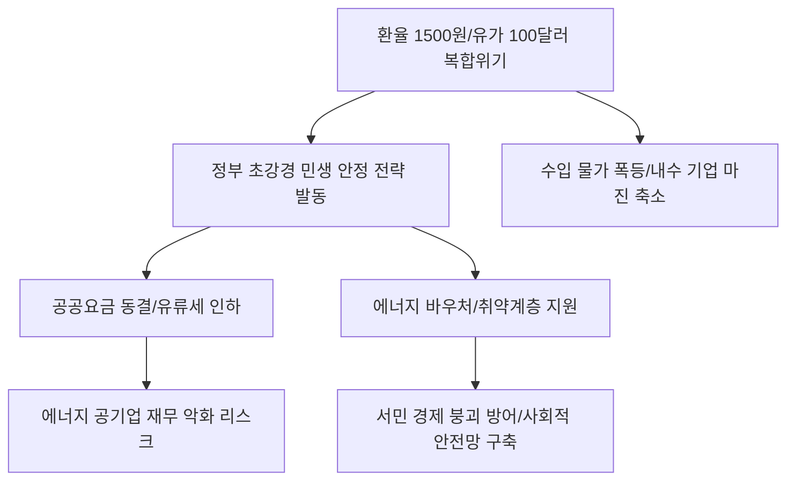

# 거시/정책 분석: 유가 100달러·환율 1500원 시대의 복합 위기와 민생 안정 초강수
## 투자 신호 + 사회적 영향 평가

---

## 📌 기사 기본 정보

- **날짜**: 2026-03-17
- **출처**: 대한민국 경제 정책 및 민생 안정 긴급 리포트
- **카테고리**: 경제 > 정책 > 거시경제
- **핵심 주제**: 국제 유가 100달러 돌파와 원/달러 환율 1,500원 시대라는 유례없는 '복합 위기' 상황에서 정부가 꺼내 든 유류세 인하 확대, 공공요금 동결 등 초강경 민생 안정 전략과 그에 따른 시장 파급 효과 분석

**메타데이터**
- 주요 이슈: 에너지 물가 폭등 및 수입 물가 비상
- 핵심 정책: 유류세 한시적 추가 인하, 공공요금(전기·가스) 상반기 동결, 장바구니 물가 밀착 감시
- 주요 주체: 기획재정부, 산업통상자원부, 일반 가계, 에너지 다소비 기업
- 키워드: 복합 경제 위기, 1500원 환율, 민생 안정 전략, 에너지 바우처, 공공요금 동결

---

## 🔍 기사를 통한 투자 신호 추출

### 1단계: 핵심 사건 분해

**What (무엇이 일어났는가?)**
- 지정학적 갈등으로 유가가 100달러를 넘어서고 환율이 1,500원을 돌파하자, 정부가 서민 경제 붕괴를 막기 위해 시장 원리를 일시적으로 멈추는 '초강경 가격 통제 및 지원' 카드를 발부함. 이는 국가 재정을 투입해 물가 상승의 충격을 정부가 대신 흡수하겠다는 강력한 의지 표현임.

**When (언제 일어났는가?)**
- 2026-03-17 (에너지 가격과 환율이 동시 폭등하며 산업계와 가계가 집단적 패닉에 빠지기 시작한 시점)

**Why (왜 일어났는가?)**
- 고물가로 인한 내수 소비 절벽을 막기 위한 최선의 방어책
- 선거 등을 앞둔 정치적 상황과 맞물려 서민 고통을 줄이려는 전방위적 행정력 동원
- 가격 인상이 임계점을 넘어설 경우 발생할 '스태그플레이션' 악순환 차단

**Who (누가 주도하는가?)**
- 물가 당국(기재부)과 에너지 복지를 총괄하는 관계 부처 합동
- 정부 정책에 호응하여 가격 인상을 자제하는 주요 유통 및 에너지 공기업

---

### 2단계: 투자 신호 해석

#### A. **긍정적 신호 (Bullish)**

**① '정부 보조금 및 세제 혜택' 수혜 섹터의 하방 경직성 확보**
- **신호**: 유류세 인화 및 에너지 바우처 지원 확대
- **의미**: 기름값이 올라도 정부가 깎아줌으로써 관련 물동량이나 이동 수요가 급격히 줄지 않음
- **투자 기회**: 알뜰 주유소 관련 유통사, 에너지 바우처 결제 시스템 관련 테크 주

**② '필수 소비재' 내 유통 혁신 기업의 시장 지배력 강화**
- **신호**: 정부의 물가 관리 압박 속에서 '가격 경쟁력'을 유지하는 기업
- **의미**: 남들이 올릴 때 안 올리면서 고객을 락인(Lock-in)하고, 정부의 눈도장까지 찍은 우량 기업
- **투자 기회**: PB 상품 매출 비중이 높고 유동 인구가 많은 대형 편의점/마트 대장주

---

#### B. **위험 신호 (Bearish)**

**③ '공공요금 동결'에 따른 에너지 공기업의 재무 건전성 악화**
- **신호**: 정부의 강제적인 전기·가스 요금 인상 억제 
- **의미**: 원가는 올랐는데 판매가는 고정되어 적자가 눈덩이처럼 불어남
- **투자 리스크**: 한국전력, 한국가스공사 등 상장 에너지 공기업 및 관련 채권 시장

**④ 가처분 소득 감소에 따른 '비필수 내구재' 섹터의 매출 급감**
- **신호**: 정부 지원에도 불구하고 실질 구매력이 떨어지는 현상
- **의미**: 먹고 살기 바쁜데 가전, 가구, 자동차를 살 여유가 사라짐
- **투자 리스크**: 대형 가전 제조사, 인테리어 유통사, 수입차 딜러사

---

### 3단계: 섹터별 투자 기회 매트릭스

#### ✅ **높은 기대도 + 낮은 리스크**

**글로벌 공급망 리스크에서 자유로운 '디지털 엔터테인먼트/콘텐츠'**
- 유가가 오르고 환율이 높아도 집에서 즐기는 게임이나 OTT 수요는 견고함. 비용은 낮고 시간 점유율은 높은 섹터가 안전함
- **투자 추천도**: ⭐⭐⭐⭐

---

## 💰 구체적 투자 신호 변환

### 신호 1: '가격 통제'의 시대, '효율'을 파는 기업이 이긴다

**투자 해석**: 기사는 정부가 직접 가격을 관리하는 '전시 경제' 수준의 대응을 하고 있음을 시사함. 이는 기업들의 마진(Margin) 압박이 극에 달할 것임을 뜻함. 투자자는 지금 즉시 '가격 전가력'이 없는 평범한 내수주를 버리고, 고환율 장기화에 대비해 '달러 벌이'를 잘하거나 정부의 민생 예산이 직접 투입되는 '복지 인프라' 관련주로 자산을 옮겨야 함. 정책의 방향이 곧 돈의 주소임.

---

## 🌍 사회적 영향 평가

### A. 긍정적 사회 영향
- **취약 계층의 생존권 보호**: 급격한 에너지 가격 상승으로부터 서민 가계의 붕괴를 막고 사회적 안전망을 유지하는 직접적인 효과
- **국가적 고통 분담 기조 형성**: 정부와 기업이 힘을 합쳐 위기를 극복하려는 모습을 통해 사회적 신뢰 유지 및 국론 분열 방어

### B. 부정적 사회 영향
- **미래 세대에게 전가되는 '미납 청구서'**: 지금 억지로 누른 공공요금과 세제 혜택은 결국 향후 대대적인 인상이나 국가 부채로 돌아와 젊은 세대의 짐이 됨
- **시장 원리의 훼손과 자원 배분의 비효율**: 억지로 싼 가격이 유지되면서 에너지를 아껴 써야 한다는 신호가 무시되어 국가 전체의 에너지 낭비가 지속될 위험

---

## 🎯 결론: 당신의 투자 전략 수립

- **즉시 실행**: 에너지 비용 노출도가 큰 제조업 종목 축소 및 정부 민생 예산 수혜주(통신, 필수 소비 유통)로 방어적 포지션 구축
- **3개월 후**: 정부의 민생 대책 실효성 데이터(물가 상승률 완화 여부) 확인 후 금리 하락 시나리오에 따른 배당주 비중 확대

---

## 📝 Obsidian 연결 구조

