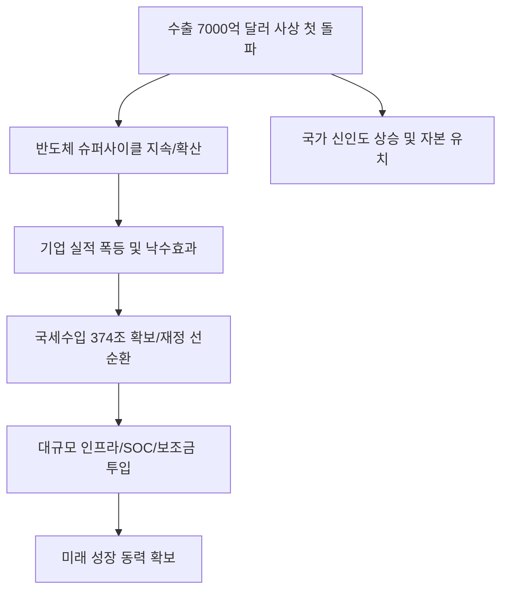

# 거시/경제 분석: 수출 7000억 달러 돌파와 반도체 슈퍼사이클, 국세수입의 선순환
## 투자 신호 + 사회적 영향 평가

---

## 📌 기사 기본 정보

- **날짜**: 2026-03-18
- **출처**: 대한민국 경제 발전 현황 및 무역수지 분석 통계 리포트
- **카테고리**: 경제 > 거시경제 > 통상/수출
- **핵심 주제**: 대한민국 연간 수출액이 사상 처음으로 7,000억 달러를 돌파하며 새로운 이정표를 세운 현상과, 이를 견인한 반도체 슈퍼사이클의 지속력 및 기업 실적 호조에 따른 국세수입(374조 원 예상) 증대의 경제 선순환 구조 분석

**메타데이터**
- 주요 지계: 사상 첫 수출 7,000억 달러 달성, 국세수입 374조 원 전망
- 핵심 동력: HBM 반도체 독점적 지위, AI 인프라 수요 폭발, K-자동차/조선 동반 호조
- 주요 주체: 삼성전자, SK하이닉스, 산업통상자원부, 관세청
- 키워드: 수출 7000억불, 반도체 슈퍼사이클, 국세수입 선순환, 경제 기초체력 강화

---

## 🔍 기사를 통한 투자 신호 추출

### 1단계: 핵심 사건 분해

**What (무엇이 일어났는가?)**
- 대한민국 경제의 중추인 수출이 전례 없는 호황을 누리며 7,000억 달러(약 900조 원 이상) 시대를 열었음. 특히 AI용 고대역폭메모리(HBM)를 중심으로 한 반도체 수출이 폭증하며 국가 재정의 근간이 되는 법인세 수입까지 크게 늘어남. 이는 정부가 복지와 미래 투자를 위한 재원을 확보하는 '성장의 선순환'이 시작되었음을 의미함.

**When (언제 일어났는가?)**
- 2026-03-18 (글로벌 AI 투자가 실질적인 성과로 이어지며 한국 반도체에 대한 주문이 전 세계에서 쏟아진 분기점)

**Why (왜 일어났는가?)**
- 글로벌 빅테크(MS, Google 등)의 데이터센터 확장 경쟁 가속화
- 한국 반도체 기업들의 압도적 기술력(HBM 등) 격차 유지
- 공급망 재편 국면에서 한국이 '신뢰할 수 있는 제조 기지'로 부상

**Who (누가 주도하는가?)**
- 글로벌 시장을 제패 중인 국내 반도체 투톱(삼성, SK)과 그 협력사들
- 적극적인 세일즈 외교와 규제 완화로 수출 환경을 조성한 정책 당국

---

### 2단계: 투자 신호 해석

#### A. **긍정적 신호 (Bullish)**

**① 반도체 '소부장(소재·부품·장비)' 기업들의 역사적 실적 최고치 경신**
- **신호**: 수출 7,000억 불 중 반도체 비중의 지속적 상승 
- **의미**: 낙수 효과가 1, 2차 협력사들로 고스란히 전달되어 이익 체력이 급격히 좋아짐
- **투자 기회**: HBM 세정/검사 장비 전문 사, EUV용 고감도 감광액 제조 사

**② '국세수입 증대'에 따른 대규모 국책 인프라(SOC) 발주 재개**
- **신호**: 세수 실적 호조로 인한 정부의 재정 투입 여력 확보 (374조 원)
- **의미**: 돈이 없어 미뤄왔던 전국 단위의 전력망 확충, 도로/철도 지하화 등 대형 토목 사업 시작
- **투자 기회**: 고압 송전망 기술 보유사, 스마트 시티 구축 관련 대형 건설사

---

#### B. **위험 신호 (Bearish)**

**③ '수출 편중'에 따른 글로벌 경기 민감도 심화**
- **신호**: 전체 수출액 중 특정 섹터(반도체/자동차) 비중이 과도하게 높음
- **의미**: 글로벌 금리나 지정학적 리스크로 AI 투자가 한순간에 식을 경우, 한국 경제 전체가 휘청일 '변동성 리스크' 공존
- **투자 리스크**: 수출 주도주 위주의 자금 쏠림 이후의 급격한 조정 가능성

**④ 원화 강세 전환 시 발생하는 '가격 경쟁력' 약화 우려**
- **신호**: 수출 호조 → 경상수지 흑자 → 원화 가치 상승 (환율 하락)
- **의미**: 달러 환산 이익이 줄어들며 수출 기업들의 이익률이 정점을 찍고 내려오는 '피크아웃' 논란
- **투자 리스크**: 환율 변동에 민감한 저마진 중소 수출주

---

### 3단계: 섹터별 투자 기회 매트릭스

#### ✅ **높은 기대도 + 낮은 리스크**

**국가 세수 증대의 직접 수혜를 입는 '미래 전략 공공 프로젝트' 참여 기업**
- 정부는 늘어난 세금으로 반도체 보조금 지급과 인프라 구축에 박차를 가할 것임. 정책과 민간 수요가 만나는 접점이 가장 안전한 투자처임
- **투자 추천도**: ⭐⭐⭐⭐⭐

---

## 💰 구체적 투자 신호 변환

### 신호 1: '숫자'는 거짓말을 하지 않는다, 한국의 저력을 믿어라

**투자 해석**: 기사는 한국 경제의 체질이 '조립 가공'을 넘어 '핵심 원천 부품 공급' 국가로 진화했음을 보여줌. 수출 7,000억 달러는 단순한 숫자가 아닌 '글로벌 공급망에서의 불가 대체성'을 상징함. 투자자는 지금 즉시 '반도체 피크아웃'이라는 막연한 공포를 버리고, 슈퍼사이클의 정점이 아직 오지 않았음을 인지해야 함. 재정이 튼튼해진 정부가 다음으로 돈을 풀 곳(전력망, 스마트 시티)을 선점하는 것이 하반기 최고의 전략임.

---

## 🌍 사회적 영향 평가

### A. 긍정적 사회 영향
- **일자리 창출 및 가계 소득 증대의 기반 마련**: 수출 호조가 기업 투자 확대로 이어져 양질의 일자리를 창출하고, 성장의 결실이 세금을 통해 복지로 환류되는 긍정적 효과
- **국가 위상(National Brand) 향상**: '7,000억 불 수출 강국'이라는 이미지가 글로벌 무대에서 한국 기업들의 신인도를 높여 후속 수출 계약과 자본 유치에 유리한 고지 점검

### B. 부정적 사회 영향
- **산업 간 양극화 심화**: IT/첨단 제조 섹터만 독주하고 전통 산업이나 내수 서비스업은 소외되는 '경제의 이중 구조' 심화 우려
- **대외 의존도 상향에 따른 주권 위축 우려**: 특정 국가나 특정 산업 랠리에 국가 운명을 맡기게 됨으로써, 글로벌 패권 전쟁의 소용돌이 속에서 한국의 독자적 목소리가 약해질 수 있는 리스크

---

## 🎯 결론: 당신의 투자 전략 수립

- **즉시 실행**: 수출 대장주(삼성/하이닉스) 보유 유지 및 잉여 현금으로 전력망 인프라/SOC 관련주 분할 매수 시작
- **3개월 후**: 미-중 무역 분쟁의 강도와 하반기 반도체 재고 실적 확인 후 비중 조절

---

## 📝 Obsidian 연결 구조

