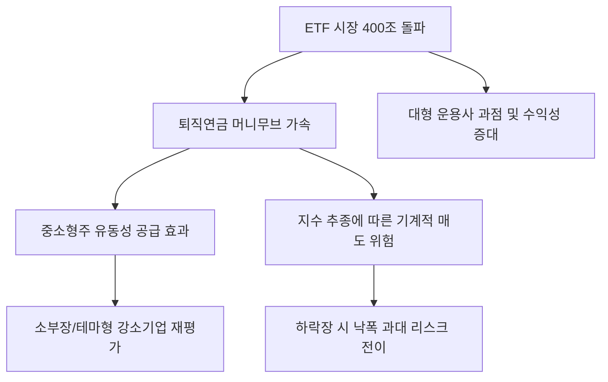

# 증권/금융 분석: ETF 400조 시대와 퇴직연금 '머니무브', 중소형주 유동성의 명암
## 투자 신호 + 사회적 영향 평가

---

## 📌 기사 기본 정보

- **날짜**: 2026-03-18
- **출처**: 대한민국 ETF 시장 동향 및 퇴직연금 자산 배분 분석 리포트
- **카테고리**: 경제 > 금융 > 증권/ETF
- **핵심 주제**: 국내 ETF 시장 규모가 400조 원을 돌파하며 퇴직연금 자산의 대대적인 이동(Money Move)이 촉발된 현상과, 이 과정에서 발생하는 중소형주 유동성 개선 효과 및 지수 추종 매매에 따른 변동성 리스크 분석

**메타데이터**
- 주요 지계: 국내 ETF 순자산 총액 400조 원 돌파 
- 핵심 이슈: 퇴직연금(DC/IRP) 내 ETF 투자 비중 급증, 패시브 자금의 시장 지배력 강화
- 주요 주체: 자산운용사(삼성, 미래 등), 퇴직연금 가입자, 개인 투자자, 중소형 상장사
- 키워드: ETF 400조, 퇴직연금 머니무브, 패시브 투자의 역설, 중소형주 유동성, 지수 추종 리스크

---

## 🔍 기사를 통한 투자 신호 추출

### 1단계: 핵심 사건 분해

**What (무엇이 일어났는가?)**
- 원금 보장형 상품에만 머물던 퇴직연금 자금이 ETF라는 '실시간 매매 가능한 실적 배당형' 상품으로 댐이 무너지듯 쏟아져 들어옴. 전체 시장 규모가 400조 원을 넘어서며, 이제 ETF는 단순한 투자 수단이 아닌 대한민국 자본 시장의 '거대한 수급 그 자체'가 됨. 특히 소외되었던 중소형주들이 특정 ETF에 편입되며 유동성이 공급되는 긍정적 효과와 동시에, 지수 하락 시 기계적 매도로 주가가 폭락하는 부작용이 공존.

**When (언제 일어났는가?)**
- 2026-03-18 (연금 계좌 세액공제 한도 확대와 맞물려 연초 대규모 자금 유입이 확인된 시점)

**Why (왜 일어났는가?)**
- 예금 금리만으로는 노후 준비가 불가능하다는 인식 확산
- 자산운용사들의 치열한 수수료 인하 및 월배당/테마형 ETF 출시 경쟁
- 모바일 앱을 통한 퇴직연금 운용의 편의성 극대화

**Who (누가 주도하는가?)**
- 직접 운용의 재미를 느낀 3040 직장인 투자자
- 점유율 확보를 위해 대대적인 마케팅을 벌이는 대형 운용사들

---

### 2단계: 투자 신호 해석

#### A. **긍정적 신호 (Bullish)**

**① '지수 편입 유력' 중소형 우량주의 유동성 프리미엄 발생**
- **신호**: 특정 테마 ETF(AI, 소부장 등)의 설정액 급증
- **의미**: ETF가 장바구니를 채우기 위해 해당 종목을 기계적으로 사들이면서, 거래량이 적던 중소형주 주가가 한 단계 레벨업됨
- **투자 기회**: 주요 지수 리밸런싱 시 편입 가능성이 높은 강소기업, 독보적 기술력을 가진 소부장주

**② 운용 보수 수익이 사상 최고치를 경신 중인 '대형 자산운용사'**
- **신호**: ETF AUM(운용자산)의 기하급수적 성장 
- **의미**: 규모의 경제를 달성한 운용사들은 이제 앉아서 관리 보수(Fee)만으로도 엄청난 현금을 창출함
- **투자 기회**: 1, 2위 시장 지배력을 가진 운용사의 모기업 지주사

---

#### B. **위험 신호 (Bearish)**

**③ '패시브 투자의 역설'에 따른 변동성 위험**
- **신호**: 펀더멘컬과 무관하게 지수 빠지면 다 같이 투매되는 현상
- **의미**: 개별 기업의 가치 분석이 무의미해지며, 시장 전체의 하락 시 중소형주가 대형주보다 더 깊게 폭락함
- **투자 리스크**: 거래량이 적고 ETF 편입 비중만 높은 코스닥 테마주

**④ 테마형 펀드의 '상승 끝물' 가입에 따른 손실 리스크**
- **신호**: 이미 주가가 오를 대로 오른 테마(예: 특정 유행 섹터) ETF가 400조 성장의 주역이 됨
- **의미**: 개인들이 "좋다"고 할 때가 상투인 경우가 많으며, 유행이 지나면 거래량 실종으로 환매가 어려워짐
- **투자 리스크**: 최근 1개월 수익률만 보고 가입하는 초단기 유행 테마 ETF

---

### 3단계: 섹터별 투자 기회 매트릭스

#### ✅ **높은 기대도 + 낮은 리스크**

**퇴직연금의 본질인 '장기 성장'과 '배당'을 결합한 인프라성 자산**
- 400조 원의 물줄기는 결국 '안정적 수익'을 찾아 배당 성장주나 인프라 펀드로 향하게 됨. 수급의 종착지에 미리 가 있는 전략이 유효함
- **투자 추천도**: ⭐⭐⭐⭐

---

## 💰 구체적 투자 신호 변환

### 신호 1: '개별 종목' 분석보다 '수급의 길목' 선점이 중요하다

**투자 해석**: 기사는 한국 증시가 '종목 장세'에서 '수급 장세'로 이동했음을 뜻함. 이제 내가 산 주식이 아무리 좋아도 특정 ETF 바구니에 들어가지 못하면 주가는 오르지 않음. 투자자는 지금 즉시 보유 종목 중 '주요 ETF 편입 현황'을 체크하고, 400조 수급의 혜택을 받는 종목인지 확인해야 함. 퇴직연금 자금은 '롱(Long)' 성격의 장기 자금이므로, 이들이 매수하는 길목에 서 있는 것이 가장 확률 높은 투자법임.

---

## 🌍 사회적 영향 평가

### A. 긍정적 사회 영향
- **국민의 자본 소득 기회 확대**: 금융 자산으로의 머니무브를 통해 근로 소득 외의 자산 형성 기회가 대중화되며 노후 안보 강화 기여
- **자본 시장의 유동성 공급과 효율성 제고**: 소외되었던 중소형 혁신 기업들에게 ETF라는 창구를 통해 자금이 원활히 공급되어 국가 산업 생태계 활성화

### B. 부정적 사회 영향
- **증시의 쏠림 현상과 획일화**: 지수 위주의 투자가 심화되면서 개별 기업의 혁신 노력보다 '지수 편입 로비'나 '덩치 키우기'에 집중하는 기형적 문화 우려
- **변동성 전이에 따른 개인 자산 붕괴**: 시장 충격 시 ETF의 집단 매도로 인해 아무 잘못 없는 개미들의 노후 자금이 한꺼번에 증발할 수 있는 사회적 리스크 상존

---

## 🎯 결론: 당신의 투자 전략 수립

- **즉시 실행**: 본인 퇴직연금(DC/IRP) 내 원리금 보장 상품 비중 확인 후 저비용 인덱스 또는 배당 성장 ETF로 20~30% 전환 전략 수립
- **3개월 후**: 국내 ETF 시장 1, 2위 사업자의 점유율 변화 및 신규 상장 테마 ETF의 자금 유입 지속성 평가 후 리밸런싱

---

## 📝 Obsidian 연결 구조

