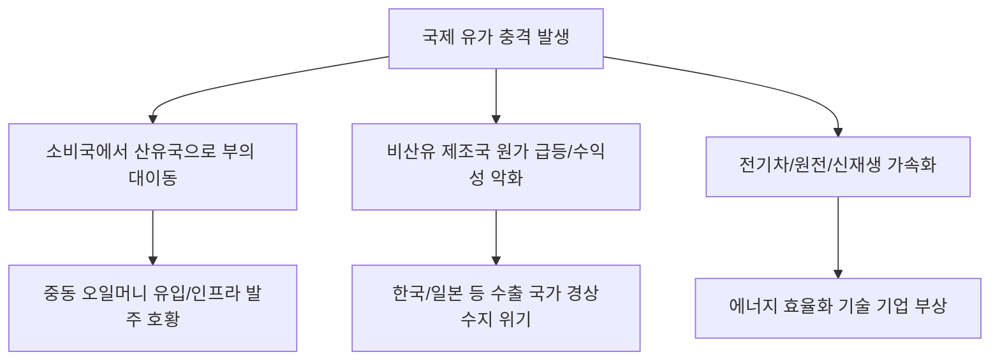

# 거시/경제 분석: 유가 충격과 글로벌 '부의 재편', 돈의 흐름을 통한 주체별 영향
## 투자 신호 + 사회적 영향 평가

---

## 📌 기사 기본 정보

- **날짜**: 2026-03-18
- **출처**: 글로벌 에너지 거시 경제 및 자산 가격 영향 분석 리포트
- **카테고리**: 경제 > 금융 > 거시경제
- **핵심 주제**: 국제 유가의 급격한 등락이 자원 보유국과 소비국 사이의 '부의 대이동(Wealth Transfer)'을 촉발하는 현상과, 에너지 비용 상승이 정부·기업·가계라는 3대 경제 주체에게 미치는 상이한 영향 및 이에 따른 글로벌 자본의 재편 방향 분석

**메타데이터**
- 주요 이슈: 에너지 인플레이션에 따른 글로벌 경상수지 재편
- 핵심 리스크: 제조 원가 상승 → 수익성 악화 → 고용 불안의 악순환
- 주요 주체: 산유국(OPEC+), 에너지 다소비 주(한국/독일 등), 글로벌 물류·항공 사
- 키워드: 유가 충격, 부의 재편, 오일 머니 역류, 에너지 양극화, 비용 인상 파급

---

## 🔍 기사를 통한 투자 신호 추출

### 1단계: 핵심 사건 분해

**What (무엇이 일어났는가?)**
- 국제 유가가 공급 불안으로 임계치를 넘어서자, 전 세계 소비 국가들의 부(Wealth)가 산유국으로 빨려 들어가는 거대한 '역머니무브'가 발생. 이는 단순히 주유비 상승을 넘어, 운송비와 제조 원가를 자극하여 전 세계 모든 물건의 값을 올리고, 소비자의 구매력을 약화시키는 '강제적 소득 축소' 현상으로 이어짐.

**When (언제 일어났는가?)**
- 2026-03-18 (지정학적 리스크로 인한 공급망 훼손이 장기화 조짐을 보이며 유가 상승세가 비탄력적으로 변한 시점)

**Why (왜 일어났는가?)**
- 화석 연료에 대한 투자가 줄어든 상태에서 갑작스러운 공급 병목 발생
- 신재생 에너지로의 전환 과도기에서 발생하는 '그린플레이션(Greenflation)'
- 자원을 무기화하려는 산유국들의 담합 강화

**Who (누가 주도하는가?)**
- 감산을 통해 가격을 통제하는 중동 및 러시아 등 산유국 연합
- 폭등하는 원가를 감당하며 생존 전략을 짜는 비산유국 제조 기업들

---

### 2단계: 투자 신호 해석

#### A. **긍정적 신호 (Bullish)**

**① '오일 머니'가 유입되는 글로벌 수주 및 방산 섹터의 호황**
- **신호**: 산유국들의 국고 유입 폭증 및 재정 집행 확대
- **의미**: 돈이 넘쳐나는 산유국들이 자국 인프라 건설(네옴시티 등)과 안보를 위해 대규모 발주를 냄
- **투자 기회**: 중동 프로젝트 수주 비중이 높은 건설/플랜트, K-방산 대형주

**② 에너지 효율 및 '대체 안보 자산' 관련 기업의 가치 급등**
- **신호**: 유가 충격을 더 이상 감당할 수 없다는 비산유국들의 비명
- **의미**: 비싸진 기름을 대신할 전기차, 원전, 수소 등 에너지 전환 기술이 '경제성'을 확보함
- **투자 기회**: 차세대 배터리 소재사, 전력망 효율화(ESS) 전문 기업

---

#### B. **위험 신호 (Bearish)**

**③ 에너지 비용을 가격에 전가하지 못하는 '저부가가치 제조'의 몰락**
- **신호**: 원가 비중에서 에너지가 차지하는 비율이 높은 장치 산업의 마진 붕괴
- **의미**: 기름값이 오르면 바로 적자로 전환되는 한계 기업들의 연쇄 도산 우려
- **투자 리스크**: 전통적 석유화학(범용 제품 사), 저가 항공사(LCC), 시멘트/철강 중견주

**④ 가계 가처분 소득 감소에 따른 '선택적 소비재' 시장의 침체**
- **신호**: 주유비와 공공요금 부담이 식비와 교육비까지 침범하는 현상
- **의미**: 생존을 위한 지출 외에 여행, 가전, 문화 등 즐거움을 위한 소비가 급격히 위축됨
- **투자 리스크**: 가구/가전 브랜드 상장사, 테마파크 및 영화관 운영사

---

### 3단계: 섹터별 투자 기회 매트릭스

#### ✅ **높은 기대도 + 낮은 리스크**

**미국 셰일가스 기반의 '에너지 독립형' 미국 우량제조업**
- 외부 유가 충격에 상대적으로 강하며, 자국 내 저렴한 에너지를 활용해 글로벌 경쟁력을 유지하는 미국 내 기업이 피난처임
- **투자 추천도**: ⭐⭐⭐⭐⭐

---

## 💰 구체적 투자 신호 변환

### 신호 1: '돈의 주소'가 바뀌었다, 당신의 주식도 주소를 바꿔라

**투자 해석**: 기사는 글로벌 부의 지도가 '제조국'에서 '자원국'으로 다시 이동하고 있음을 경고함. 한국처럼 기름 한 방울 안 나는 제조 기반 국가의 주식은 에너지가 비싸질수록 가치가 하락함. 투자자는 지금 즉시 '기름을 쓰는 기업'에서 '기름을 파는 기업'이나 '기름을 안 쓰게 만드는 기업'으로 포트폴리오를 전면 교체해야 함. 유가 충격은 단순한 물가 문제가 아니라, 국가 간의 국력이 재편되는 거대한 권력 이동임.

---

## 🌍 사회적 영향 평가

### A. 긍정적 사회 영향
- **탈화석 연료 이행의 강력한 촉매제**: 높은 에너지가 가격이 역설적으로 친환경 기술에 대한 투자를 정당화하고, 지구 전체의 탄소 중립 시계를 앞당기는 효과
- **에너지 주권에 대한 대중적 인식 확산**: 에너지 자립이 국방만큼 중요하다는 사회적 공감대 형성을 통해 국가 백년대계로서의 에너지 정책 수립 지원

### B. 부정적 사회 영향
- **전 지구적 '에너지 빈곤층' 양산**: 난방비와 이동 비용을 감당하지 못해 생존의 위협을 느끼는 취약 계층이 급증하며 사회적 불평등과 분노 심화
- **자원 민족주의의 심화와 안보 위협**: 에너지를 가진 국가들의 횡포에 맞서기 위한 각국의 합종연횡으로 지정학적 긴장이 고조되고 소모적인 무역 보복 확산

---

## 🎯 결론: 당신의 투자 전략 수립

- **즉시 실행**: 항공/여행 섹터 차익 실현 및 에너지 비용 전가가 쉬운 업종(글로벌 에너지 메이저) 비중 확대
- **3개월 후**: 미 전략비축유 방출 여부와 OPEC+의 추가 감산 결정 가능성에 따른 유가 변곡점 점검

---

## 📝 Obsidian 연결 구조

