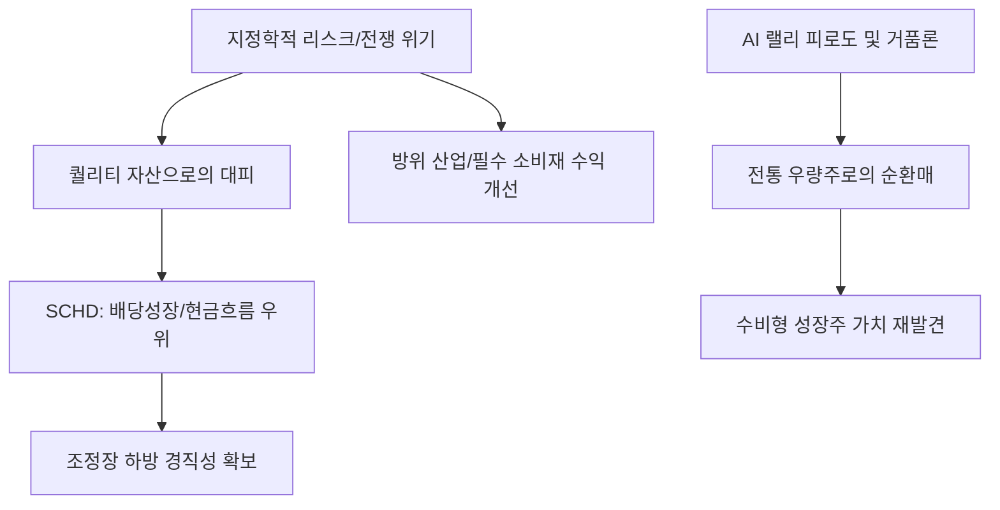

# 금융/투자 분석: 미국 배당성장주 ETF '슈드(SCHD)'의 전쟁 특수와 AI 소외 반사 이익
## 투자 신호 + 사회적 영향 평가

---

## 📌 기사 기본 정보

- **날짜**: 2026-03-18
- **출처**: 글로벌 금융 투자 전략 및 배당 투자 리서치 리포트
- **카테고리**: 경제 > 금융 > 투자전략/ETF
- **핵심 주제**: AI 랠리에서 소외되었던 전통적인 미국 배당성장주 ETF인 '슈드(SCHD)'가 지정학적 리스크(전쟁) 고조와 기술주 거품 논란 속에서 '수비형 성장주'로서 재조명받는 현상과, 포트폴리오의 회복탄력성(Resilience) 확보 전략 분석

**메타데이터**
- 주요 상품: Schwab US Dividend Equity ETF (SCHD)
- 핵심 전략: 배당 성장성, 부채비율 관리, 잉여현금흐름(FCF) 기반의 퀄리티 투자
- 비교군: 나스닥 100(QQQ), S&P 500(SPY), 고배당 중심 ETF(JEPI 등)
- 주요 기업: 펩시코, 앱비, 록히드마틴 등 현금 흐름 우량주
- 키워드: 슈드(SCHD), 배당성장주, 수비형 투자, AI 소외 반사 이익, 전쟁 특수

---

## 🔍 기사를 통한 투자 신호 추출

### 1단계: 핵심 사건 분해

**What (무엇이 일어났는가?)**
- 엔비디아 등 AI 빅테크들이 지수를 끌어올릴 때 상대적으로 저조한 수익률을 보였던 SCHD가, 중동과 유럽의 전쟁 위기가 격화되자 강력한 방어력을 과시하며 자금 유입이 가속화됨. 특히 밸류에이션 부담이 커진 AI 기술주에서 이탈한 스마트 머니가 '현금 흐름이 확실하고 배당을 늘리는' 전통 강자들로 대피하는 현상 발생.

**When (언제 일어났는가?)**
- 2026-03-18 (AI 기술주들의 분기 실적 발표 전후로 차익 실현 매물이 쏟아지고, 지정학적 위험 지수가 최고치에 달한 시점)

**Why (왜 일어났는가?)**
- 전쟁 상황에서는 꿈(Hope)보다는 밥(Consumption)과 무기(Defense)가 더 중요해지기 때문
- 고금리가 유지되는 환경에서 부채가 적고 현금을 꾸준히 창출하는 '수익성' 지표의 중요성 부각
- 지난 1년간의 AI 독주에 따른 시장의 피로도와 업종 간 순환매(Sector Rotation) 발생

**Who (누가 주도하는가?)**
- 변동성을 회피하려는 장기 연기금 및 은퇴 준비 자금
- 기술주의 낙폭 과대가 두려워진 헤지펀드들의 롱-숏(Long-Short) 스위칭 물량

---

### 2단계: 투자 신호 해석

#### A. **긍정적 신호 (Bullish)**

**① '수익의 가시성'이 확보된 전통 제조 및 헬스케어의 화려한 귀환**
- **신호**: SCHD가 보유한 필수 소비재 및 제약사들의 어닝 서프라이즈
- **의미**: 세상이 시끄러울수록 먹고 마시고 치료하는 기초 소비의 가치는 절대적임
- **투자 기회**: SCHD ETF 직접 매수, 구성 종목 중 고배당 성장 주(펩시, 앱비 등)

**② '자본 재배치(Capital Reallocation)'의 주인공인 배당 귀족주**
- **신호**: 기업들이 벌어들인 돈을 AI 투자 대신 '주주 환원(배당/자사주 소각)'에 집중하는 흐름
- **의미**: 주가 지지력이 압도적으로 좋아지며, 하락장에서 지수 대비 알파 수익 창출
- **투자 기회**: 10년 이상 배당을 증액해온 미국 '배당 귀족' 기업

---

#### B. **위험 신호 (Bearish)**

**③ '성장 지체'에 대한 시장의 엄격한 잣대 적용**
- **신호**: 배당은 주지만 매출 성장이 멈춘 기업에 대한 '배당 함정(Dividend Trap)' 경고
- **의미**: 단순히 배당 수익률만 높은 주식은 이번 장세에서 제외되며, '성장'이 동반된 배당주 위주로만 자금이 쏠림
- **투자 리스크**: 부채를 내서 배당을 주는 구시대적 유틸리티/통신주

**④ AI 테마 재점화 시 발생하는 '상대적 수익률 저하(Performance Gap)'**
- **신호**: 새로운 획기적 AI 서비스 출시 뉴스 시 배당주에서 기술주로의 급격한 자금 이탈
- **의미**: 투자자의 참을성이 부족할 경우 하락장은 잘 막았으나 상승장에서 소외되는 '포모(FOMO)' 리스크
- **투자 리스크**: 단기 차익을 노리는 공격적 성향의 개인 투자자 포트폴리오

---

### 3단계: 섹터별 투자 기회 매트릭스

#### ✅ **높은 기대도 + 낮은 리스크**

**글로벌 안보 위기 속 '방위 산업'과 연동된 배당 성장주**
- 전쟁 특수는 방산주의 실적을 올리고, 이들은 배당을 늘릴 여력이 생김. 성장의 동력(War)과 안정의 열매(Dividend)를 동시에 취할 수 있음
- **투자 추천도**: ⭐⭐⭐⭐⭐

---

## 💰 구체적 투자 신호 변환

### 신호 1: '꿈'에서 '실적'으로, '성장'에서 '현금'으로

**투자 해석**: 기사는 시장의 무게 중심이 '미래에 대한 기대'에서 '현재의 현금 흐름'으로 이동했음을 뜻함. SCHD는 단순한 배당주 모음이 아니라, 미국 경제의 가장 단단한 '기초 체력'을 가진 기업들의 집합체임. 투자자는 지금 즉시 AI 테마주에서 발생한 수익의 절반을 SCHD로 옮겨 '수익의 확정'과 '포트폴리오 안정화'를 동시에 달성해야 함. 폭풍우 치는 바다에서 돛을 내리고 닻(Anchor)을 올리는 지혜가 필요함.

---

## 🌍 사회적 영향 평가

### A. 긍정적 사회 영향
- **장기·적립식 투자 문화의 확산**: 변동성에 휘둘리지 않고 복리 효과를 노리는 건전한 투자 패러다임이 정착되며 시민들의 경제적 자립도 제고
- **기업 지배구조 개선 및 주주 가치 제고**: 배당성장주로의 자금 쏠림은 기업들로 하여금 불필요한 사업 확장 대신 주주에게 이익을 돌려주는 선진적 경영 유도

### B. 부정적 사회 영향
- **혁신 자본의 일시적 정체**: 자본이 보수적인 배당 대기업으로만 쏠리면서 파괴적 혁신을 시도하는 초기 테크 기업들의 자산 조달 난항 우려
- **부의 세습 강화와 자산 양극화**: 안정적인 배당 자산을 이미 많이 확보한 상류층은 위기에도 부를 지키고 늘리는 반면, 모험 자본에 투자한 서민들은 손실 가능성 확대

---

## 🎯 결론: 당신의 투자 전략 수립

- **즉시 실행**: 포트폴리오의 30%를 SCHD 또는 유사 배당성장 ETF로 채워 하방 경직성 확보, 록히드마틴 등 방산 배당주 개별 매수 검토
- **3개월 후**: AI 기술주의 밸류에이션 부담 완화(PER 하락) 여부 확인 후 배당주와 성장주 간의 비중 재조정(Rebalancing)

---

## 📝 Obsidian 연결 구조

