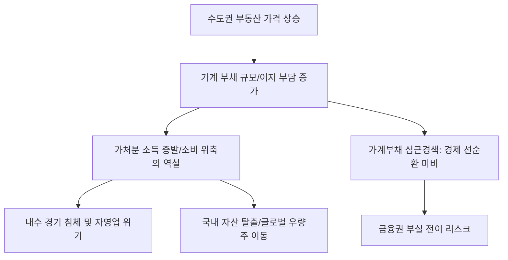

# 부동산/거시 분석: 집값 상승과 소비 위축의 역설, 가계부채 '심근경색' 현상
## 투자 신호 + 사회적 영향 평가

---

## 📌 기사 기본 정보

- **날짜**: 2026-03-18
- **출처**: 대한민국 부동산 시장 및 가계 경제 리서치 리포트
- **카테고리**: 경제 > 부동산 > 가계부채
- **핵심 주제**: 자산 가치(집값)는 오르는데 오히려 내수 소비는 얼어붙는 '부의 효과(Wealth Effect)'의 실종 현상과, 가계 총소득의 대부분이 원리금 상환에 묶이며 경제 선순환이 막히는 '가계부채 심근경색'의 구조적 위험 분석

**메타데이터**
- 주요 이슈: 자산 가격과 내수 소비의 디커플링(Decoupling), DSR(총부채원리금상환비율) 임계점 도달
- 핵심 지표: 가계 대출 원리금 상환 부담액, 민간 소비 성장률 하락, 가계 부채 대비 가처분 소득 비중
- 주요 주체: 주택 담보 대출 보유 가구, 금융위원회, 소상공인, 내수 기업
- 키워드: 집값 상승의 역설, 소비 위축, 가계부채 심근경색, 부채의 덫, 가처분 소득 고갈

---

## 🔍 기사를 통한 투자 신호 추출

### 1단계: 핵심 사건 분해

**What (무엇이 일어났는가?)**
- 부동산 가격이 반등했음에도 불구하고, 대출 금리가 높게 유지되면서 집을 가진 사람들이 쓸 돈이 없어 소비를 줄이는 기이한 현상이 고착화됨. 과거에는 집값이 오르면 기분이 좋아 돈을 썼으나(부의 효과), 이제는 오르는 집값보다 무거운 이자 부담이 삶을 압도하면서 가계가 '심근경색' 상태에 빠짐.

**When (언제 일어났는가?)**
- 2026-03-18 (수도권 중심의 집값 불안과 고금리 기조가 1년 넘게 지속되며 중산층의 가처분 소득이 한계치에 도달한 시점)

**Why (왜 일어났는가?)**
- 가계 자산의 70~80%가 부동산에 묶인 기형적 구조 때문
- 소득 증가율보다 이자 지출 증가율이 압도적으로 높음
- 집값 상승이 실질적 소득 증가가 아닌 '대출'에 의한 자산 가치 뻥튀기였기 때문

**Who (누가 주도하는가?)**
- 이자 갚기에 급급해 외식과 쇼핑을 끊은 '영끌(영혼까지 끌어모은)' 가구
- 소비 실종으로 폐업 위기에 몰린 자영업자와 내수 중소기업

---

### 2단계: 투자 신호 해석

#### A. **긍정적 신호 (Bullish)**

**① '초저가 브랜드(Value Player)' 및 '자취/실속형' 시장의 약진**
- **신호**: 소비 위축으로 인한 가성비 극대화 상품 쏠림
- **의미**: 돈이 없어도 생존을 위해 사야 하는 생필품 중 가장 싼 것을 파는 기업은 점유율 확대
- **투자 기회**: 유통업태 중 다이소형 저가 전문점, PB 상품 비중이 높은 편의점 대장주

**② 개인의 부채 관리를 돕는 '핀테크 및 채무 재구조화' 서비스**
- **신호**: 이자 부담을 줄이려는 대환 대출 및 부채 통합 서비스 수요 급증
- **의미**: 가계의 '심근경색'을 치료해주겠다고 나서는 플랫폼 권력의 강화
- **투자 기회**: 대환 대출 인프라를 선점한 테크 기업, 신용 관리 솔루션 제공 사

---

#### B. **위험 신호 (Bearish)**

**③ '프리미엄 소비' 및 '전통 유통' 섹터의 장기 침체**
- **신호**: 중산층의 가처분 소득 실종
- **의미**: 백화점, 명품, 자동차, 가전 등 '안 사도 그만인' 고가 상품 군의 매출 급감
- **투자 리스크**: 대형 백화점 관련주, 고가 내구재 제조 사, 프랜차이즈 외식업

**④ 내수 경기에 의존하는 '중소형 은행 및 저축은행'의 부실화**
- **신호**: 소상공인과 개인들의 원리금 연체율 상승
- **의미**: 심근경색이 심장(금융권) 마비로 이어지는 구간. 회수 불가능한 부실 채권 증가
- **투자 리스크**: 가계 대출 비중이 자산의 대부분인 소규모 금융 주

---

### 3단계: 섹터별 투자 기회 매트릭스

#### ✅ **높은 기대도 + 낮은 리스크**

**국내 내수보다 '해외 명품/명품 제조'에 강점이 있는 글로벌 럭셔리주**
- 한국의 영끌족은 돈이 없지만, 전 세계의 자산가들은 여전히 건재함. 국내 소비 위축을 회피하기 위해서는 매출의 90% 이상이 해외에서 발생하는 기업을 사야 함
- **투자 추천도**: ⭐⭐⭐⭐

---

## 💰 구체적 투자 신호 변환

### 신호 1: '콘크리트'에 갇힌 자본은 죽은 자산이다

**투자 해석**: 기사는 한국의 부동산 신화가 내수 경제를 좀먹는 '암(Cancer)'이 되었음을 시사함. 집값이 올라도 소비가 안 된다는 것은, 그 집이 '수익 자산'이 아닌 '고정 비용'으로 전락했다는 뜻임. 투자자는 지금 즉시 '국내 내수 지표'와 연동된 주식(음식업, 패션 등)을 정리해야 함. 대신, 부채 스트레스를 받지 않는 '글로벌 유동성'이 흐르는 시장(미국 주식 등)으로 자산을 옮겨야 함. 한국 내 경제는 부채라는 혈전 때문에 혈액 순환이 멈추고 있음.

---

## 🌍 사회적 영향 평가

### A. 긍정적 사회 영향
- **'소유'에서 '경험'과 '실속'으로의 가치관 변화**: 무리한 내 집 마련보다는 현재의 삶의 질과 실질적인 현금 흐름을 중시하는 소비 문화 성숙의 계기
- **자산 배분의 다변화 필요성 인식**: 부동산 일변도의 자산 구조가 얼마나 위험한지 깨닫고, 금융 자산 및 해외 자산으로의 분산 투자 교육 가속화

### B. 부정적 사회 영향
- **자영업 생태계의 붕괴와 지역 상권 황폐화**: 소비 위축의 직격탄을 맞은 600만 자영업자들이 몰락하며 중산층이 빈곤층으로 추락하는 사회적 안전망 위기
- **저출산 및 혼인율 하락의 가속**: 집값 부담과 이자 감당으로 인해 미래 세대가 결혼과 출산을 영구 포기하며 국가 존립 자체가 위협받는 극단적 리스크

---

## 🎯 결론: 당신의 투자 전략 수립

- **즉시 실행**: 포트폴리오 내 국내 소비재/유통 섹터 전량 매도 및 '수출형 성장주' 또는 '글로벌 배당주'로 스위칭
- **3개월 후**: 정부의 가계부채 관리 대책(DSR 추가 강화 등) 발표 시 부동산 시장의 급매물 출현 여부 확인 및 경기 침체 깊이 재산정

---

## 📝 Obsidian 연결 구조

