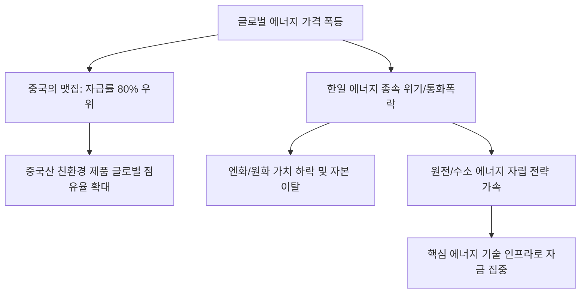

# 에너지/외환 분석: 중국의 '맷집'과 한·일 경제의 에너지 종속 위기
## 투자 신호 + 사회적 영향 평가

---

## 📌 기사 기본 정보

- **날짜**: 2026-03-18
- **출처**: 동북아 거시 경제 및 글로벌 공급망 위기 분석 리포트
- **카테고리**: 경제 > 에너지 > 외환/통상
- **핵심 주제**: 글로벌 에너지 가격 폭등 속에서 자급률을 높여온 중국의 상대적 경제 '맷집'과, 에너지 수입 의존도가 절대적인 한국·일본이 직면한 외환 위기 및 에너지 안보의 구조적 취약성 분석과 이에 따른 공급망 다변화 전략 제언

**메타데이터**
- 주요 이슈: 유가 $100+ 상시화에 따른 무역수지 악화, 위안화 vs 원/엔화 가치 차별화
- 핵심 지표: 에너지 자급률(중국 80% vs 한국 5%), 경상수지 적자폭, 환율 변동성
- 주요 주체: 국가발전개혁위원회(중국), 통상산업성(일본), 산업통상자원부(한국)
- 키워드: 에너지 종속, 중국의 맷집, 한일 외환 위기, 공급망 다변화, 에너지 안보

---

## 🔍 기사를 통한 투자 신호 추출

### 1단계: 핵심 사건 분해

**What (무엇이 일어났는가?)**
- 국제 유가와 천연가스 가격이 상승하자, 태양광·원전 등 에너지 자립 준비를 마친 중국은 상대적으로 안정적인 물가와 환율을 유지하며 '맷집'을 과시함. 반면, 해외 에너지 없이는 산업 가동이 불가능한 한·일 양국은 수입 대금(달러) 결제를 위해 외화를 쏟아부으며 원화와 엔화 가치가 폭락하는 '에너지발 통화 위기'에 직면.

**When (언제 일어났는가?)**
- 2026-03-18 (지정학적 갈등으로 국제 유가가 $110를 돌파하며 에너지 수입국들의 경상수지가 사상 최악의 적자를 기록하기 시작한 시점)

**Why (왜 일어났는가?)**
- 중국은 지난 10년간 전략적으로 재생에너지 공급망을 독점하고 원전 건설을 가속화했기 때문
- 한국과 일본은 탈원전 논란이나 정책 혼선으로 에너지 자립의 골든타임을 놓쳤기 때문
- 에너지 결제 통화인 '달러'의 강세가 에너지 가격 상승과 겹치는 '더블 펀치' 발생

**Who (누가 주도하는가?)**
- 자금력과 자원력을 바탕으로 동북아 경제 패권을 재편하려는 중국
- 방어적 자세로 에너지 도입선 다변화(중동 탈피 등)를 서두르는 한·일 정부

---

### 2단계: 투자 신호 해석

#### A. **긍정적 신호 (Bullish)**

**① 중국의 '에너지 패권'과 연동된 친환경/신재생 선도 기업의 독주**
- **신호**: 유가 상승 시 중국 태양광/배터리 기업들의 가격 경쟁력 폭발
- **의미**: 전 세계가 고유가에 비명을 지를 때, 값싼 에너지로 만든 중국산 제품의 시장 점유율 가속화
- **투자 기회**: 글로벌 1위 중국 태양광 모듈사, LFP 배터리 공급망 선도 기업

**② 한·일 양국의 '에너지 안보' 강화를 위한 '원전 및 수소' 인프라 대규모 발주**
- **신호**: 에너지 종속 탈피를 위한 국가적 생존 전략 가동
- **의미**: 수조 원 단위의 신규 원전 건설 및 해외 수소 생산 기지 구축 프로젝트가 봇물 터짐
- **투자 기회**: 원전 핵심 기자재 공급사, 액화수소 운반선 보유 조선사, 차세대 SMR 기술 사

---

#### B. **위험 신호 (Bearish)**

**③ 에너지 비용을 제품 가에 전가하지 못하는 '한국형 제조 기업'의 실적 붕괴**
- **신호**: 고유가와 고환율(원가 상승)의 이중 압박
- **의미**: 전기료와 물류비 폭등으로 'Made in Korea'의 가격 경쟁력이 중국 및 미국산에 밀려 급락함
- **투자 리스크**: 에너지 다소비 업종(철강, 화학, 가전), 내수 위주 유통주

**④ 엔화와 원화의 '영구적인 가치 하락(Depreciation)' 리스크**
- **신호**: 에너지 수입 구조가 바뀌지 않는 한 통화 가치 회복 불가능
- **의미**: 일본과 한국 자산이 글로벌 투자자들에게 '위험 자산'으로 분류되어 장기 소외됨
- **투자 리스크**: 일본/한국 국채 및 통화 가치 연동 ETF

---

### 3단계: 섹터별 투자 기회 매트릭스

#### ✅ **높은 기대도 + 낮은 리스크**

**미국 내 기반을 둔 '에너지 자립형' 첨단 제조 기업**
- 미국 내에서 저렴한 셰일가스를 쓰면서 한국·일본의 숙련된 기술력을 흡수하고 있는 기업은 동북아의 에너지 리스크를 완벽히 회피함
- **투자 추천도**: ⭐⭐⭐⭐⭐

---

## 💰 구체적 투자 신호 변환

### 신호 1: '에너지'를 가진 국가가 '부'를 재정의한다

**투자 해석**: 기사는 단순히 유가가 올랐다는 뉴스가 아니라, 동북아의 경제 서열이 '에너지 자립도'에 의해 바뀌고 있음을 뜻함. 한국과 일본의 제조 기업들은 이제 '생존'을 위해 공장을 에너지 단가가 싼 곳으로 옮길 수밖에 없음. 투자자는 지금 즉시 포트폴리오에서 '한국 내수 제조주'를 줄이고, 에너지를 직접 생산하거나 중국의 에너지 공급망을 우회할 수 있는 '글로벌 에너지 인프라' 주식으로 이동해야 함. 에너지 안보 없는 국가는 자산의 안전을 보장할 수 없음.

---

## 🌍 사회적 영향 평가

### A. 긍정적 사회 영향
- **에너지 전환 속도의 비약적 가속**: 위기 의식을 바탕으로 소모적인 정쟁을 끝내고 원전 재가동, 재생에너지 확대 등 실질적인 에너지 자립 정책에 대한 국민적 합의 형성
- **에너지 절약형 사회 구조로의 재편**: 스마트 그리드, 제로 에너지 빌딩 등 에너지 효율화 기술 도입이 일상화되며 장기적인 탄소 중립 목표 달성 기여

### B. 부정적 사회 영향
- **산업 공동화와 고용 불안**: 에너지 비용을 못 이겨 해외로 떠나는 기업들로 인해 국내 일자리가 줄어들고 산업 경쟁력이 공동화되는 '데드 하트(Dead Heart)' 현상 우려
- **교통·물류비 상승에 따른 서민 생활고 가중**: 대중교통 및 생필품 가격 폭등으로 취약 계층의 이동권과 주거권이 위협받는 사회적 긴장 고조

---

## 🎯 결론: 당신의 투자 전략 수립

- **즉시 실행**: 에너지 비용 노출도가 큰 철강/화학 섹터 비중 축소 및 원전/수소/SMR 관련 핵심 소재주 매집 시작
- **3개월 후**: 중국의 경기 회복 속도와 한·일 경상수지 흑자 전환 여부에 따른 통화 가치 바닥 확인 후 리밸런싱

---

## 📝 Obsidian 연결 구조

