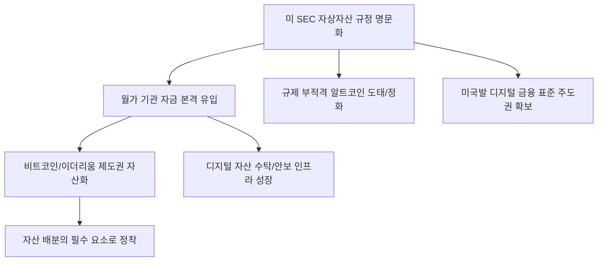

# 금융/혁신 분석: 미국 SEC의 암호화폐 상품 규정화와 '기관 자본' 유입 가속화
## 투자 신호 + 사회적 영향 평가

---

## 📌 기사 기본 정보

- **날짜**: 2026-03-19
- **출처**: 글로벌 가상자산 규제 및 암호화폐 시장 동향 리포트
- **카테고리**: 경제 > 금융 > 가상자산/핀테크
- **핵심 주제**: 미국 증권거래위원회(SEC)가 가상자산 상장지수펀드(ETF)를 넘어 파생상품 및 복합 투자 상품에 대한 규정(Regulation)을 명문화하고 일부 규제를 해제함에 따라, 월가 대형 기관들의 자본이 암호화폐 시장으로 본격 유입되는 '제도권 화(Institutionalization)' 현상 분석

**메타데이터**
- 주요 정책: 가상자산 파생상품 규정 공식화(Regulation D/S 등 준용), 스테이킹 상품 허용 검토
- 핵심 이슈: 기관 전용 커스터디(Custody) 서비스 확대, 비트코인/이더리움 외 알트코인 ETF 기대감
- 주요 주체: 게리 겐슬러 SEC 의장, 블랙록, 피델리티, 글로벌 기관 투자자
- 키워드: 비트코인 제도권화, 기관 자금 유입, SEC 규제 해제, 가상자산 ETF 확장

---

## 🔍 기사를 통한 투자 신호 추출

### 1단계: 핵심 사건 분해

**What (무엇이 일어났는가?)**
- 그동안 '회색 지대'에 머물렀던 가상자산 관련 다양한 파생 상품들이 SEC의 명확한 가이드라인 안으로 들어옴. 이는 곧 "법적으로 안전하게 투자할 수 있는 통로"가 열렸음을 뜻하며, 사고 싶어도 법적 근거가 없어 못 샀던 거대 연기금과 국부펀드의 빗장이 풀리는 역사적 변곡점임.

**When (언제 일어났는가?)**
- 2026-03-19 (기존 비트코인 현물 ETF의 성공적 안착 이후, 다음 단계인 파생상품/스테이킹 시장 개방 요구가 정점에 달한 시점)

**Why (왜 일어났는가?)**
- 가상자산을 무조건 막기보다 제도권 내에서 '투명하게 관리'하는 것이 시장 안정에 유리하다는 판단
- 글로벌 금융 패권 전쟁에서 '디지털 자산 허브' 지위를 뺏기지 않으려는 미국의 전략적 선택
- 기관들의 강력한 로비와 시장 성숙도 확인

**Who (누가 주도하는가?)**
- 규제의 칼자루를 쥐고 실리적으로 선회한 SEC
- 자본 유입을 통해 막대한 수수료 수익을 노리는 월가의 자산 운용 대기업들

---

### 2단계: 투자 신호 해석

#### A. **긍정적 신호 (Bullish)**

**① '비트코인'과 '이더리움'의 자산 클래스 지격 격상 (Sovereign Level)**
- **신호**: SEC의 규정 명문화로 인한 법적 리스크 소멸
- **의미**: 이제 가상자산은 투기판이 아닌 '포트폴리오의 필수 구성 요소(Asset Class)'로 인정받음
- **투자 기회**: 비트코인/이더리움 현물 및 파생상품 ETF, 관련 인프라 지배력을 가진 상장사

**② '가상자산 커스터디' 및 '증권형 토큰(STO)' 관련 기업의 폭발적 성장**
- **신호**: 기관 자금이 들어올 때 반드시 필요한 '보관 및 보안' 인프라 수요 폭증
- **의미**: 금고 역할을 하는 기업들이 제도권 화의 최대 수혜를 입음
- **투자 기회**: 디지털 자산 수탁 전문 금융사, 토큰 증권 발행(STO) 플랫폼 선점 기업

---

#### B. **위험 신호 (Bearish)**

**③ 알트코인(Altcoins) 시장의 '옥석 가리기' 가속화**
- **신호**: 규제 가이드라인에 부합하지 못하는 잡코인(Shitcoins)의 상장 폐지 리스크
- **의미**: 기관은 검증된 자산만 매수하며, 규정 밖에 있는 코인들은 유동성이 마르며 소멸할 것임
- **투자 리스크**: 명확한 쓰임새나 법적 실체가 없는 중소형 프로젝트 코인

**④ 거래소 간 '수수료 인하 경쟁'에 따른 수익성 악화**
- **신호**: 거대 금융사들의 진입으로 인한 시장 경쟁 치열
- **의미**: 기존 가상자산 전문 거래소들의 높은 수수료 모델이 붕괴되며 이익률 하락
- **투자 리스크**: 업력은 길지만 유동성 규모에서 월가에 밀리는 로컬 가상자산 거래소주

---

### 3단계: 섹터별 투자 기회 매트릭스

#### ✅ **높은 기대도 + 낮은 리스크**

**글로벌 기관 자금의 물줄기를 쥔 '월가 대형 자산운용사'**
- 가상자산 가격이 오르든 내리든, 기관 자금의 유입 통로(ETF 등)를 선점한 블랙록 같은 기업은 수수료로 돈을 범
- **투자 추천도**: ⭐⭐⭐⭐⭐

---

## 💰 구체적 투자 신호 변환

### 신호 1: '디지털 금'의 시대가 열리고, 개미의 투기장은 닫힌다

**투자 해석**: 기사는 가상자산 시장의 권력이 '개인'에서 '기관'으로 완전히 넘어갔음을 시사함. 이는 주식 시장의 역사와 닮아 있음. 투자자는 이제 변동성 큰 잡코인을 쫓기보다, 기관이 매수 리스트에 올릴 수 있는 '규제 적격 자산'에만 집중해야 함. SEC가 규제를 해제했다는 것은 역설적으로 '규정을 지키는 것'이 가장 큰 경쟁력이 되었음을 뜻함. 비트코인을 포트폴리오의 '핵심 안보 자산'으로 편입할 마지막 기회일 수 있음.

---

## 🌍 사회적 영향 평가

### A. 긍정적 사회 영향
- **금융 시스템의 효율성 및 투명성 제고**: 블록체인 기술의 제도권 편입을 통해 자산 거래의 비용은 낮추고, 기록의 불변성을 확보하여 부패 및 사기 방지 기여
- **자본 시장의 스펙트럼 확장**: 새로운 자산 클래스의 등장으로 개인과 기관 모두에게 다양한 자산 배분 기회와 인플레이션 대응 수단 제공

### B. 부정적 사회 영향
- **디지털 정보 격차에 따른 부의 편중**: 복잡한 규정과 제도권 상품을 이해할 수 있는 정보 상류층에게만 수익 기회가 집중되고, 소외 계층은 여전히 투기적 손실 위험 노출
- **에너지 소비 및 탄소 배출 논란**: 가상자산 시장 확대에 따른 전력 소모 증대 압박과 이를 둘러싼 환경 보호 가치와의 사회적 갈등 지속

---

## 🎯 결론: 당신의 투자 전략 수립

- **즉시 실행**: 포트폴리오 내 출처 불분명한 알트코인 정리, 비트코인/이더리움 및 관련 제도권 ETF 비중 10~15% 설정
- **3개월 후**: SEC의 차세대 알트코인 ETF 승인 여부와 기관 자금 유입 속도(AUM 데이터) 확인 후 스테이킹 상품 등 추가 포트폴리오 다변화

---

## 📝 Obsidian 연결 구조

