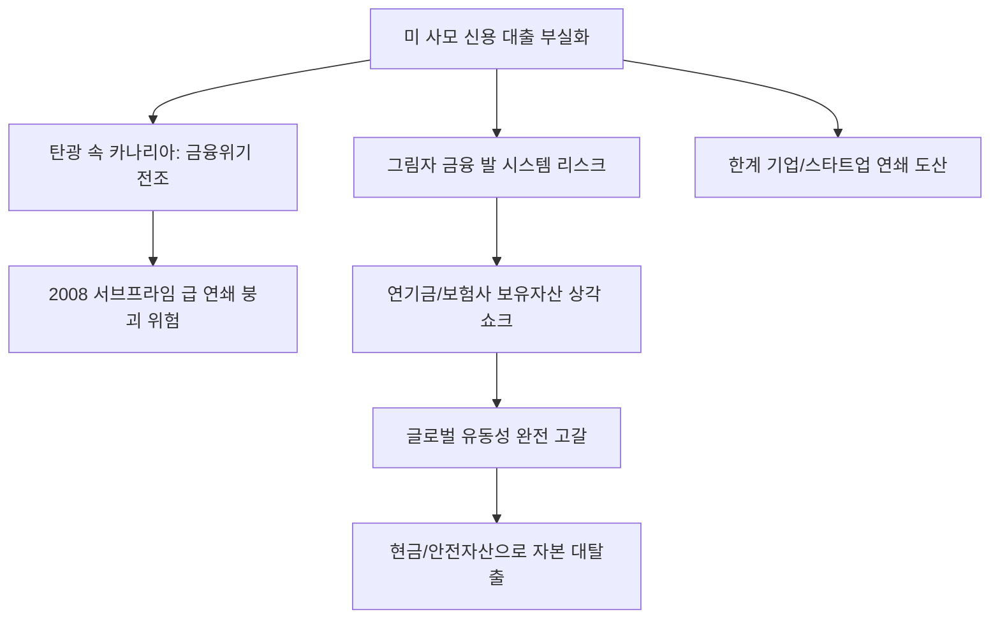

# 금융/국제 분석: 미국 사모 신용(Private Credit) 발 위기와 '서브프라임 데자뷔'
## 투자 신호 + 사회적 영향 평가

---

## 📌 기사 기본 정보

- **날짜**: 2026-03-19
- **출처**: 글로벌 금융 시장 리스크 분석 보고서 및 금융 스트레스 모니터링
- **카테고리**: 경제 > 글로벌금융 > 리스크관리
- **핵심 주제**: 고금리 장기화로 인해 미국 사모 신용(Private Credit) 시장의 연체율이 급등하며 2008년 서브프라임 모기지 사태의 전조와 유사한 양상을 보이는 현상과, '탄광 속의 카나리아'처럼 금융 위기의 가장 최전선에서 울리는 경고 신호 분석

**메타데이터**
- 주요 이슈: 사모 대출 연체율 임계점 도달, 레버리지 론 부실화
- 핵심 리스크: 투명성 부족(Black Box), 그림자 금융 전이, 자산 가치 재평가 쇼크
- 주요 주체: 글로벌 사모펀드(PE), 한계 기업, 규제 당국(BIS, Fed)
- 키워드: 사모 신용 위기, 서브프라임 데자뷔, 탄광 속 카나리아, 레버리지 폭탄

---

## 🔍 기사를 통한 투자 신호 추출

### 1단계: 핵심 사건 분해

**What (무엇이 일어났는가?)**
- 은행권의 까다로운 대출 대신 '사모 펀드'를 통해 돈을 빌렸던 기업들이 고금리 이자를 감당하지 못해 줄도산 위기에 처함. 사모 신용 시장은 공적 규제가 적어 부실 규모가 정확히 파악되지 않는 '블랙박스' 상태였으나, 최근 환매 중단과 연체율 급등이 한꺼번에 터져 나오며 시장 전체로 공포가 확산 중.

**When (언제 일어났는가?)**
- 2026-03-19 (글로벌 금융 스트레스 지수가 1만 포인트를 넘어서고 달러 가치가 폭등하며 자금 조달 시장이 완전히 얼어붙기 시작한 시점)

**Why (왜 일어났는가?)**
- 10년 넘게 이어진 저금리 기간 중 과도하게 부풀려진 기업 부채의 거품이 금리 정상화 과정에서 터지는 현상
- 대출 채권을 다시 쪼개고 묶어서 팔았던 복잡한 구조가 2008년의 MBS/CDO 사태와 판박이기 때문

**Who (누가 주도하는가?)**
- 고수익에 눈이 멀어 고위험 사모 신용에 투자했던 거대 연기금과 국부펀드
- 한계 기업들의 부실을 막기 위해 '폭탄 돌리기'식 대환 대출을 이어온 제2금융권

---

### 2단계: 투자 신호 해석

#### A. **긍정적 신호 (Bullish)**

**① '정통 상업은행'의 압도적 시장 지배력 및 안전성 확인**
- **신호**: 비제도권 금융(사모 신용)의 몰락과 대비되는 제도권 은행의 탄탄한 자본력
- **의미**: 리스크가 터질 때 정부가 보증하고 지원하는 '대마불사' 은행으로 자금이 대피함
- **투자 기회**: 미국 5대 메이저 은행주, 한국의 리스크 관리 1위 금융 지주사

**② 부실 자산을 전문적으로 처리하는 '워크아웃/NPL(부실채권)' 시장의 호황**
- **신호**: 시장에 헐값으로 쏟아지는 부실 대출 채권들
- **의미**: 위기를 청산하고 재구조화하여 수익을 내는 기업들에게는 수십 년 만의 기회
- **투자 기회**: 글로벌 NPL 투자 전문사, 기업 구조조정 자문사

---

#### B. **위험 신호 (Bearish)**

**③ '그물망 리스크'로 인한 금융 시스템 전반의 신용 경색**
- **신호**: 사모 신용 부실이 이를 담보로 잡은 보험사/증권사의 재무 건전성 악화로 전이
- **의미**: 누가 얼마나 물렸는지 모르는 공포가 '대출 중단'으로 이어져 멀쩡한 기업까지 죽이는 상황
- **투자 리스크**: 대체 투자 비중이 자산의 30%를 넘는 생명보험사 및 중소형 증권주

**④ 자금 수혈이 절실한 '중소형 성장주/바이오'의 밸류에이션 증발**
- **신호**: 사모 펀드들이 자기 코가 석 자라 더 이상 '꿈'에 투자하지 않음
- **의미**: 추가 펀딩이 안 되는 성장주들은 부도 또는 반 토막 상장 폐지 절차 돌입
- **투자 리스크**: 매출은 없고 연구 개발비만 쓰는 기술 특례 상장주

---

### 3단계: 섹터별 투자 기회 매트릭스

#### ✅ **높은 기대도 + 낮은 리스크**

**글로벌 공급망의 필수재인 '필수 원자재 및 에너지' 생산 기업**
- 금융 시스템이 흔들려도 석유, 가스, 구리 등 실물 자산의 가치는 보존되며 오히려 인플레이션 헤지 수단으로 부각됨
- **투자 추천도**: ⭐⭐⭐⭐

---

## 💰 구체적 투자 신호 변환

### 신호 1: '탄광 속 카나리아'가 죽었다면, 광산에서 즉시 나가라

**투자 해석**: 기사는 지금이 금융 위기의 '시작점'일 수 있음을 경고함. 사모 신용 사태는 찻잔 속의 태풍이 아니라, 거대한 쓰나미의 선발대임. 투자자는 지금 즉시 '고수익 대체 투자' 포트폴리오를 전량 매도하고, 가장 투명하고 유동성이 풍부한 기초 자산(현금, 금, 미 국채)으로 이동해야 함. 보이지 않는 곳에서 터진 균열은 결국 눈에 보이는 모든 것을 무너뜨릴 때까지 멈추지 않을 것임.

---

## 🌍 사회적 영향 평가

### A. 긍정적 사회 영향
- **금융 시장의 투명성 및 규제 사각지대 해소**: 이번 위기를 통해 그림자 금융에 대한 강력한 공시 제도와 규제 장벽을 구축하여 장기적인 시스템 안정성 강화 계기 마련
- **기업들의 '부채 다이어트' 유도**: 과도한 빚으로 연명하던 좀비 기업들이 도태되고, 실질적인 이익을 내는 견실한 기업 위주로 경제 구조 재편

### B. 부정적 사회 영향
- **대규모 실업 및 실물 경제 침체**: 중소기업의 자금줄이 마르면서 발생하는 연쇄 도산과 그에 따른 대규모 실업은 사회적 불안과 가계 소득 붕괴로 이어짐
- **공공 재정의 투입 위험**: 위기가 걷잡을 수 없이 커질 경우, 결국 국민의 세금으로 금융사들의 실책을 메워줘야 하는 도덕적 해이와 재정 건전성 악화 발생

---

## 🎯 결론: 당신의 투자 전략 수립

- **즉시 실행**: 대체 투자 자산(비상장 펀드, 사모대출 등) 노출 확인 및 즉각적인 리스크 헤지, 현금 비중 60% 이상 상향
- **3개월 후**: 주요 사모 펀드들의 분기 보고서와 연체율 통계 확인 후 금융 위기 전개 양상에 따른 대응 단계 조정

---

## 📝 Obsidian 연결 구조

