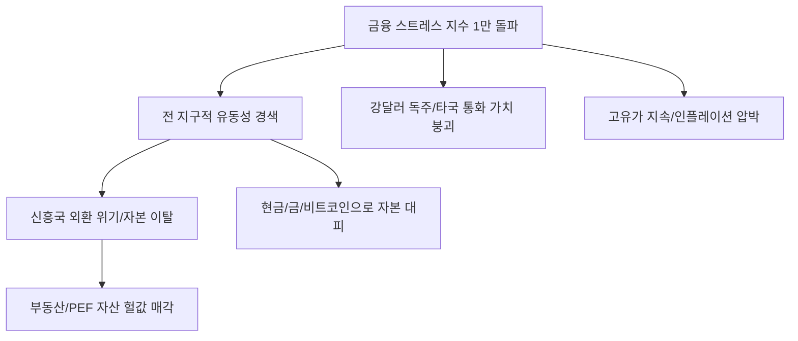

# 금융/거시 분석: 강달러·고유가와 '금융 스트레스 지수' 1만 포인트 돌파의 신호
## 투자 신호 + 사회적 영향 평가

---

## 📌 기사 기본 정보

- **날짜**: 2026-03-19
- **출처**: 글로벌 금융 시장 리스크 모니터링 및 외환 분석 리포트
- **카테고리**: 경제 > 금융 > 거시경제
- **핵심 주제**: 강달러와 고유가의 결합이 글로벌 금융 시스템에 가하는 압박이 임계점에 달하며, '글로벌 금융 스트레스 지수(GFSI)'가 심리적 저항선인 1만 포인트를 돌파한 현상과 이에 따른 시스템 붕괴 리스크 분석

**메타데이터**
- 주요 지표: 금융 스트레스 지수(GFSI) 10,000pt 돌파, 달러 인덱스(DXY) 최고치, 브렌트유 $110+
- 핵심 리스크: 신흥국 외환 위기, 선진국 스태그플레이션 심화, 자본 조달 비용 폭등
- 주요 주체: 미 연방준비제도(Fed), 주요국 중앙은행, 국제통화기금(IMF)
- 키워드: 금융 스트레스, 강달러 독주, 고유가 충격, 리스크 임계점, 자본 이탈

---

## 🔍 기사를 통한 투자 신호 추출

### 1단계: 핵심 사건 분해

**What (무엇이 일어났는가?)**
- 전 세계 금융 시장의 불안 정도를 나타내는 ‘금융 스트레스 지수’가 자금 조달의 어려움과 외환 변동성 확대로 인해 1만 포인트를 돌파함. 이는 2008년 금융위기와 2020년 팬데믹 초기에 육박하는 수치로, 시장이 사실상 '패닉(Panic)' 직전 단계에 진입했음을 의미함.

**When (언제 일어났는가?)**
- 2026-03-19 (중동발 가스/석유 공급망 불안과 미 연준의 금리 인하 지연이 겹친 시점)

**Why (왜 일어났는가?)**
- 미국만 홀로 성장하는 '디커플링'으로 달러 몸값 폭등 (King Dollar)
- 전쟁 장기화로 인한 고유가가 전 세계 물가를 다시 자극 (Cost-push inflation)
- 급격한 금리 인상의 후행적 부작용(Lag effect)으로 인한 기업 부채 상환 능력 저하

**Who (누가 주도하는가?)**
- 유동성을 회수하며 안전 자산으로 회귀하는 글로벌 패시브 자금
- 달러 결제 대금을 구하지 못해 비명 지르는 수입 국가들

---

### 2단계: 투자 신호 해석

#### A. **긍정적 신호 (Bullish)**

**① '진짜 금(Real Gold)'과 '디지털 금(Bitcoin)'의 자산 이동 가속**
- **신호**: 금융 시스템에 대한 불신이 1만 포인트로 증명됨
- **의미**: 법정 화폐 시스템의 불안을 느낀 자금이 희소성 있는 대체 자산으로 급격히 쏠림
- **투자 기회**: 실물 금 금통, 비트코인 등 가상자산 대장주, 금 채굴 기업

**② 에너지 패권을 쥔 '천연가스/석유 산유국' 관련 자본 수혜**
- **신호**: 고유가 상황이 스트레스 지수를 높이는 주범이 됨
- **의미**: 에너지 가격 결정권을 가진 주체들이 전 세계의 부를 빨아들임
- **투자 기회**: 미국 셰일가스 생산 선도 기업, 글로벌 에너지 메이저(Exxon 등)

---

#### B. **위험 신호 (Bearish)**

**③ 신흥국(EM) 자본 시장의 '블랙홀' 탈출 현상**
- **신호**: 스트레스 지수 상승 시 가장 먼저 무너지는 것은 기초 체력이 약한 신흥국 통화
- **의미**: 외국인 자금이 썰물처럼 빠져나가며 주가-채권-환율이 동시 폭락하는 '트리플 약세'
- **투자 리스크**: 에너지 자급이 안 되는 아시아/아프리카 신흥국 주식 및 채권

**④ 레버리지를 활용한 '부동산/PEF' 자산의 대규모 손실 확정**
- **신호**: 금융 스트레스 상위 1%는 조달 비용의 폭증을 의미
- **의미**: 빚을 내서 자산을 굴리던 사모펀드나 부동산 리츠들이 이자를 감당 못해 자산을 헐값 매각(Fire sale)
- **투자 리스크**: 고레버리지 상업용 부동산 리츠, 공격적 투자를 이어온 증권주

---

### 3단계: 섹터별 투자 기회 매트릭스

#### ✅ **높은 기대도 + 낮은 리스크**

**초우량 단기 채권(T-Bill) 및 현금성 자산(MMF)**
- 스트레스 지수가 1만을 넘었다는 것은 '무조건 살아남는 게 장땡'인 장세임. 현금을 쥐고 폭풍이 지나가길 기다리는 것이 최고의 투자임
- **투자 추천도**: ⭐⭐⭐⭐⭐

---

## 💰 구체적 투자 신호 변환

### 신호 1: '1만 포인트'는 시장이 보낸 마지막 탈출 신호다

**투자 해석**: 기사는 지금이 바닥을 잡을 때가 아니라, '생존'을 고민해야 할 때임을 시사함. 지수가 1만을 넘었을 때 항상 큰 금융 사고(Lehman 등)가 뒤따랐음을 기억해야 함. 투자자는 지금 즉시 '변동성'에 노출된 모든 파생 상품을 정리하고, 가장 지루하지만 안전한 '달러 현금'과 '금'으로 피신해야 함. 시장이 다시는 안 열릴 것처럼 공포스러울 때가 올 것이며, 그때 현금을 든 자만이 다음 10년의 부를 거머쥘 것임.

---

## 🌍 사회적 영향 평가

### A. 긍정적 사회 영향
- **과잉 유동성 파티의 종료와 건전성 회복**: 거품이 낀 한계 기업들이 정리되면서 경제 전반의 효율성이 높아지는 고통스러운 정화 과정
- **대체 통화 및 기술에 대한 관심 증대**: 기존 금융 시스템의 한계를 극복하기 위한 블록체인 및 핀테크 기술의 실질적 도입 가속화

### B. 부정적 사회 영향
- **글로벌 경제의 '부익부 빈익빈' 극단화**: 달러를 가진 국가(미국)와 에너지를 가진 국가만 살아남고 공산품 제조 중심의 국가들은 극심한 빈곤 직면
- **사회적 불만 폭주와 지정학적 충돌 위험**: 경제적 고통을 대외 갈등으로 돌리려는 지도자들에 의해 국지전이나 무역 전쟁이 더 격화될 사회적 리스크

---

## 🎯 결론: 당신의 투자 전략 수립

- **즉시 실행**: 포트폴리오의 70% 이상을 현금 및 금으로 전환, 레버리지 상품 완전 청산
- **3개월 후**: 스트레스 지수가 8,000pt 이하로 안정화되는지 확인 후, 살아남은 미국 빅테크 위주로 분할 매수 재개

---

## 📝 Obsidian 연결 구조

