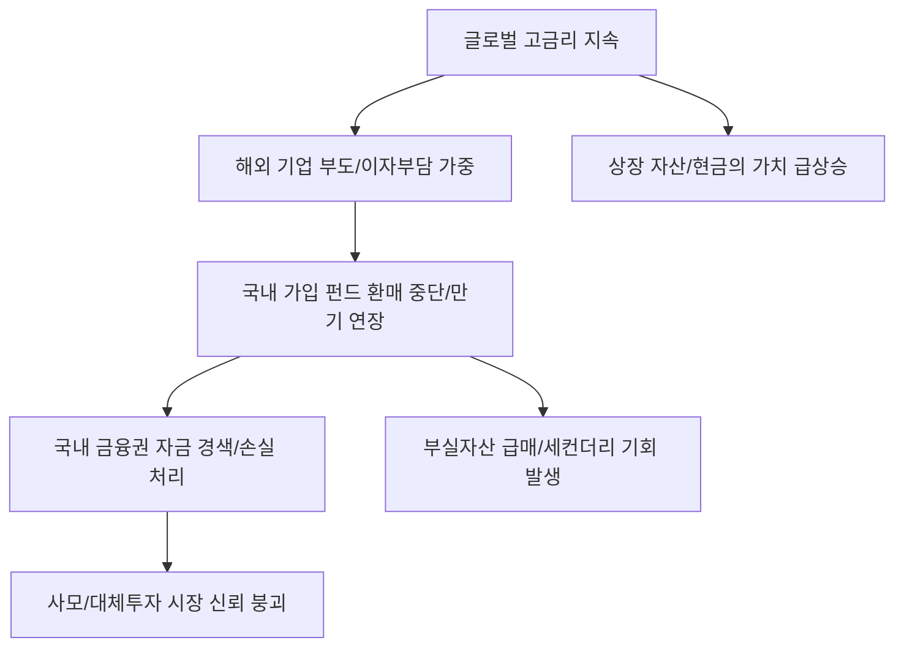

# 금융/투자 분석: 해외 사모대출펀드 '투자 잠김(Lock-up)'과 글로벌 리스크 전이
## 투자 신호 + 사회적 영향 평가

---

## 📌 기사 기본 정보

- **날짜**: 2026-03-19
- **출처**: 글로벌 대체 투자 시장 리스크 분석 뉴스
- **카테고리**: 경제 > 금융 > 해외투자/연기금
- **핵심 주제**: 글로벌 고금리 여파로 해외 사모대출(Private Credit) 시장의 수익성이 악화되면서 국내 기관 및 개인 투자자들이 가입한 펀드의 환매가 중단되거나 만기가 연장되는 '투자 잠김(Lock-up)' 현상의 심각성과 이에 따른 도미노 부실 리스크 분석

**메타데이터**
- 주요 이슈: 해외 사모대출 펀드 환매 중단 및 자금 회수 불능
- 핵심 이슈: 중소형 기업 대출 부실화, 유동성 매칭(Mismatch) 오류
- 주요 주체: 국내 대형 증권사, 자산운용사, 해외 현지 GP(운용사), 기관 투자자(LP)
- 키워드: 사모대출 펀드 잠김, 유동성 하수구, 글로벌 부실 전이, 대체투자 잔혹사

---

## 🔍 기사를 통한 투자 신호 추출

### 1단계: 핵심 사건 분해

**What (무엇이 일어났는가?)**
- 연 6~8%의 안정적인 이자를 약속하며 인기를 끌었던 '해외 사모대출 펀드'들이 기초 자산인 해외 기업들의 부도와 유동성 부족으로 인해 돈을 돌려주지 못하는 사태 발생. 국내 투자자들의 자산이 해외에 묶이면서(Lock-up) 국내 금융권의 현금 흐름에도 차질이 생기기 시작함.

**When (언제 일어났는가?)**
- 2026-03-19 (해외 기업들의 이자 보상 능력이 한계에 도달하고, 주요 펀드들의 '만기 반환' 시즌이 돌아오며 잠복했던 부실이 수면 위로 드러난 시점)

**Why (왜 일어났는가?)**
- 고금리가 예상보다 길어지며 대출을 받은 기업들의 이자 부담이 눈덩이처럼 불어났기 때문
- 펀드 설정 당시 '부도율'을 너무 낙관적으로 설계한 구조적 결함
- 전 세계적인 리스크 오프(Risk-off) 상황에서 해외 운용사들이 자국 자금부터 챙기는 '자국 우선주의' 작동

**Who (누가 주도하는가?)**
- 환매를 제한하며 시간을 벌려는 글로벌 사모펀드(PEF) 운용사
- 돈을 돌려받지 못해 발을 동동 구르는 국내 금융사 및 고액 자산가들

---

### 2단계: 투자 신호 해석

#### A. **긍정적 신호 (Bullish)**

**① '상장 주식' 및 '국채' 등 유동성 자산의 매력도 급상승**
- **신호**: 대체 투자의 '환매 불능' 공포가 확산되는 국면
- **의미**: 언제든 팔 수 있는 상장 자산의 가치가 상승하며, '유동성 프리미엄'이 붙기 시작함
- **투자 기회**: 거래량이 풍부한 미국 대형주, 고유동성 미 국채 ETF, 현금성 자산(MMF)

**② 부실 펀드를 정리해주는 '세컨더리(Secondary)' 시장의 기회**
- **신호**: 묶인 돈을 헐값에라도 팔려는 매물 속출
- **의미**: 장기적으로 우량한 자산임에도 당장의 유동성 때문에 투매되는 자산을 매집할 수 있는 기회
- **투자 기회**: 글로벌 세컨더리 전문 펀드, 부실 자산 인수 전문 금융사

---

#### B. **위험 신호 (Bearish)**

**③ 국내 금융사의 '충당금 적립' 및 '손실 처리'에 따른 실적 쇼크**
- **신호**: 해외 투자 자산의 공식적인 손실 확정 및 상각 처리
- **의미**: 배당 재원이 줄어들고 주가 하락 압력이 강해짐
- **투자 리스크**: 해외 대체 투자 비중이 높았던 증권사, 보험사, 지주사

**④ 국내 '사모 펀드' 시장 전반의 신뢰 붕괴 및 자금 경색**
- **신호**: "해외도 망하는데 국내는 괜찮냐"는 식의 연쇄 공포
- **의미**: 신규 펀드 설정이 안 되어 건실한 국내 벤처/중소기업까지 자금줄이 마르는 부작용
- **투자 리스크**: 자금 조달을 사모펀드에 의존하고 있는 고레버리지 기업군

---

### 3단계: 섹터별 투자 기회 매트릭스

#### ✅ **높은 기대도 + 낮은 리스크**

**해외 노출도가 거의 없고 현금 흐름이 확실한 '국가 기반 인프라'**
- 전 지구가 유동성으로 고통받을 때, 전기·가스·통신처럼 망하지 않고 돈이 계속 들어오는 'Local Fortress' 자산이 안전함
- **투자 추천도**: ⭐⭐⭐⭐

---

## 💰 구체적 투자 신호 변환

### 신호 1: '이름값'도 '고수익'도 믿지 마라, '유동성'이 왕이다

**투자 해석**: 기사는 한국 금융의 '대체 투자 열풍'이 끝났음을 알리는 조종(弔鐘)임. 해외 유수 운용사라는 이름표가 당신의 돈을 지켜주지 못함. 투자자는 지금 즉시 '언제든 현금화할 수 없는 자산'에 투자된 비중을 전수 조사하고, 신규 대체 투자 권유를 거절해야 함. 위기 시에는 1% 더 높은 수익보다 '오늘 당장 팔 수 있는 권리'가 수백 배 더 가치 있음.

---

## 🌍 사회적 영향 평가

### A. 긍정적 사회 영향
- **묻지마 해외 투자에 대한 경각심 고취**: 국내 자본이 해외의 부실한 자산으로 흘러 들어가는 것을 막고, 국내 우량 기업으로의 자금 환류를 유도하는 계기
- **금융사들의 리스크 관리 체계 선진화**: 단순 상품 판매(Brokerage)에서 벗어나 실질적인 기초 자산 실사(Due-diligence) 능력을 강화하는 방향으로 발전

### B. 부정적 사회 영향
- **중산층 및 은퇴 세대의 자산 붕괴**: 안정적 수익을 믿고 노후 자금을 넣은 개인 투자자들의 피해가 사회 전체적인 빈곤 문제로 확산
- **국가 금융 신뢰도 하락**: 해외 자산 부실을 사전에 걸러내지 못한 국내 금융 시스템에 대한 불신이 커지며 금융 시장 전반의 활력 저하

---

## 🎯 결론: 당신의 투자 전략 수립

- **즉시 실행**: 가입된 사모/대체 펀드의 기초 자산 보고서를 요청하여 연체율 및 환매 가능 여부 점검, 의심 종목은 '손실 확정' 전 세컨더리 매각 타진
- **3개월 후**: 글로벌 사모대출 시장의 부도율 피크아웃(Peak-out) 여부 및 미국 대형 운용사들의 '환매 중단 해제' 공지 확인

---

## 📝 Obsidian 연결 구조

