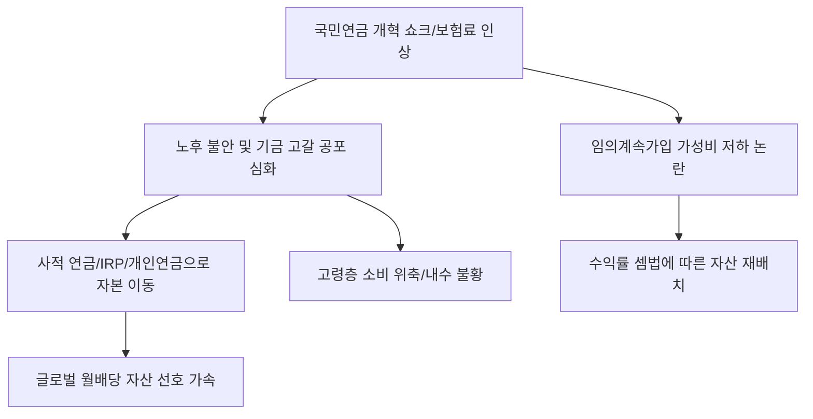

# 사회/연금 분석: 국민연금 '임의계속가입'의 손익분기점과 연금개혁 쇼크
## 투자 신호 + 사회적 영향 평가

---

## 📌 기사 기본 정보

- **날짜**: 2026-03-19
- **출처**: 대한민국 연금 정책 및 고령 사회 자산 관리 분석 리포트
- **카테고리**: 경제 > 사회 > 국민연금/복지
- **핵심 주제**: 국민연금 수령 연령 상향 및 보험료율 인상이라는 '연금개혁 쇼크' 속에서, 만 60세 이후에도 보험료를 계속 내는 '임의계속가입'이 과연 개인에게 이득인지에 대한 손익분기점(BEP) 정밀 분석과 노후 준비 전략의 패러다임 변화 분석

**메타데이터**
- 주요 정책: 국민연금 제5차 재정추계 결과에 따른 보험료율 인상(9%→13~15%안), 수령 연령 68세 상향 논의
- 핵심 지표: 임의계속가입 증가율, 기대수명에 따른 수익률(Money's worth ratio)
- 주요 주체: 보건복지부, 국민연금공단, 5060 은퇴 준비 세대
- 키워드: 임의계속가입 손익분기점, 연금개혁 쇼크, 노후 안보, 더 내고 늦게 받기, 연금 고갈 공포

---

## 🔍 기사를 통한 투자 신호 추출

### 1단계: 핵심 사건 분해

**What (무엇이 일어났는가?)**
- 정부의 연금 개혁안이 '더 많이 내고 더 늦게 받는' 쪽으로 굳어지자, 60세 정년 퇴직을 앞둔 가입자들이 혼란에 빠짐. 특히 가입 기간을 늘려 연금액을 높이려는 '임의계속가입'의 가성비가 떨어질 수 있다는 우려가 나오며, 60세 이후에도 보험료를 내는 것이 나은지 아니면 그 돈으로 개인 연금에 투자하는 것이 나은지에 대한 '수익률 전쟁' 시작.

**When (언제 일어났는가?)**
- 2026-03-19 (연금개혁 특별위원회의 최종 권고안 발표가 임박하며 고령층의 자산 이동이 포착된 시점)

**Why (왜 일어났는가?)**
- 저출산·고령화로 인해 기금이 2055년 전후로 고갈될 것이라는 공포 때문
- 과거처럼 "국가가 알아서 해주겠지"라는 신뢰가 붕괴되고, 철저한 '개인별 셈법' 작동
- 늘어난 기대수명으로 인해 60~65세 사이의 '소득 절벽' 구간(L-곡선) 대응 필요성

**Who (누가 주도하는가?)**
- 재정 건전성을 외치는 정부 및 관련 전문가
- 자신의 노후 자금이 깎일까 봐 민감하게 반응하는 5060 베이비부머 세대

---

### 2단계: 투자 신호 해석

#### A. **긍정적 신호 (Bullish)**

**① '개인연금(IRP/연금저축)' 및 '사적 연금'으로의 거대 머니무브**
- **신호**: 공적 연금의 불확실성이 커질수록 스스로 준비하는 연금 상품에 돈이 몰림
- **의미**: 연금 개혁 뉴스가 나올수록 대형 증권사/보험사의 연금 계좌 유입액이 급증함
- **투자 기회**: 연금 자산 운용 능력이 뛰어난 대형 금융 지주사, 글로벌 배당 ETF

**② 은퇴자를 겨냥한 '수익형 부동산' 및 '배당 성장주'의 가치 재발견**
- **신호**: 연금 수령 공백기(Bridge Period)를 메워줄 확실한 현금 흐름 수요
- **의미**: "매달 돈이 들어오는" 확실한 자산에 대한 프리미엄이 붙기 시작함
- **투자 기회**: 월배당 ETF 전문 운용사, 안정적 배당 성향의 통신/전력주

---

#### B. **위험 신호 (Bearish)**

**③ 가계 가처분 소득 감소에 따른 '내수 소비'의 장기 위축**
- **신호**: 보험료율 인상으로 인해 현재 쓸 수 있는 돈이 줄어드는 현상
- **의미**: 미래의 연금을 위해 현재의 소비를 줄이면서 백화점, 자동차, 여행 등 내수 산업 매출 타격
- **투자 리스크**: 고가 내구재 및 프리미엄 소비 섹터

**④ '연금 고갈' 테마를 이용한 고위험 투자 상품 기승**
- **신호**: 노후 불안 심리를 자극하는 코인/사설 펀드 등 투기적 상품 홍보 급증
- **의미**: 자산 방어를 위해 무리한 레버리지를 쓰다가 은퇴 자금을 탕진하는 사회적 참사 가능성
- **투자 리스크**: 검증되지 않은 가상자산 프로젝트 및 고위험 해외 파생 펀드

---

### 3단계: 섹터별 투자 기회 매트릭스

#### ✅ **높은 기대도 + 낮은 리스크**

**글로벌 '배당 귀족주(Dividend Aristocrats)' 및 '수익률 방어형 ETF'**
- 국가 연금이 흔들려도 전 세계를 상대로 50년 넘게 배당을 준 기업들의 신뢰도는 변하지 않음. 불안한 은퇴자들의 자금은 결국 여기로 모임
- **투자 추천도**: ⭐⭐⭐⭐⭐

---

## 💰 구체적 투자 신호 변환

### 신호 1: '국가'는 당신의 노후를 책임지지 않는다, '자산'이 책임진다

**투자 해석**: 기사는 국민연금이 이제 '수익성' 높은 투자처라기보다 최소한의 '보험'으로 전락하고 있음을 시사함. 임의계속가입의 손익분기점은 이제 85세 이상 생존해야만 이득인 구조로 변하고 있음. 투자자는 이제 공적 연금에 대한 기대를 낮추고, 국민연금 보험료로 낼 돈 중 일부를 '글로벌 우량주 월배당 포트폴리오'로 직접 운용하여 '나만의 연금 국고'를 구축해야 함. 국가 시스템의 하자가 발견될 때가 자산 자립을 선언할 최적의 시기임.

---

## 🌍 사회적 영향 평가

### A. 긍정적 사회 영향
- **전 국민의 금융 문해력(Financial Literacy) 향상**: 연금 계산기를 두드리며 생애 주기별 자산 관리의 중요성을 깨닫고 건전한 장기 투자 문화 확산
- **연금 재정의 지속 가능성 확보 노력**: 비록 고통스럽지만 '더 내고 늦게 받는' 개혁을 통해 미래 세대의 연금 고갈 공포를 줄이려는 사회적 책임 실천

### B. 부정적 사회 영향
- **노인 빈곤 및 '연금 난민' 발생 우려**: 개혁안을 따라갈 여력이 없는 저소득 고령층이 연금 사각지대에 놓이며 극심한 빈곤과 사회적 소외 직면
- **세대 간 갈등의 최고조**: "우린 못 받을 것"이라며 납부를 거부하는 청년 세대와 "이미 평생 냈다"며 수령액 보전을 주장하는 노년 세대 간의 돌이킬 수 없는 국론 분열

---

## 🎯 결론: 당신의 투자 전략 수립

- **즉시 실행**: 본인의 국민연금 예상 수령액 및 '임의계속가입' 시 모의 계산 수행, 부족분만큼 IRP 세액공제 한도까지 즉시 불입 및 월배당 ETF 세팅
- **3개월 후**: 정부의 연금 개혁 최종 법안 통과 여부 및 국민연금 기금운용본부의 자산 배분 전략(해외 주식 비중 확대 등) 변화 확인

---

## 📝 Obsidian 연결 구조

