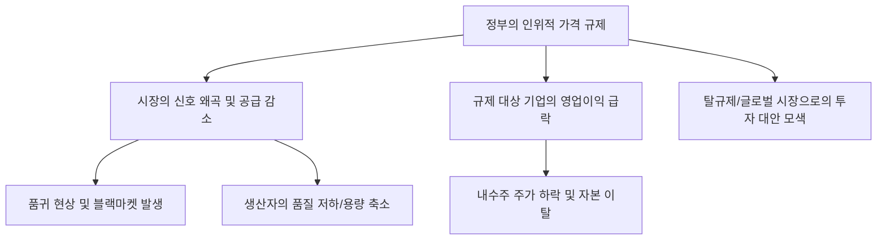

# 정책/경제학 분석: "세상에 공짜 점심은 없다"와 '가격 규제'의 역설적 부작용
## 투자 신호 + 사회적 영향 평가

---

## 📌 기사 기본 정보

- **날짜**: 2026-03-19
- **출처**: 대한민국 경제 정책 비판 및 시장 원리 분석 리포트
- **카테고리**: 경제 > 정책 > 시장원리
- **핵심 주제**: "경제에는 공짜 점심이 없다(There's no such thing as a free lunch)"라는 경제학의 금언을 중심으로, 정부의 인위적인 가격 규제와 시장 통제가 불러오는 역설적 부작용(품귀 현상, 블랙마켓 발생, 품질 저하 등)과 이에 따른 장기적 경제 손실 가능성 분석

**메타데이터**
- 주요 정책: 생필품 가격 상한제, 임대료 규제, 대출 금리 강제 인하 유도 등
- 핵심 이슈: 시장의 자율적 가격 결정 기능 훼손, 공급망 왜곡
- 주요 학설: 기회비용(Opportunity Cost), 수요-공급의 법칙(Law of Demand and Supply)
- 주요 주체: 소비자 물가 관리 팀, 시장 상인, 소상공인, 일반 가계
- 키워드: 가격 규제 부작용, 시장 통제, 공급 부족, 공짜 점심은 없다, 왜곡된 신호

---

## 🔍 기사를 통한 투자 신호 추출

### 1단계: 핵심 사건 분해

**What (무엇이 일어났는가?)**
- 정부가 치솟는 물가를 잡기 위해 가공식품, 임대료 등 특정 품목의 가격을 강제로 누르려 함. 그러나 '가격'이라는 신호가 왜곡되자 판매자는 공급을 줄이거나 품질을 낮추고, 소비자는 필요 이상의 가수요를 일으켜 오히려 시장의 혼란이 가중되는 현상이 목격됨.

**When (언제 일어났는가?)**
- 2026-03-19 (글로벌 공급망 위기로 인한 인플레이션 압력이 정부의 통제 범위를 넘어서기 시작한 시점)

**Why (왜 일어났는가?)**
- 정치적 지지율을 의식한 단기적 물가 억제 정책의 부작용
- 가격이 비용(원가)과 이윤의 반영이라는 경제적 본질을 간과한 행정 편의주의

**Who (누가 주도하는가?)**
- 전방위적 물가 단속을 벌이는 행정 당국
- 규제를 피해 가격을 올리거나 제품 용량을 줄이는(슈링크플레이션) 기업들

---

### 2단계: 투자 신호 해석

#### A. **긍정적 신호 (Bullish)**

**① 규제 범위를 넘어선 '프리미엄' 및 '수출' 섹터로의 자본 이동**
- **신호**: 정부의 가격 통제가 적용되지 않는 기호품, 명품, 수출 전용 상품 비중 확대
- **의미**: 내수용 필수재는 가격이 묶여 이익이 줄어드나, 규제 밖의 상품을 파는 기업은 시장 원리대로 높은 이익을 챙김
- **투자 기회**: 해외 매출 비중이 압도적인 식품주(K-푸드), 규제에서 자유로운 하이엔드 소비재

**② 시장 왜곡을 해결하는 '효율화 기술' 및 '유통 혁신' 기업**
- **신호**: 인위적 규제 속에서 마진을 지키기 위한 비용 절감 인프라 수요 증대
- **의미**: 가격을 못 올리면 '비용'을 줄여야 함. 이를 가능케 하는 자동화 시스템이나 직접 유통(D2C) 플랫폼의 가치 상승
- **투자 기회**: 무인 점포 솔루션 업체, 스마트 물류 자동화 전문 기술 사

---

#### B. **위험 신호 (Bearish)**

**③ '가격 통제' 대상 품목을 주력으로 하는 시가총액 상위 내수 기업의 이익 훼손**
- **신호**: "서민 물가 협조"라는 명목하의 가격 동결 압박
- **의미**: 원가는 오르는데 가격을 못 올리면 이익률이 급락하여 기업의 기초 체력이 무너짐
- **투자 리스크**: 대형 라면/제과/밀가루 식품주, 전선/가스 등 공공재 성격의 기업

**④ 임대차 규제 및 금융 규제에 따른 '에셋(Asset)' 시장의 거래 마비**
- **신호**: 전월세 상한제 및 대출 금리 상한 강제 등
- **의미**: 수익성이 담보되지 않는 자산에서 투자 자본이 이탈하며 부동산이나 금융 상품의 거래량이 급감하고 가치가 하락함
- **투자 리스크**: 주택 중심 건설주, 이자 마진이 깎이는 지방 은행

---

### 3단계: 섹터별 투자 기회 매트릭스

#### ✅ **높은 기대도 + 낮은 리스크**

**국내 규제의 영향권을 완전히 벗어난 '글로벌 경쟁력' 자산**
- 한국 정부가 통제할 수 없는 '미국 주식'이나 '글로벌 원자재 ETF'. 시장 원리가 가작 잘 작동하는 곳이 가장 안전한 투자처임
- **투자 추천도**: ⭐⭐⭐⭐⭐

---

## 💰 구체적 투자 신호 변환

### 신호 1: '착한 가격' 뒤에는 '나쁜 품질'이나 '부족한 물량'이 숨어 있다

**투자 해석**: 기사는 정부의 '선의'가 항상 '좋은 결과'로 이어지지 않음을 경제학적으로 증명함. 가격 규제가 심해질수록 해당 업종의 이익은 증발하며, 이는 주가 폭락으로 이어짐. 투자자는 지금 즉시 '가격 통제 예비 리스트'에 오른 내수주를 정리해야 함. 대신, 시장의 보이지 않는 손(수요-공급)이 정상적으로 작동하는 '글로벌 자산'이나 '탈규제 섹터'로 자본을 옮겨야 함.

---

## 🌍 사회적 영향 평가

### A. 긍정적 사회 영향
- **시장 원리의 중요성에 대한 국민적 자각**: 규제 부작용을 목격하며 가격의 자원 배분 기능에 대한 사회적 합의 및 경제 교육 효과 유발
- **지속 가능한 소비 문화로의 전환 유도**: 인위적 억제보다는 실질적인 생산성 향상을 통해 물가를 잡으려는 구조적 대안 마련의 동력 형성

### B. 부정적 사회 영향
- **'블랙마켓' 형성에 따른 사회적 부패 및 불평등**: 공식 가격은 낮으나 실질적으로는 웃돈을 주어야 살 수 있는 기형적 시장이 형성되어 법을 지키는 사람들만 피해를 보는 불공정 확산
- **서민들의 '실질적 고통' 가중**: 겉으론 가격이 싸 보이지만 정작 상점에 물건이 없거나 품질이 떨어져 실질적으로는 더 비싼 대가를 치러야 하는 '규제의 역설' 발생

---

## 🎯 결론: 당신의 투자 전략 수립

- **즉시 실행**: 가격 규제 압박을 받는 필수 소비재 섹터 비중 축소 및 규제가 미치지 않는 '수출 성장주'로 자산 리포지셔닝
- **3개월 후**: 규제 품목의 품귀 현상 데이터(재고율 추이)를 확인하여 시장 왜곡이 정점에 달했을 때의 자산 대피령 재점검

---

## 📝 Obsidian 연결 구조

