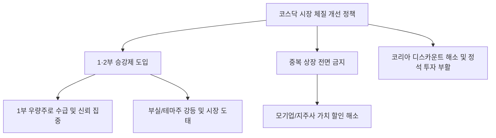

# 증권/금융 분석: 코스닥 1·2부 승강제 도입과 중복상장 금지, 자본시장 체질 개선 전략
## 투자 신호 + 사회적 영향 평가

---

## 📌 기사 기본 정보

- **날짜**: 2026-03-19
- **출처**: 대한민국 자본시장 구조 개혁 및 코스닥 활성화 정책 리포트
- **카테고리**: 경제 > 증권 > 자본시장정책
- **핵심 주제**: 코스닥 시장의 변동성을 줄이고 신뢰도를 높이기 위해 추진 중인 '1·2부 승강제(Promotion/Relegation)' 도입과 알짜 자회사의 '중복 상장(Double Listing)' 전면 금지 및 이를 통한 코리아 디스카운트 해소 방안 분석

**메타데이터**
- 주요 정책: 코스닥 시장 이원화(1부: 우량주, 2부: 벤처/성장주), 물적분할 후 중복상장 규제
- 핵심 이슈: '깜깜이' 테마주 퇴출 유도, 상장 기업의 주주 환원 책임 강화
- 주요 주체: 금융위원회, 한국거래소(KRX), 코스닥협회, 개인 및 기관 투자자
- 키워드: 코스닥 승강제, 중복상장 금지, 자본시장 체질 개선, 거버넌스 개혁

---

## 🔍 기사를 통한 투자 신호 추출

### 1단계: 핵심 사건 분해

**What (무엇이 일어났는가?)**
- 정부가 코스닥 시장을 우량 부문(1부)과 일반 부문(2부)으로 나누어 성과가 나쁜 기업을 하위 리그로 강등시키고, 모기업의 알짜 사업부를 떼어내 다시 상장하는 '중복 상장'을 막아 주주 가치를 지키겠다고 선언함. 이는 코스닥 시장을 단순 투기장이 아닌 실질적 '혁신 성장판'으로 바꾸려는 강력한 제도 개혁임.

**When (언제 일어났는가?)**
- 2026-03-19 (지속되는 코리아 디스카운트로 인한 투자자 불만이 폭발하고, 시장 정화의 필요성이 임계점에 도달한 시점)

**Why (왜 일어났는가?)**
- 무분별한 테마주 쏠림과 불투명한 거버넌스로 인해 외국인 자본이 코스닥을 기피하기 때문
- '상장사 개수'만 늘리고 '질적 성장'은 외면하는 현 시스템의 한계 돌파를 위함

**Who (누가 주도하는가?)**
- 시장 신뢰 회복을 추진하는 금융당국 및 거래소 운영 주체
- 주주 권리 보호를 요구하는 행동주의 펀드 및 개인 투자자 연대

---

### 2단계: 투자 신호 해석

#### A. **긍정적 신호 (Bullish)**

**① '1부 리그' 선정이 예상되는 코스닥 우량주의 가치 재평가**
- **신호**: 승강제 도입으로 인한 우량-부실 기업 간 차별화
- **의미**: 1부 리그에 포함된 종목은 지수 편입(Index inclusion) 및 기관 자금 유입이 가속화되어 '안정적인 우상향' 가능성 증대
- **투자 기회**: 현금 흐름이 탄탄하고 시가총액 상위권인 반도체/바이오 내 코스닥 대장주

**② 중복상장 금지로 인한 '지주사 및 모기업'의 가치 회복**
- **신호**: 핵심 자회사를 상장시키지 못하게 하는 강력한 규제 가이드라인
- **의미**: 모기업이 자회사 가치를 온전히 누리게 되어 '모회사 할인(Parent-subsidiary discount)'이 해소됨
- **투자 기회**: 알짜 비상장 자회사를 많이 보유했으나 중복 상장 우려로 저평가받던 코스닥 홀딩스 주식

---

#### B. **위험 신호 (Bearish)**

**③ '2부 리그' 강등 위기에 처한 부실 테마주 및 좀비 기업의 대량 매도**
- **신호**: 실적 미달 및 공시 불성실 기업에 대한 강등 예고
- **의미**: 2부 리그로 추락하면 시장 신뢰를 잃고 유동성이 말라 사실상 '상장 폐지 후보군'으로 인식될 리스크
- **투자 리스크**: 실적 없이 뉴스에만 춤추는 잡주, 부채율이 높고 자본 잠식 우려가 있는 중소형주

**④ 상장 요건 강화에 따른 'IPO 시장'의 일시적 위축**
- **신호**: 상장 심사 기준 상향 및 중복 상장 금지 적용
- **의미**: 일단 상장하고 보자는 식의 기업 공개가 줄어들며 증권사의 IB 수수료 수익 및 벤처 자금 회수가 일시적으로 지연됨
- **투자 리스크**: 공모주 위주의 증권주, 무분별한 상장 추진 중인 초기 단계 VC(벤처캐피탈) 자산

---

### 3단계: 섹터별 투자 기회 매트릭스

#### ✅ **높은 기대도 + 낮은 리스크**

**글로벌 경쟁력을 갖추고 '1부 리그' 안착이 확정적인 기술 대장주**
- 제도가 변할 때 가장 큰 혜택은 '기준을 압도적으로 넘는 강자'에게 돌아감. 코스닥 시장의 옥석 가리기가 끝나면 이들의 독주 체제가 굳어질 것임
- **투자 추천도**: ⭐⭐⭐⭐⭐

---

## 💰 구체적 투자 신호 변환

### 신호 1: '숫자'가 증명하지 못하는 기업은 시장에서 지워진다

**투자 해석**: 기사는 코스닥 시장이 '세력의 장난'에서 '투자의 전당'으로 바뀌는 역사적 변곡점임을 시사함. 투자자는 지금 즉시 포트폴리오에서 실적 없는 테마주를 전량 매도하고, '1부 리그' 진입 요건(이익 규모, 재무 건전성 등)을 충족하는 종목으로 비중을 옮겨야 함. 중복 상장 금지는 기업 지배구조의 선진화를 뜻하므로, 주주 친화적인 기업을 골라내는 것이 수익률의 핵심임.

---

## 🌍 사회적 영향 평가

### A. 긍정적 사회 영향
- **소액 주주 권리 보호의 획기적 전력**: 자회사 상장으로 인한 주가 희석 리스크를 원천 차단하여 개인 투자자들의 재산권을 공정하게 보호
- **자본 시장의 선순환 구조 정착**: 질 나쁜 기업이 도태되고 건실한 기업으로 자금이 흘러 들어가며 국가의 미래 성장 동력이 튼튼해지는 계기

### B. 부정적 사회 영향
- **정보 소외 계층의 손실 우려**: 승강제 도입 및 리그 강등 정보를 미리 알지 못하는 정보 취약 계층(고령자 등)이 부실주에 물려 자산 손실을 볼 위험
- **기술 벤처 기업의 자금 경색 가능성**: 상장 문턱이 너무 높아질 경우, 잠재력 있는 초기 기업들이 시장에서 자금을 조달하지 못해 성장이 정체되는 '사회적 기회 비용' 발생

---

## 🎯 결론: 당신의 투자 전략 수립

- **즉시 실행**: 코스닥 보유 종목의 최근 3개년 실적 분석 및 '2부 리그' 강등 가능 종목(순손실 지속, 공시 부실 등) 과감히 정리
- **3개월 후**: 정부의 최종 '승강제 세부 기준' 발표에 따른 1부 리그 유망주 선별 및 비중 확대

---

## 📝 Obsidian 연결 구조

