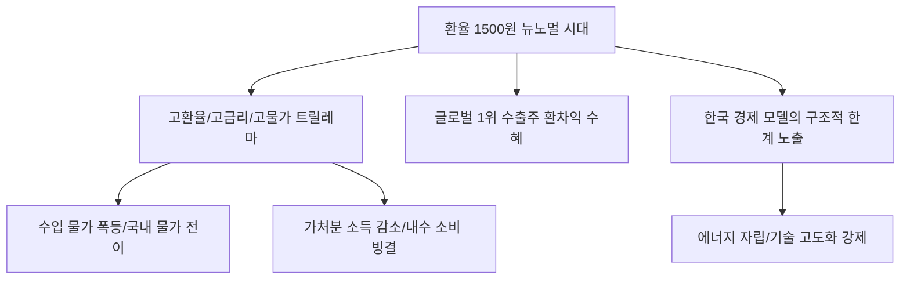

# 거시/경제 분석: 환율 1500원 '뉴노멀' 시대, 3고(高) 트릴레마의 구조적 위기
## 투자 신호 + 사회적 영향 평가

---

## 📌 기사 기본 정보

- **날짜**: 2026-03-23
- **출처**: 대한민국 거시 금융 및 외환 시장 긴급 분석 리포트
- **카테고리**: 경제 > 거시금융 > 환율/물가
- **핵심 주제**: 원/달러 환율 1,500원 선이 일시적 충격이 아닌 일상이 되는 '뉴노멀(New Normal)'의 도래와, 고환율·고금리·고물가라는 '3고(高) 트릴레마' 속에서 한국 경제가 직면한 전례 없는 구조적 위기 및 대응 전략 분석

**메타데이터**
- 주요 지계: 원/달러 환율 1,500원 돌파, 국제 유가 $100+ 상시화
- 핵심 쟁점: 수입 물가 폭등 → 국내 물가 상승 → 금리 인하 불가능 (Stagflation Risk)
- 주요 주체: 한국은행(BOK), 기획재정부, 에너지 수량 수입 기업, 일반 가계
- 키워드: 환율 1500원 시대, 뉴노멀, 트릴레마(Trilemma), 에너지 안보, 원화 약세 고착화

---

## 🔍 기사를 통한 투자 신호 추출

### 1단계: 핵심 사건 분해

**What (무엇이 일어났는가?)**
- 심리적 마지노선이었던 1,500원 환율이 일주일 넘게 유지되며 시장의 인식이 "떨어질 것"에서 "안 내려갈 것"으로 변화함. 에너지 가격 폭등과 달러 강세가 결합하며 한국의 경상수지를 압박하고, 통화 정책의 자율성이 완전히 상실된 '외통수' 상황에 직면.

**When (언제 일어났는가?)**
- 2026-03-23 (지정학적 리스크가 유가를 밀어 올리고, 미 연준의 매파적 태도가 원화 가치를 끌어내리는 정점에서 발생)

**Why (왜 일어났는가?)**
- 공급망 전쟁으로 인한 무역 구조의 변화 (대중국 흑자 시대 종말)
- 미국 경제의 나홀로 호황과 한국 경제의 기초 체력(재정 건전성, 인구 절벽) 약화
- 에너지 수입 의존도가 절대적인 한국형 경제 모델의 고유가 취약성 노출

**Who (누가 주도하는가?)**
- 금리를 올려 환율을 방어할지, 내려서 경기를 살릴지 고민하는 한국은행 금융통화위
- 환율 헤지에 실패하여 도산 위기에 처한 중소 수출입 기업들

---

### 2단계: 투자 신호 해석

#### A. **긍정적 신호 (Bullish)**

**① '달러 표시' 이익 비중이 90% 이상인 글로벌 수출 대장주**
- **신호**: 환율 1,500원 고착화에 따른 환차익의 극대화
- **의미**: 생산 기반은 자동화되어 한국에 있으나 매출이 달러로 발생하는 기업은 앉아서 돈을 버는 '어닝 서프라이즈' 구간 진입
- **투자 기회**: 북미 점유율 1위 자동차/에너지 기업, 글로벌 무대에서 달러로 결제받는 K-방산/K-조선

**② 해외 자산 보유량이 압도적인 '무국적 지주사' 및 투자사**
- **신호**: 원화 자산 가치는 떨어지는데 보유한 외화 자산 가치는 폭등
- **의미**: 자산 재평가를 통해 장부상 가치가 급등하며 배당 여력 확대
- **투자 기회**: 미국 빅테크 지분을 다량 보유한 국내 지주사, 글로벌 사모펀드 운용사

---

#### B. **위험 신호 (Bearish)**

**③ 에너지·원자재 수입 비중이 높고 '내수 판매' 위주인 기업의 줄도산**
- **신호**: 고환율(수입가 상승) + 고유가(원가 상승)의 이중고
- **의미**: 원가는 올랐는데 소비 절벽으로 가격 인상을 못 하는 기업은 이익이 순식간에 증발함
- **투자 리스크**: 정유/화학(단순 정제마진 의존 사), 대형 식품가공주, 수입 내구재 유통사

**④ 부동산 리츠 및 '고레버리지' 건설 섹터의 자금 마비**
- **신호**: 환율 방어를 위해 금리를 내릴 수 없는 환경의 지속
- **의미**: 이자 부담을 못 이겨 자산 매각이 잇따르고, 신규 PF 대출이 사실상 중단됨
- **투자 리스크**: 부채 비율이 높은 부동산 리츠, 주택 비중이 높은 건설사

---

### 3단계: 섹터별 투자 기회 매트릭스

#### ✅ **높은 기대도 + 낮은 리스크**

**국내보다 '글로벌 경쟁력'이 확인된 '에너지 효율/신재생' 솔루션**
- 유가가 오를수록 이들의 기술은 더 빨리 채택됨. 고환율 시대에는 이런 '에너지 절감 기술' 자체가 금보다 귀한 자원이 됨
- **투자 추천도**: ⭐⭐⭐⭐

---

## 💰 구체적 투자 신호 변환

### 신호 1: '원화'의 시대는 저물고 '안보 자산'만 살아남는다

**투자 해석**: 기사는 한국 경제가 '3고'라는 지독한 함정에 빠졌음을 시사함. 1,500원 환율은 국가 신인도의 경고등임. 투자자는 지금 즉시 '원화 현금' 보유를 최소화하고, 모든 자산의 기준 통화를 '달러'로 바꿔야 함. 또한 단순히 수출을 많이 하는 기업이 아니라, '환율 변동을 무기로 쓸 수 있는 글로벌 1등'에게만 집중 투자해야 함. 한국 내수 전용 주식은 소외될 가능성이 매우 높음.

---

## 🌍 사회적 영향 평가

### A. 긍정적 사회 영향
- **산업 구조의 강제적 고도화**: 에너지 수입 비용을 줄이기 위한 국가적 에너지 자립(원전, 재생에너지) 및 에너지 효율 기술의 비약적 발전 계기
- **수출 기업의 현지화 가속**: 관세와 환율 장벽을 넘기 위해 글로벌 현지 생산 기지를 구축하며 진정한 다국적 기업으로 성장

### B. 부정적 사회 영향
- **전 국민적 실질 소득 감소 및 극심한 물가 고통**: 수입 물가 폭등으로 인해 밥상 물가가 통제 불능이 되며 서민과 취약 계층의 삶의 질 급락
- **사회적 갈등의 격화**: 금리를 올려 환율을 잡으라는 요구(자산가/수입업자)와 내려서 대출 이자를 줄여달라는 요구(서민/대출자)가 충돌하며 극심한 국론 분열

---

## 🎯 결론: 당신의 투자 전략 수립

- **즉시 실행**: 원화 표시 예산에서 달러 표시 자산으로의 대대적 시프트(Shift) 및 에너지 수입 노출도가 큰 업종 전량 매도
- **3개월 후**: 한국은행의 기준금리 결정 방향과 경상수지 흑자 전환 여부에 따른 '원화 가치' 회복 가능성 재산정

---

## 📝 Obsidian 연결 구조

