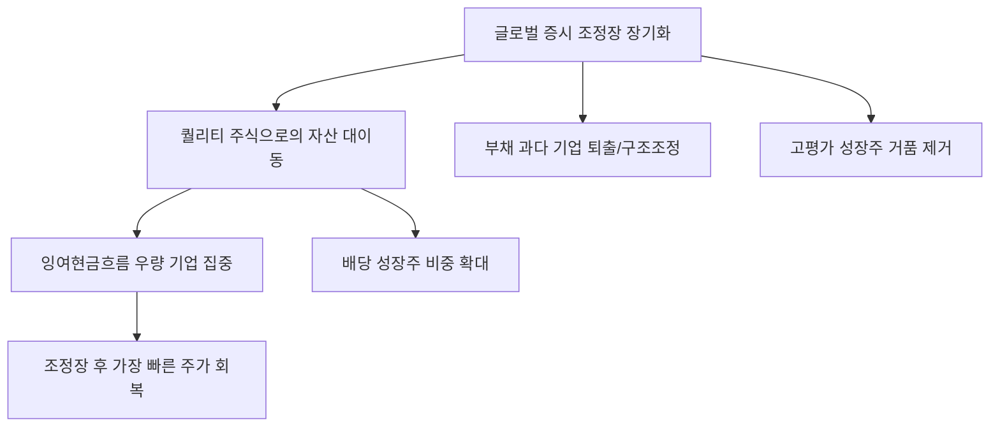

# 금융/투자 분석: 조정장을 이기는 월가 4인의 '버티는 주식' 포트폴리오 처방
## 투자 신호 + 사회적 영향 평가

---

## 📌 기사 기본 정보

- **날짜**: 2026-03-23
- **출처**: 월스트리트 투자 전문가 긴급 인터뷰 및 포트폴리오 분석
- **카테고리**: 경제 > 금융투자 > 투자전략
- **핵심 주제**: 글로벌 증시 조정장이 길어지는 국면에서, 월가의 전설적 투자자 4인이 제시하는 '버티는 힘(Resilience)'이 있는 주식 선별법과 하락장에서 살아남아 다음 상승장을 주도할 생존 포트폴리오 전략 분석

**메타데이터**
- 주요 전략: 퀄리티 주식(Quality Stock) 집중, 현금 비중 25% 확보, 배당 성장주 편입
- 핵심 섹터: 헬스케어, 필수 소비재, 현금 흐름 우량 테크주
- 주요 주체: 월가 대표 구루 4인 (가치투자자, 성장주 전문가, 매크로 전략가 등)
- 키워드: 조정장 생존법, 퀄리티 투자, 잉여현금흐름(FCF), 회복탄력성

---

## 🔍 기사를 통한 투자 신호 추출

### 1단계: 핵심 사건 분해

**What (무엇이 일어났는가?)**
- 금리 불확실성과 경기 둔화 우려로 증시가 변동성 구간에 진입하자, 월가의 거목들이 '공격' 대신 '수비'를 강화하는 포트폴리오 처방전 제시. 단순히 안 오르는 주식을 사는 것이 아니라, 하락을 견디고 나아가 지수보다 먼저 회복할 수 있는 '근육질 주식'으로의 전면 교체 강조.

**When (언제 일어났는가?)**
- 2026-03-23 (지수 하락이 일시적 조정이 아닌 '추세 전환'의 전조가 아닐까 하는 공포가 시장을 지배하던 시점)

**Why (왜 일어났는가?)**
- 자본의 비용(금리)이 높아진 시대에는 부채가 많고 꿈(Hope)만 큰 기업은 생존이 불가능하기 때문
- 조정장은 옥석 가리기의 가장 좋은 기회이며, 이때 잡은 우량주는 다음 10년의 수익률을 결정하기 때문

**Who (누가 주도하는가?)**
- 장기 수익률로 검증된 월가의 펀드 매니저 및 자산 배분 전략가 4인

---

### 2단계: 투자 신호 해석

#### A. **긍정적 신호 (Bullish)**

**① '잉여현금흐름(FCF)'이 폭발하는 기업의 절대적 안전판**
- **신호**: 월가 구루들이 공통으로 꼽은 제1 원칙 '현금 창출 능력'
- **의미**: 배당을 주고도 돈이 남는 기업은 하락장에서 자사주 소각 등을 통해 주가를 방어할 수 있음
- **투자 기회**: 현금 보유액이 사상 최고치인 빅테크, 현금 흐름이 꾸준한 필수 소비재 대장주

**② 인플레이션 방어력이 입증된 '정가(Pricing Power)' 보유 기업**
- **신호**: 원가 상승분을 소비자에게 전가해도 수요가 줄지 않는 독점적 지위
- **의미**: 물가가 올라도 이익률(Margin)을 지키는 기업은 조정장 이후 시가 총액 상위권 점유율 확대
- **투자 기회**: 글로벌 럭셔리 브랜드, 독점적 특허를 보유한 제약/바이오 기업

---

#### B. **위험 신호 (Bearish)**

**③ '성장 정체'가 확인된 고평가 기술주의 가파른 밸류에이션 하향**
- **신호**: 매출 성장 가이던스가 아주 조금이라도 꺾이는 성장주
- **의미**: 조정장에서는 '미래 가치'에 대한 관용이 사라지며 주가가 토막 날 수 있음
- **투자 리스크**: PER 100배가 넘으면서 실적은 아직 적자인 '꿈나무' 기업들

**④ 부채 상환 압박이 큰 '레버리지 과다' 좀비 기업의 퇴출**
- **신호**: 고금리가 안정적 뉴노멀로 자리 잡는 현상
- **의미**: 저금리 시대에 빚으로 연명하던 기업들은 이번 조정장에서 청산되거나 헐값에 인수될 것임
- **투자 리스크**: 부채비율이 업종 평균보다 현저히 높은 건설/유통 관련주

---

### 3단계: 섹터별 투자 기회 매트릭스

#### ✅ **높은 기대도 + 낮은 리스크**

**글로벌 노령화 수혜를 입는 '배당 주는 헬스케어'**
- 경기가 나빠도 약은 먹어야 하고, 고령화는 멈출 수 없는 대세임. 게다가 이들은 안정적 배당까지 주므로 하락장의 최고의 도피처임
- **투자 추천도**: ⭐⭐⭐⭐⭐

---

## 💰 구체적 투자 신호 변환

### 신호 1: '속도'보다 '체력'이 수익률을 결정하는 구간

**투자 해석**: 기사는 지금이 화려한 수익률을 쫓을 때가 아니라, 무너지지 않는 포트폴리오를 짜야 할 때임을 시사함. 월가 전문가 4인이 공통으로 강조하는 것은 '퀄리티(Quality)'임. 투자자는 지금 당장 자신의 포트폴리오에서 '이자보상배율'이 낮은 기업을 골라내고, 그 자리를 '현금 흐름'이 완벽한 1등주로 채워야 함. 조정장은 끝이 아니라, 승자를 바꾸는 '선수 교체'의 시간임.

---

## 🌍 사회적 영향 평가

### A. 긍정적 사회 영향
- **건전한 투자 문화 정착**: 단기 투기보다는 기업의 펀더멘컬을 중시하는 장기 가치 투자의 가치 확산
- **산업 구조 고도화**: 경쟁력 없는 좀비 기업들이 자본 시장에서 걸러지며 국가 경제 전체의 생산성 향상 기여

### B. 부정적 사회 영향
- **부의 양극화 가속**: 하락장에서 버틸 수 있는 자본가들은 우량 자산을 줍고, 여유가 없는 개인들은 손실을 보고 시장을 떠나는 '부의 비대칭적 이동' 심화
- **혁신 동력 위축 우려**: 자본이 안전 자산과 기성 대기업으로만 쏠리면서, 세상을 바꿀 도전적 스타트업들의 자본 줄이 마르는 사회적 기회 비용 발생

---

## 🎯 결론: 당신의 투자 전략 수립

- **즉시 실행**: 보유 종목의 잉여현금흐름(FCF) 전수 조사 및 하위 20% 종목을 배당 성장주로 교체 매매
- **3개월 후**: 조정장의 바닥 신호(공포 지수 하락) 확인 후, 살아남은 우량주 중 낙폭 과대주 위주로 비중 확대

---

## 📝 Obsidian 연결 구조

