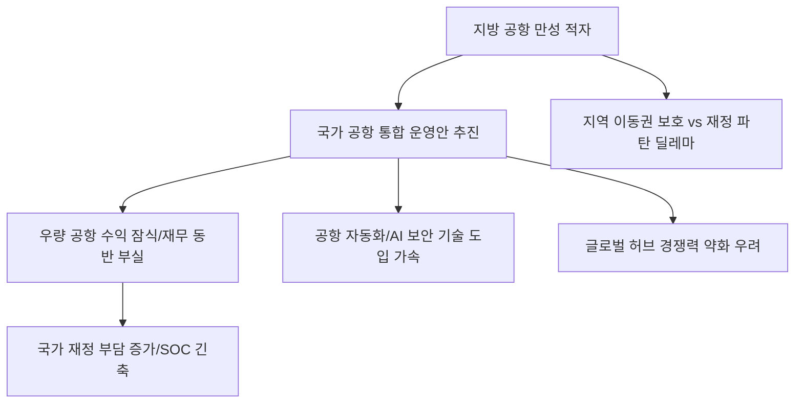

# 공공/인프라 분석: 국가 공항 '통합안'의 위험한 도박과 재무적 임계점
## 투자 신호 + 사회적 영향 평가

---

## 📌 기사 기본 정보

- **날짜**: 2026-03-25
- **출처**: 대한민국 국가기간 인프라 재정 및 정책 분석 리포트
- **카테고리**: 경제 > 공공기관 > 인프라/건설
- **핵심 주제**: 지방 공항 적자 해소 및 효율성 제고를 위해 추진 중인 '국가 공항 통합 운영안'이 불러올 재무적 동반 부실 위험과, 수요 예측 실패를 무시한 무리한 인프라 확장이 국가 재정의 임계점을 넘어서고 있다는 비판 분석

**메타데이터**
- 주요 정책: 전국 지방 공항 통합 운영 및 지배구조 개편안
- 핵심 리스크: 인천공항 등 흑자 공항의 수익을 적자 공항 보전에 쏟아붓는 '재무적 하향 평준화'
- 주요 수치: 전국 15개 공항 중 10개 이상 만성 적자, 통합 시 예상 부채 비율 상승
- 주요 주체: 국토교통부, 한국공항공사, 인천국제공항공사, 지자체
- 키워드: 공항 통합, 재무적 임계점, 수요 예측 오류, 인프라 포퓰리즘

---

## 🔍 기사를 통한 투자 신호 추출

### 1단계: 핵심 사건 분해

**What (무엇이 일어났는가?)**
- 정부가 만성 적자에 시달리는 지방 공항들을 살리기 위해 인천국제공항공사 등 우량 공공기관의 수익을 공유하고 운영권을 통합하는 방안을 추진. 그러나 이는 우량 공공기관의 투자 여력을 갉아먹고, 국가 전체의 항공 경쟁력을 약화시킬 수 있는 '재정적 폭탄 돌리기'라는 우려 확산.

**When (언제 일어났는가?)**
- 2026-03-25 (신공항 건설 등 대규모 토목 사업 예산이 추가되면서 기존 공항 공공기관들의 재정 건전성 지표가 위험 수위에 도달한 시점)

**Why (왜 일어났는가?)**
- 표심을 의식한 지역별 공항 건설 경쟁(포퓰리즘)의 결과물인 적자를 가리기 위한 정책적 꼼수
- 개별 공항으로는 자생이 불가능한 한계 상황 도달

**Who (누가 주도하는가?)**
- 통합을 통해 적자를 희석하려는 국토부 및 정치권
- 글로벌 경쟁력 하락을 우려하며 독자 운영을 고수하려는 우량 공항 운영 주체들

---

### 2단계: 투자 신호 해석

#### A. **긍정적 신호 (Bullish)**

**① '공항 주변 부지 개발' 및 '배후 도시 건설' 관련 특수**
- **신호**: 통합 운영의 전제조건으로 제시되는 거점 공항 주변의 대규모 상업/물류 개발
- **의미**: 공항 본연의 수익보다는 '부동산 및 도시 인프라' 개발권이 핵심 이익원이 됨
- **투자 기회**: 공항 배후 단지 토지 보유 건설사, 물류 센터 자동화 솔루션 기업

**② '스마트 공항 솔루션' 및 'UAM(도심항공교통)' 인프라 시장 확대**
- **신호**: 적자 공항의 무인화·지능화를 통한 비용 절감 시도
- **의미**: 사람이 없는 효율적인 공항을 만들기 위한 AI 보안, 자율주행 셔틀 등의 기술 도입 가속화
- **투자 기회**: UAM 수직 이착륙장(Vertiport) 기술 보유사, 공항 보안 AI 전문사

---

#### B. **위험 신호 (Bearish)**

**③ 우량 공항 운영사의 '신용등급 하락' 및 '배당 감소'**
- **신호**: 적자 공유로 인한 인천공항공사 등 우량 기관의 재무 지표 악화
- **의미**: 주식 시장에 상장된 공공 인프라 관련주나 채권의 매력도 급감
- **투자 리스크**: 공공 인프라 펀드, 항공 관련 공기업 채권 비중이 높은 자산운용사

**④ 국가 부채 증가에 따른 'SOC 예산 긴축' 도미노**
- **신호**: 공항 통합 후에도 적자가 해결되지 않고 국가 예산 지원 규모가 커지는 상황
- **의미**: 공항에 돈이 묶이면서 다른 필수 인프라(철도, 도로 등) 예산이 삭감됨
- **투자 리스크**: 전통적인 국내 토목/SOC 건설 섹터 대형주

---

### 3단계: 섹터별 투자 기회 매트릭스

#### ✅ **높은 기대도 + 낮은 리스크**

**국내보다 '해외 공항 수주' 비중이 높은 엔지니어링 기업**
- 국내는 포화와 적자로 신규 발주 마진이 박하지만, 쌓아온 기술력을 바탕으로 해외 공항 운영/건설권을 따내는 기업은 안전함
- **투자 추천도**: ⭐⭐⭐

---

## 💰 구체적 투자 신호 변환

### 신호 1: '밑 빠진 독'에 붓는 물은 결국 세금이다

**투자 해석**: 기사는 한국 공항 인프라가 '경제 논리'가 아닌 '정치 논리'로 돌아가고 있음을 폭로함. 통합 운영은 근본 해결책이 아닌 '시간 끌기'일 뿐임. 투자자는 국내 공항 인프라와 관련된 채권이나 수익 증권에서 비중을 줄여야 함. 대신, 적자를 극복하기 위해 강제 도입될 '무인화/자동화 기술' 전문 섹터에서 기회를 찾아야 함. 인프라가 부실해질수록 관리 효율화 기술의 가치는 올라감.

---

## 🌍 사회적 영향 평가

### A. 긍정적 사회 영향
- **지역 간 이동 편의성 유지**: 적자에도 불구하고 지방 공항을 유지함으로써 지방 소멸 방어 및 지역 주민의 이동 기본권 보호
- **항공 산업 생태계 통합**: 전국 공항 데이터의 통합 관리를 통해 항공 경로 최적화 및 운영 효율 개선의 발판 마련

### B. 부정적 사회 영향
- **미래 세대의 재정 부담 전가**: 오늘 억지로 유지하는 적자 공항의 빚은 결국 미래 세대가 갚아야 할 세금으로 남음
- **국가 관문 공항의 경쟁력 약화**: 인천공항 등 세계적 허브 공항의 수익이 지방 보전에 쓰이면서, 싱가포르·홍콩 등 경쟁 공항과의 시설 투자 경쟁에서 뒤처지는 사회적 손실 발생

---

## 🎯 결론: 당신의 투자 전략 수립

- **즉시 실행**: 공공 인프라 관련 펀드의 국내 비중 축소 및 '스마트 공항 기술' 수출 기업으로 포트폴리오 스위칭
- **3개월 후**: 정부의 최종 '공항 통합 로드맵' 발표 및 이에 따른 인천공항 등 우량 기관의 신용 등급 변동 추이 확인

---

## 📝 Obsidian 연결 구조

