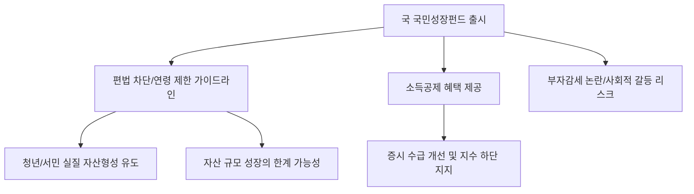

# 금융/정책 분석: '국민성장펀드' 편법 차단과 가입 연령 제한, 소득공제 혜택의 실효성
## 투자 신호 + 사회적 영향 평가

---

## 📌 기사 기본 정보

- **날짜**: 2026-03-25
- **출처**: 대한민국 거시 금융 정책 및 서민 금융 지원 리포트
- **카테고리**: 경제 > 금융 > 정책상품
- **핵심 주제**: 정부가 야심 차게 준비한 '국민성장펀드'의 출시를 앞두고 제기된 고소득자들의 편법 가입 우려를 차단하기 위한 가입 연령 제한(청년·중장년 집중) 검토 내용과 실질적인 소득공제 혜택 및 운용 구조 분석

**메타데이터**
- 주요 상품: 국민성장펀드 (가칭, 국가 전략 산업 투자 및 수익 배분 펀드)
- 핵심 혜택: 소득공제(최대 XX%), 정부 매칭 지원 가능성
- 주요 규제: 편법 증여 차단(부모-자녀 우회 가입), 가입 연령 상한선 검토
- 주요 주체: 금융위원회, 기획재정부, 일반 국민(청년층 주타겟)
- 키워드: 국민성장펀드, 소득공제 혜택, 편법 가입 방지, 세제 혜택 딜레마

---

## 🔍 기사를 통한 투자 신호 추출

### 1단계: 핵심 사건 분해

**What (무엇이 일어났는가?)**
- 정부가 증시 부양과 국민 자산 형성을 위해 내놓은 '국민성장펀드'가 당초 취지와 달리 고자산가들의 자녀 증여 수단이나 '부자 감세'로 이용될 수 있다는 우려가 제기됨. 이에 정부는 가입 대상을 특정 연령층(예: 19~45세)으로 제한하거나, 가구소득 기준을 강화하는 '핀셋 규제'를 검토 중임.

**When (언제 일어났는가?)**
- 2026-03-25 (펀드 출시 일정이 확정되고 세부 가이던스가 나오며 정치권의 '부자 감세' 공방이 가열된 시점)

**Why (왜 일어났는가?)**
- 과거 '청년희망적금' 등의 수혜가 금수저 청년들에게 돌아갔던 학습 효과 때문
- 세금 혜택(소득공제)을 통해 자산 형성을 돕겠다는 정책이 '세수 부족' 상황에서 정당성을 얻어야 하기 때문

**Who (누가 주도하는가?)**
- 대중적 지지를 얻으려는 정부 정책당국
- 혜택의 사각지대와 형평성을 감시하려는 예산 감시 단체 및 야당

---

### 2단계: 투자 신호 해석

#### A. **긍정적 신호 (Bullish)**

**① '정부 공인' 유동성의 증시 유입 (수급 호재)**
- **신호**: 국민성장펀드를 통한 조 단위 자금의 국내 우량주 투자 
- **의미**: 연기금 외에 강력한 '롱(Long) 자금'이 들어옴으로써 지수 하단을 지지하는 효과 발생
- **투자 기회**: 펀드 편입 1순위인 '국가 전략 산업(반도체, AI, 2차전지)' 분야 대장주

**② 청년 및 서민층의 '확실한 확정 수익률' 확보**
- **신호**: 소득공제 혜택과 정부 보조금이 결합된 하이브리드 구조
- **의미**: 시장 수익률보다 높은 '정책 프리미엄'을 챙길 수 있는 무위험 가계 자산 증가
- **투자 기회**: 펀드 운용을 맡게 될 대형 자산운용사의 운용 보수 수익 및 관련 상품 포트폴리오 다양화

---

#### B. **위험 신호 (Bearish)**

**③ '가입 제한'에 따른 시장 볼륨(Scale)의 한계**
- **신호**: 연령 및 소득 제한으로 인한 잠재적 투자금의 축소
- **의미**: 증시를 끌어올리기엔 자금력이 부족한 '푼돈 펀드'로 전락할 가능성
- **투자 리스크**: 펀드 수혜를 기대하고 미리 주가를 올렸던 관련 테마주

**④ 운용 지침의 경직성에 따른 '저수익률' 리스크**
- **신호**: 정치적 외풍에 흔들리는 종목 선택(배분) 가능성
- **의미**: 수익성이 아닌 '정부 입맛'에 맞는 기업들에 투자하여 시장 평준화 수익률을 밑돌 위험
- **투자 리스크**: 펀드의 주요 편입 예상 종목 중 거버넌스가 불투명한 정책 관련 기업

---

### 3단계: 섹터별 투자 기회 매트릭스

#### ✅ **높은 기대도 + 낮은 리스크**

**국민성장펀드의 벤치마크(BM)가 될 '코리아 밸류업 지수' 관련주**
- 펀드는 정책 성격상 '저평가 우량주'를 집중 매수할 수밖에 없음. 이 기준에 부합하는 주주 환원 우수 기업이 가장 안전함
- **투자 추천도**: ⭐⭐⭐⭐

---

## 💰 구체적 투자 신호 변환

### 신호 1: '공짜 점심'은 자격이 되는 자만의 몫이다

**투자 해석**: 기사는 국민성장펀드가 단순한 투자 상품이 아니라 '자산 재분배'의 성격이 짙음을 보여줌. 투자자는 자신이 가입 대상이 되는지 즉각 확인하고, 가입이 안 된다면 펀드가 매수할 종목(반도체, 바이오 대형주)을 선점하는 '프런트 러닝(Front-running)' 전략을 구사해야 함. 정부가 소득공제라는 미끼를 던졌다는 것은, 그만큼 '국내 증시 하방'을 막겠다는 의지가 강력하다는 뜻임.

---

## 🌍 사회적 영향 평가

### A. 긍정적 사회 영향
- **청년 세대의 자산 형성 기반 마련**: 고금리와 고물가 속에서 청년층이 종잣돈(Seed Money)을 모을 수 있도록 국가가 실질적인 인센티브 제공
- **자본 시장의 건전성 제고**: 단기 단타 위주의 개인 자금을 장기 펀드 자금으로 유도하여 증시의 변동성을 줄이고 장기 투자의 중요성 확산

### B. 부정적 사회 영향
- **세대 간 갈등 및 역차별 논란**: 연령 제한으로 인해 혜택에서 소외된 50~60대 은퇴 예정 세대와의 형평성 문제 및 '역차별' 사회적 비용 발생
- **세수 부족과 재정 건전성 압박**: 과도한 소득공제 혜택이 국가 세수 부족을 가속화하여 장기적으로 다른 공공 서비스의 질을 낮출 수 있는 잠재적 위험

---

## 🎯 결론: 당신의 투자 전략 수립

- **즉시 실행**: 펀드 가입 조건(연령, 소득) 실시간 모니터링 및 본인 기준 부합 시 가입 준비, 불부합 시 편입 예상 종목(K-Value Up 지수주) 지수 추종 매수
- **3개월 후**: 펀드 가입 속도와 시중 자금 유입 데이터 확인 및 정부의 '사후 관리(Exit 전략)' 방침 점검

---

## 📝 Obsidian 연결 구조

