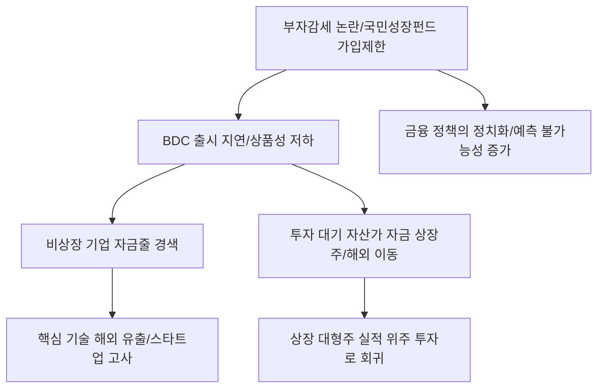

# 금융/시장 분석: '국민성장펀드' 가입 제한과 BDC 출시 빨간불, '부자감세' 논란의 본질
## 투자 신호 + 사회적 영향 평가

---

## 📌 기사 기본 정보

- **날짜**: 2026-03-25
- **출처**: 대한민국 자본시장 규제 및 벤처 투자 동향 리포트
- **카테고리**: 경제 > 금융 > 증시/벤처
- **핵심 주제**: 국민성장펀드의 가입 대상 제한 검토가 불러온 기업성장집합투자기구(BDC) 출시 지연 우려와, 세제 혜택을 둘러싼 '부자감세' 프레임이 혁신 벤처 자금 공급에 미치는 부정적 영향 분석

**메타데이터**
- 주요 제도: BDC (Business Development Company, 비상장 기업 투자 상장 펀드)
- 핵심 논란: 고소득자 혜택 배제 시 '큰손' 실종 가능성, BDC 상품성 약화
- 주요 주체: 금융위원회, 자산운용업계, 혁신 벤처기업, 정치권
- 관련 변수: 소득공제 한도, 비상장 주식 양도세 감면 여부, 상장 일정
- 키워드: BDC 출시 지연, 부자감세 논란, 모험 자본 위축, 국민성장펀드 연동

---

## 🔍 기사를 통한 투자 신호 추출

### 1단계: 핵심 사건 분해

**What (무엇이 일어났는가?)**
- 정부가 '국민성장펀드'의 형평성을 맞추기 위해 가입 대상을 제한하자, 이 펀드와 연계되어 시너지를 내야 할 'BDC(기업성장집합투자기구)'의 흥행에도 빨간불이 켜짐. 자산가들의 자금이 들어와야 비상장 벤처 기업에 대규모 자금 공급이 가능한데, '부자감세' 논란에 갇혀 혜택이 축소되면서 제도 자체가 동력을 잃고 있음.

**When (언제 일어났는가?)**
- 2026-03-25 (비상장 투자의 대중화를 선언했던 BDC 법안 통과 이후 실제 상품 출시를 앞두고 규제 노이즈가 최고조에 달한 시점)

**Why (왜 일어났는가?)**
- '혁신'보다는 '배분'을 강조하는 정치적 압박으로 인해 투자 인센티브(세제 혜택)가 약화되었기 때문
- 비상장 투자의 높은 리스크를 감당할 수 있는 것은 역설적으로 고자산가들인데, 이들을 '적패'로 몰아 세부 지침이 꼬여버림

**Who (누가 주도하는가?)**
- 혜택 축소를 주장하는 정치권과 시민단체
- 상품성 저하로 인해 BDC 출시를 주저하게 된 대형 증권사 및 운용사

---

### 2단계: 투자 신호 해석

#### A. **긍정적 신호 (Bullish)**

**① '공모주(IPO)' 시장의 상대적 수혜 및 수급 집중**
- **신호**: 비상장 직접 투자(BDC) 시장의 위축 
- **의미**: 비상장 주식을 간접적으로 살 경로가 막히면서, 자산가들의 자금이 다시 '공모주 청약'이나 '기존 상장 대형주'로 회귀
- **투자 기회**: IPO 주관 실적이 우수한 대형 증권사, 상장을 앞둔 기업의 구주 매출 지분을 보유한 VC(벤처캐피털) 상장주

**② 정책 보완을 위한 '정부 직접 투자' 확대 가능성**
- **신호**: 민간 자금이 안 들어온다는 비판에 따른 '모태펀드' 증액 
- **의미**: 정부가 직접 돈을 풀면서 특정 전략 섹터(반도체, AI)의 소부장 기업들에게 자금 지원이 강화됨
- **투자 기회**: 정부 보조금 수혜가 확정적인 국가 전략 기술 인증 기업

---

#### B. **위험 신호 (Bearish)**

**③ '비상장 유니콘'들의 상장 전 자금난(Death Valley) 심화**
- **신호**: BDC를 통한 대규모 모험 자본 유입 무산 우려
- **의미**: 상장을 앞두고 대규모 자금 수혈이 필요한 스타트업들이 파산하거나 헐값에 매각될 리스크 증가
- **투자 리스크**: 비상장 지분 가치가 높은 지주사, 프리(Pre)-IPO 단계의 지분을 많이 보유한 투자사

**④ 국내 금융 산업의 '혁신 동력 상실' 및 제도 낙후**
- **신호**: 선진국형 투자 수단(BDC)의 도입 실패 혹은 변질
- **의미**: 한국 자본 시장의 매력이 떨어지며 글로벌 시장 대비 '저평가(Discount)'가 고착화됨
- **투자 리스크**: 증권주 전반(위탁 매매 수수료 외의 IB 수익성 악화)

---

### 3단계: 섹터별 투자 기회 매트릭스

#### ✅ **높은 기대도 + 낮은 리스크**

**이미 수익권에 진입한 '상장 벤처캐피탈(VC)' 우량주**
- 신규 BDC 마진은 줄어도, 기존에 투자한 기업들이 상장(IPO)하며 내는 수익은 변함없음. 제도의 혼란기에 오히려 실적이 검증된 상장 VC가 안전함
- **투자 추천도**: ⭐⭐⭐

---

## 💰 구체적 투자 신호 변환

### 신호 1: '평등'이 앞서면 '성장'의 엔진은 멈춘다

**투자 해석**: 기사는 한국 금융 정책이 '정치 논리'에 갇혀 혁신 자본 공급이라는 본질을 놓치고 있음을 경고함. BDC의 위기는 곧 비상장 시장의 '겨울'이 길어질 것임을 의미함. 투자자는 지금 비상장 주식이나 이를 기반으로 하는 펀드 투자를 지양해야 함. 대신, 제도의 불확실성이 해소되기 전까지는 유동성이 풍부한 코스피 200 내 대형 수출주로 자산을 피신시켜 '정책 리스크'를 회피해야 함.

---

## 🌍 사회적 영향 평가

### A. 긍정적 사회 영향
- **조세 형평성 강화**: 고소득자에게 과도한 혜택이 집중되는 것을 막아 사회적 통합을 꾀하고 '특혜 논란'을 사전에 방지
- **투자의 대중화 유도**: 소액 투자자(개미)들도 비상장 기업 성장의 과실을 나눌 수 있도록 상품 구조를 재설계하는 계기 마련

### B. 부정적 사회 영향
- **국가 혁신 성장 잠재력 고사**: 유망 벤처 기업들이 자금을 구하지 못해 해외로 기술을 매각하거나 폐업하며 국가 미래 먹거리 상실
- **금융 규제의 불확실성 증폭**: '넣었다 뺐다' 하는 정책 변화로 인해 금융 시장의 예측 가능성이 사라지고, 똑똑한 자본이 해외(나스닥 등)로 영구 이탈

---

## 🎯 결론: 당신의 투자 전략 수립

- **즉시 실행**: 포트폴리오 내 비상장 비중이나 VC 섹터 지분 축소 및 IPO 시장 대어들의 상장 일정 재점검
- **3개월 후**: BDC 최종 가이드라인 확정안 발표 여부 확인 및 운용사들의 '출시 포기' 혹은 '규모 축소' 동향 파악

---

## 📝 Obsidian 연결 구조

