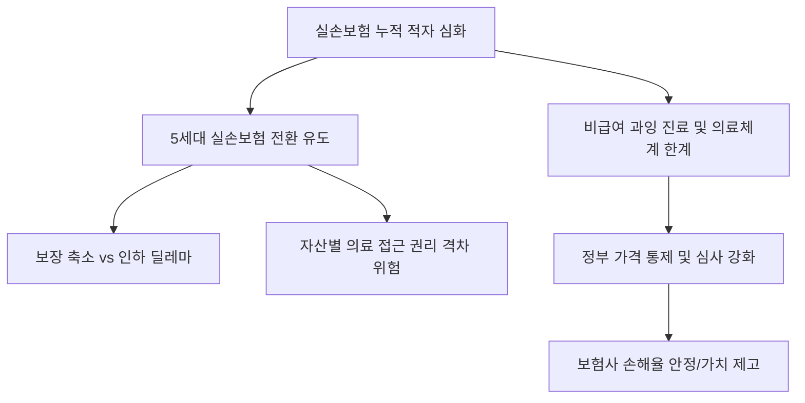

# 금융/사회 분석: 5세대 실손보험 전환 딜레마와 '비급여' 의료 체계의 구조적 한계
## 투자 신호 + 사회적 영향 평가

---

## 📌 기사 기본 정보

- **날짜**: 2026-03-25
- **출처**: 대한민국 보험 정책 및 의료비 지출 구조 분석 리포트
- **카테고리**: 경제 > 금융 > 보험/의료
- **핵심 주제**: 1~4세대 실손보험의 누적된 적자 해소를 위해 추진 중인 '5세대 실손보험'으로의 전환 유도와, 이를 가로막는 기존 가입자들의 전환 딜레마 및 비급여 의료비 폭등을 통제하지 못하는 의료 시스템의 구조적 한계 분석

**메타데이터**
- 주요 정책: 5세대 실손보험 도입(보험료 인하 vs 보장 축소), 전환 할인 혜택
- 핵심 이슈: 비급여 과잉 진료(도수치료, 영양주사 등) 통제 실패, 보험 사기 증가
- 주요 수치: 실손보험 적자 규모, 세대별 보험료 인상률(XX%), 비급여 진료비 비중
- 주요 주체: 금융감독원, 보건복지부, 생명·손해보험사, 의료계(의사협회), 가입자
- 키워드: 5세대 실손, 비급여 의료비, 보험 핀테크, 전환 딜레마, 과잉 진료

---

## 🔍 기사를 통한 투자 신호 추출

### 1단계: 핵심 사건 분해

**What (무엇이 일어났는가?)**
- 보험사들이 실손보험 손해율을 감당하지 못해 보장 범위를 좁히고 가입자의 자부담을 늘린 '5세대 실손보험'을 내놓았으나, 구세대(1~2세대) 가입자들은 "아플 때 혜택이 적다"며 전환을 거부함. 한편 의료 현장에서는 보험금 지급이 쉬운 '비급여 항목' 중심의 과격한 비즈니스 모델이 고착화되어 보험 체계 전체의 근간을 뒤흔드는 중.

**When (언제 일어났는가?)**
- 2026-03-25 (신학기 및 환절기 의료 수요 증가와 맞물려 보험료 갱신 고지서가 대량 발송되며 전환 논란이 불거진 시점)

**Why (왜 일어났는가?)**
- 일부 가입자와 일부 병원의 결탁(도덕적 해이)으로 인한 보험 적자가 선량한 가입자 전체의 보험료 인상으로 전가되는 구조
- 건강보험 보장성 강화(문재인 케어 등)의 반작용으로 비급여 시장이 무분별하게 팽창한 역설

**Who (누가 주도하는가?)**
- 손해율 방어를 위해 전환 마케팅을 펼치는 삼성화재, 현대해상 등 손보사
- '과잉 진료' 수익 모델에 의존하며 비급여 표준화에 저항하는 비필수 의료계

---

### 2단계: 투자 신호 해석

#### A. **긍정적 신호 (Bullish)**

**① 보험사의 '손해율 관리' 성공 시 기업 가치 정상화**
- **신호**: 5세대 전환 가속화 및 비급여 관리 정책(가이드라인) 강화
- **의미**: 보험사의 가장 큰 불안 요소인 '실손 적자'가 통제되기 시작하면, 자산 운용 수익이 실적으로 고스란히 반영됨
- **투자 기회**: 실손 비중이 낮고 자동차/화재 보험 포트폴리오가 탄탄한 우량 손해보험주

**② 의료 투명성을 높이는 '디지털 헬스케어' 및 '심사 기술' 사 부상**
- **신호**: 비급여 진료비 표준화 및 디지털 확인 시스템 도입 논의
- **의미**: 과잉 진료를 걸러내는 AI 심사 시스템이나, 투명한 진료비 비교 플랫폼의 시장 지배력 확대
- **투자 기회**: 리걸/메디컬 테크 기업, 클라우드 기반 병원 관리 시스템 제공 사

---

#### B. **위험 신호 (Bearish)**

**③ '전환 거부' 사태 지속 시 보험사 실적의 하방 압력 지속**
- **신호**: 1~2세대 가입자의 전환율 정체 및 손해율 130% 상회 지속
- **의미**: 아무리 보험료를 올려도 나가는 보험금이 더 많은 '밑 빠진 독' 상태가 장기화됨
- **투자 리스크**: 실손보험 계약 잔액이 많고 고령 가입자 비중이 높은 중소형 보험사

**④ 가계 가처분 소득 감소에 따른 '해지 열풍' 리스크**
- **신호**: 보험료 인상 폭이 물가 상승률을 압도하는 현상
- **의미**: 버티다 못한 중산층이 실손을 포기하거나 다른 필수 소비를 줄임으로써 내수 경기가 위축됨
- **투자 리스크**: 보험 의존도가 높았던 제약/바이오(비필수 약제) 섹터

---

### 3단계: 섹터별 투자 기회 매트릭스

#### ✅ **높은 기대도 + 낮은 리스크**

**비급여 논란에서 자유로운 'AI 기반 자산 운용 솔루션' 및 '재보험사'**
- 개별 보험사의 손해율과 무관하게 이를 재분산하거나, 보험사의 풍부한 현금을 인공지능으로 굴려 수익을 내는 인프라 성격의 기업
- **투자 추천도**: ⭐⭐⭐⭐

---

## 💰 구체적 투자 신호 변환

### 신호 1: '약속된 보장'은 줄어들고 '본인 부담'은 늘어나는 미래

**투자 해석**: 기사는 한국의 저비용-고효율 의료 신화가 '실손보험 적자'라는 벽에 부딪혔음을 시사함. 투자자는 이제 보험주를 볼 때 단순히 '금리가 오르니 호재'라고 볼 것이 아니라, '손해율 관리를 위해 정부가 얼마나 강한 매를 대는가'를 봐야 함. 또한 소비자로서도 '실손 만능 시대'가 끝났음을 인지하고, 보험금에 의존하는 투자 전략이 아닌 스스로의 '건강 관리 기술'에 투자하는 헬스케어 기기에 관심을 가져야 함.

---

## 🌍 사회적 영향 평가

### A. 긍정적 사회 영향
- **지속 가능한 의료 시스템 구축**: 과잉 진료를 억제하여 건강보험과 민간 보험의 재정 건전성을 높이고, 미래 세대의 보험료 부담 완화 기여
- **의료 서비스의 투명성 제고**: 비급여 항목 표준화를 통해 소비자들이 정보의 비대칭성에서 벗어나 합리적인 의료 선택을 할 수 있는 환경 조성

### B. 부정적 사회 영향
- **의료 양극화 심화**: 보장이 축소된 5세대 보험으로 전환한 서민들은 큰 병이 났을 때 경제적 타격을 더 입게 되고, 자산가들은 여전히 구세대를 유지하거나 비싼 프리미엄 의료 혜택 향유
- **필수 의료 기피 현상 가속**: 비급여 수익이 막힐 경우, 의료 인력이 돈 안 되는 '필수 의료(내·외·산·소)'보다 더 기형적인 수익 모델을 찾아 떠날 우려

---

## 🎯 결론: 당신의 투자 전략 수립

- **즉시 실행**: 보유 중인 실손보험 세대 확인 및 '5세대 전환' 시 실익 계산(연간 보험료 절감액 vs 잠재적 의료비 지출), 손보사 주식은 손해율 지표 확인 후 비중 조절
- **3개월 후**: 정부의 '비급여 진료비 통제 강화 방안' 공식 발표 내용과 이에 대한 의료계의 반응 모니터링

---

## 📝 Obsidian 연결 구조

