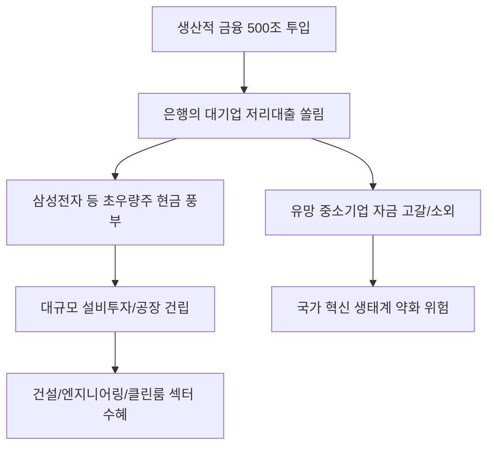

# 금융/산업 분석: '생산적 금융' 500조와 삼성전자 저리 대출 논란, 은행의 리스크 선별 역량
## 투자 신호 + 사회적 영향 평가

---

## 📌 기사 기본 정보

- **날짜**: 2026-03-25
- **출처**: 대한민국 금융 정책 및 기업 금융 수급 리포트
- **카테고리**: 경제 > 금융 > 산업지원
- **핵심 주제**: 정부 주도의 '생산적 금융(미래 산업 지원)' 500조 원 투입 과정에서 불거진 삼성전자 등 초우량 기업에 대한 '저리 대출(특혜 대출)' 논란과, 이 과정에서 드러난 시중은행들의 리스크 선별 역량 및 자금 배분 불균형 분석

**메타데이터**
- 주요 정책: 미래 산업(반도체, 바이오, AI 등) 대응 500조 금융지원 패키지
- 핵심 이슈: 우량 기업 쏠림(Flier Advantage) vs 중소·중견 기업 소외
- 주요 수치: 지원금 총액 500조, 대형주 대출 비중(XX%), 연간 이자 비용 절감액
- 주요 주체: 금융위원회, 시중은행, 삼성전자, 중소기업협동조합
- 키워드: 생산적 금융, 낙수 효과 논란, 은행권 리스크 기피, 자금 배분 효율성

---

## 🔍 기사를 통한 투자 신호 추출

### 1단계: 핵심 사건 분해

**What (무엇이 일어났는가?)**
- 국가 전략 기술 확보를 위해 정부가 시중은행에 저금리 자금을 공급했으나, 은행들이 손실을 우려해 이미 자금력이 풍부한 삼성전자 등 초우량 기업에만 대출을 집중시킴. 결과적으로 실질적 지원이 필요한 유망 중소·중견 기업은 소외되고, 대기업은 남의 돈으로 '이자 놀이'를 할 수 있는 구조적 모순 발생.

**When (언제 일어났는가?)**
- 2026-03-25 (정부의 500조 금융 지원 계획이 본격 집행되며 실효성 논란이 정점에 달한 시점)

**Why (왜 일어났는가?)**
- 은행권의 '실적 지상주의'와 '면책 시스템 부재'로 인해 위험한 모험 자본 공급보다는 안전한 이자 수익 선택
- '생산적 금융'의 명확한 가이드라인 없이 총량 위주의 실적 압박만 가해진 결과

**Who (누가 주도하는가?)**
- 자금 집행을 담당하며 리스크 관리에 보수적인 5대 시중은행
- 저리 자금을 확보하여 현금 보유력을 극대화하려는 대형 수출 대기업

---

### 2단계: 투자 신호 해석

#### A. **긍정적 신호 (Bullish)**

**① '초우량주'의 재무 건전성 및 투자 재원 확보 가속화**
- **신호**: 시중보다 현저히 낮은 금리로 수조 원대 자금 조달 성공
- **의미**: 삼성전자 등은 고금리 시대에 오히려 낮은 비용으로 설비 투자를 감행할 수 있는 '무기'를 얻게 됨
- **투자 기회**: 금융 지원 수혜가 집중된 각 업종 대장주(삼성전자, 현대차, SK바이오 등)

**② '리스크 관리' 소프트웨어 및 데이터 분석 기업의 가치 상승**
- **신호**: 은행들의 기업 변별력 부족 노출 (기술 기반 평가 한계)
- **의미**: 기업의 '기술력'을 정교하게 수치화하여 대출 심사를 돕는 AI 신용 평가 솔루션의 중요성 증대
- **투자 기회**: 핀테크 보안 및 데이터 분석 엔진 공급사, 기업 신용 정보 전문 플랫폼

---

#### B. **위험 신호 (Bearish)**

**③ 은행권의 '순이자마진(NIM)' 축소 및 정책 리스크 가중**
- **신호**: 정부 압박에 의한 저리 대출 실행과 대출 쏠림에 따른 정치적 비판
- **의미**: 은행이 벌어야 할 이자 수익을 국가 정책을 위해 희생하고, 향후 대규모 충당금 적립이나 사회 공헌 압박을 더 받을 여지가 큼
- **투자 리스크**: 가계/기업 대출 규제 노이즈가 잦은 대형 금융 지주사

**④ 국내 소부장(소재·부품·장비) 중소기업의 '자금 경색' 심화**
- **신호**: 대기업 쏠림으로 인한 중소기업 지원 예산의 조기 소진
- **의미**: 대기업은 이익이 나는데 정작 그 밑단에서 혁신을 일으킬 중소기업은 고금리 대출에 신음하며 도산 위기 직면
- **투자 리스크**: 자금 조달 능력이 낮고 기술 상용화 단계에 있는 소형 테크주

---

### 3단계: 섹터별 투자 기회 매트릭스

#### ✅ **높은 기대도 + 낮은 리스크**

**국가 전략 산업의 하드웨어(Fab) 건설 및 인프라 구축사**
- 대기업으로 흘러 들어간 500조 원은 결국 대규모 설비 투자(Fab 건립)로 집행됨. 자금 집행의 '최종 목적지'에 있는 건설/엔지니어링 사가 실질적인 수혜를 입음
- **투자 추천도**: ⭐⭐⭐⭐

---

## 💰 구체적 투자 신호 변환

### 신호 1: '돈의 흐름'이 실력보다 '이름값'에 흐르는 장세

**투자 해석**: 기사는 한국 금융의 고질적 병폐인 '담보 중심, 대기업 중심' 관행이 정책 자금에서도 반복되고 있음을 보여줌. 이는 앞으로도 혁신 중소기업의 성장이 더딜 것임을 시사함. 투자자는 정부의 '지원 발표' 뉴스에 속아 중소 테크주를 사기보다, 그 지원금이 최종적으로 어디로 가는지(결국 대기업의 현금 창고)를 보고 '부자 기업이 더 부자가 되는 현상'에 베팅해야 함.

---

## 🌍 사회적 영향 평가

### A. 긍정적 사회 영향
- **국가 전략 산업의 글로벌 경쟁력 유지**: 삼성전자 등이 막대한 자금력을 바탕으로 대만(TSMC) 등 경쟁국과의 기술 전쟁에서 밀리지 않는 기초 체력 확보
- **금융 시스템의 대형 사고 예방**: 은행들이 리스크 관리를 철저히 함으로써(역설적이지만) 대규모 부실 채권 발생을 막고 금융 시스템의 안정을 유지

### B. 부정적 사회 영향
- **경제적 양극화 및 '부익부 빈익빈' 고착화**: 혁신적인 아이디어는 있으나 담보가 없는 스타트업/소상공인의 성장이 제한되며 사다리가 걷어차이는 사회적 리스크
- **관치 금융 논란에 따른 시장 질서 훼손**: 효율적인 자금 배분보다 정권의 치적으로서의 '숫자 맞추기'식 금융 지원이 자본 시장의 본질적인 변별력을 약화시킴

---

## 🎯 결론: 당신의 투자 전략 수립

- **즉시 실행**: 투자 중인 반도체/바이오 대형주들의 '정책 자금 수혜 규모' 확인 후 장기 보유 전략 확정
- **3개월 후**: 정부의 '중소기업 전용 금융 지원 확대 방안' 등 보완 대책 발표 여부 확인 후 소부장(소부장) 기업 선별적 진입

---

## 📝 Obsidian 연결 구조

