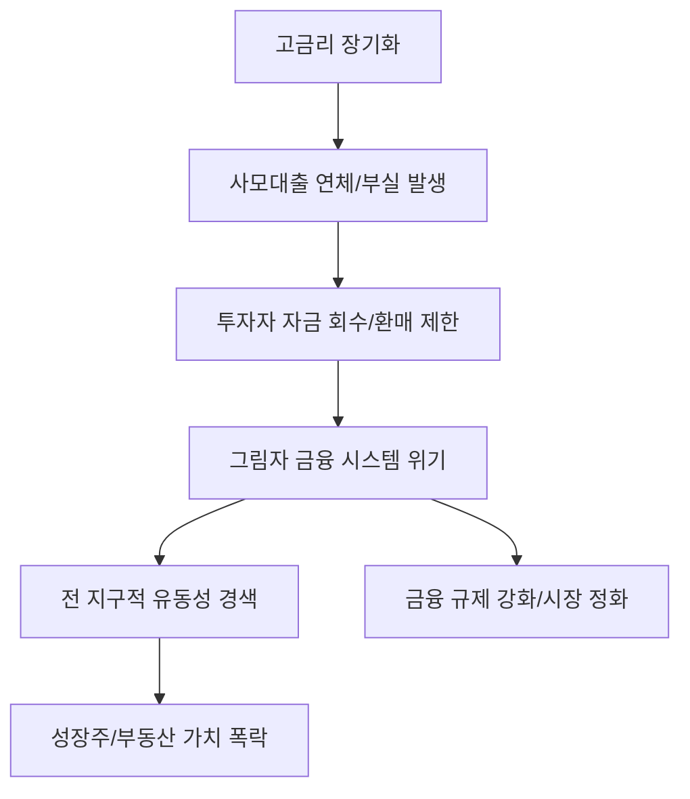

# 금융/거시 분석: 월가 사모대출 '펀드런' 위기와 그림자 금융의 구조적 리스크
## 투자 신호 + 사회적 영향 평가

---

## 📌 기사 기본 정보

- **날짜**: 2026-03-25
- **출처**: 월스트리트 저널(WSJ) 및 글로벌 금융 리스크 긴급 보고서
- **카테고리**: 경제 > 금융 > 국제금융
- **핵심 주제**: 고금리 지속에 따른 월가 사모대출(Private Credit) 시장의 부실화와 투자자들의 대규모 자금 회수(펀드런) 위기, 그리고 규제 사각지대에 놓인 '그림자 금융(Shadow Banking)'이 글로벌 금융 시스템 전체로 리스크를 전이할 가능성 분석

**메타데이터**
- 주요 이슈: 사모대출 펀드 환매 중단 및 자금 이탈 가속화
- 핵심 지표: 사모대출 연체율, 펀드 환매 요청 비율, 레버리지 비율
- 주요 주체: 블랙스톤, 아폴로 등 대형 사모펀드(PEF), 기관 투자자(LP), 규제 당국
- 키워드: 사모대출 펀드런, 그림자 금융, 유동성 경색, 시스템 리스크

---

## 🔍 기사를 통한 투자 신호 추출

### 1단계: 핵심 사건 분해

**What (무엇이 일어났는가?)**
- 은행권 대출이 막힌 기업들에게 돈을 빌려주며 급성장했던 사모대출 시장이 고금리 직격탄을 맞음. 빌려준 돈이 안 들어오고(부도 위험), 투자자들은 겁을 먹고 돈을 빼 가려 함(펀드런). 자금 회수 요청이 쏟아지자 일부 대형 펀드들이 환매를 제한하며 시장의 공포가 극에 달함.

**When (언제 일어났는가?)**
- 2026-03-25 (미 연준의 고금리 유지 기조가 장기화되며 한계 기업들의 이자 지불 능력이 임계점에 도달한 시점)

**Why (왜 일어났는가?)**
- 규제 대상인 일반 은행과 달리 감시 사각지대에서 과도한 레버리지를 사용했기 때문
- 경기 둔화로 인해 사모대출의 주요 고객인 중소·중견 기업들의 실적 악화
- 투자자들이 '현금 확보'를 최우선으로 하는 리스크 오프(Risk-off) 심리 확산

**Who (누가 주도하는가?)**
- 자산의 안전성을 우려해 탈출을 시도하는 거대 연기금 및 기관 투자자
- 유동성 확보를 위해 보유 자산을 헐값에 매각하려는 운용사들

---

### 2단계: 투자 신호 해석

#### A. **긍정적 신호 (Bullish)**

**① '정통 상업은행(Commercial Bank)'의 상대적 건전성 부각**
- **신호**: 그림자 금융의 붕괴와 대비되는 규제권 내 은행의 안정성
- **의미**: 리스크가 터질 때 자본 확충이 잘 된 대형 은행으로 자금이 역류(Reverse flow)함
- **투자 기회**: 미국 대형 은행주(JPM 등), 국내 리스크 관리가 우수한 금융 지주사

**② 부실 자산을 헐값에 살 수 있는 '디스트레스(Distressed) 자산' 투자사 수혜**
- **신호**: 유동성 위기로 인해 쏟아지는 우량 기업의 채권/지분 급매물
- **의미**: 위기를 기회로 삼는 현금 부자 사모펀드나 구조조정 전문 기업의 수익 극대화 시점
- **투자 기회**: 현금 비중이 높은 글로벌 자산 운용사, 기업 구조조정 전문사

---

#### B. **위험 신호 (Bearish)**

**③ 글로벌 유동성 경색에 따른 '고위험 성장주' 폭락 리스크**
- **신호**: 사모대출 시장의 자금줄이 마르며 벤처/스타트업 자금난 가속
- **의미**: 돈의 씨가 마르면 이익이 나지 않는 성장주들의 밸류에이션이 처참하게 무너짐
- **투자 리스크**: 부채가 많고 현금 흐름이 마이너스인 기술주, 중소형 테크 섹터

**④ '부동산 및 인프라' 연계 사모펀드의 연쇄 도산 위기**
- **신호**: 사모대출의 상당 부분이 저평가된 부동산 담보로 묶여 있음
- **의미**: 대출 부실이 부동산 가격 하락을 부르고, 이것이 다시 펀드 부실로 이어지는 악순환
- **투자 리스크**: 리츠(REITs), 상업용 부동산 투자 비중이 높은 보험/증권사

---

### 3단계: 섹터별 투자 기회 매트릭스

#### ✅ **높은 기대도 + 낮은 리스크**

**글로벌 '현금왕' 기업 및 현금성 자산(MMF 등)**
- 남들이 돈을 못 구해 죽어갈 때, 현금을 들고 있는 기업은 경쟁자를 인수하거나 초우량 자산을 헐값에 매집할 수 있음
- **투자 추천도**: ⭐⭐⭐⭐⭐

---

## 💰 구체적 투자 신호 변환

### 신호 1: '그림자'가 걷힐 때 진짜 범인이 드러난다

**투자 해석**: 기사는 우리가 보지 못했던 '사모 금융'의 취약성이 드러나고 있음을 경고함. 이는 2008년 서브프라임 모기지 사태와 닮아 있음. 투자자는 지금 즉시 '사모대출 펀드'나 관련 파생 상품 노출도가 높은 금융주를 처분해야 함. 또한 기술주보다는 현금 흐름이 확실한 '가치주'와 '현금' 그 자체를 보유하여 다가올 유동성 폭풍에 대비해야 함.

---

## 🌍 사회적 영향 평가

### A. 긍정적 사회 영향
- **금융 시스템의 투명성 강화 계기**: 이번 사태를 통해 그림자 금융에 대한 강력한 규제 도입 및 공시 의무화로 장기적인 금융 안정성 확보
- **한계 기업의 시장 퇴출 및 구조조정**: 좀비 기업들이 정리되면서 경제 전반의 자원 배분 효율성 증대

### B. 부정적 사회 영향
- **실물 경제의 위축과 고용 불안**: 중소기업에 대한 자금 공급이 끊기면서 건실한 기업들까지 도산 위기에 몰리고, 대규모 실업 발생 가능성
- **연기금 손실로 인한 노후 안보 위협**: 국민들의 노후 자금이 투입된 사모펀드들의 수익률 악화로 사회적 안전망 훼손 우려

---

## 🎯 결론: 당신의 투자 전략 수립

- **즉시 실행**: 포트폴리오 내 중소형 테크주 및 사모대출 관련 금융상품 전량 매도 및 현금 비중 50% 이상 확보
- **3개월 후**: 미 연준의 유동성 공급 재개 여부 및 대규모 펀드들의 청산 절차 진행 상황 확인 후 우량 자산 선별 매수

---

## 📝 Obsidian 연결 구조

