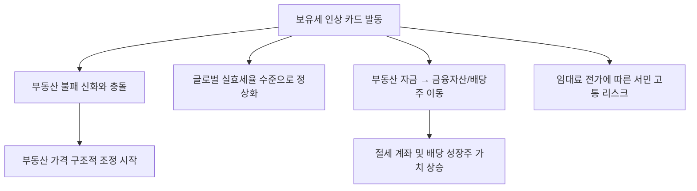

# 부동산/세제 분석: 보유세 카드와 '부동산 불패 신화'의 정면충돌 및 글로벌 실효세율 비교
## 투자 신호 + 사회적 영향 평가

---

## 📌 기사 기본 정보

- **날짜**: 2026-03-25
- **출처**: 글로벌 부동산 경제 및 조세 통계 분석 리포트
- **카테고리**: 경제 > 부동산 > 세제/거시
- **핵심 주제**: 정부의 강력한 보유세 인상 정책이 '한국형 부동산 불패 신화'와 정면으로 충돌하는 국면 분석, 그리고 선진국 대비 한국의 보유세 실효세율 데이터 비교를 통해 향후 부동산 시장의 구조적 가격 조정 가능성 진단

**메타데이터**
- 주요 지표: 보유세 실효세율(한국 0.XX% vs OECD 평균 X%), 종부세 납부 대상자 변동 추이
- 핵심 쟁점: 징벌적 과세 논란 vs 자산 불평등 해소, 부동산 수익률의 근본적 변화
- 비교 국가: 미국(재산세 중심), 영국, 독일 등 주요 선진국의 부동산 세제 구조
- 주요 주체: 기획재정부, 다주택자, 1주택 실거주자, 부동산 시장 전문가
- 키워드: 보유세 실효세율, 부동산 불패 신화, 조세 정의, 자산 다변화

---

## 🔍 기사를 통한 투자 신호 추출

### 1단계: 핵심 사건 분해

**What (무엇이 일어났는가?)**
- 부동산 가격 상승률을 상회하는 '보유 비용'의 급격한 증가. 과거 '사두면 오른다'는 믿음이 세금 때문에 '사두면 나간다(현금 유출)'는 현실로 바뀌며 부동산 자산의 매력도가 근본적으로 훼손됨. 특히 글로벌 표준(Global Standard)에 맞춘 보유세 인상 압박이 가시화됨.

**When (언제 일어났는가?)**
- 2026-03-25 (공시가격 현실화와 세율 인상이 겹치는 '슈퍼 세금 연도'를 앞두고 시장의 공포가 극에 달한 시점)

**Why (왜 일어났는가?)**
- 주거비 부담으로 인한 저출산 및 인구 고령화 등 국가적 위기 해결을 위한 강도 높은 '부동산 자본 통제'
- 생산적 분야(산업 기술)로 흐르지 않고 부동산에 잠긴 막대한 자본의 물꼬를 돌리려는 정부의 의지

**Who (누가 주도하는가?)**
- 조세 정의를 외치는 정책 당국자
- 이에 맞서 '세금 탄압'이라며 매물을 거둬들이거나 반대로 급매로 던지는 부동산 투자자 집단

---

### 2단계: 투자 신호 해석

#### A. **긍정적 신호 (Bullish)**

**① 부동산 대체 자산으로서의 '성장 가치주' 및 '배당주' 가치 재발견**
- **신호**: 부동산 보유세 부담을 피한 자본의 탈(脫) 부동산 현상
- **의미**: 연 1~2%의 세금을 내야 하는 부동산보다, 연 3~5%의 배당을 주는 주식이 상대적으로 압도적인 우위를 점하게 됨
- **투자 기회**: 국내외 우량 배당 성장주, 분기 배당 실시 기업, 밸류업 프로그램 실천 대형주

**② 부동산 시장 내 '양극화' 속에서 빛나는 '최상위 핵심 자산'**
- **신호**: 어중간한 지방/수도권 외곽 매각 후 '초핵심 강남권'으로의 회귀
- **의미**: 전체 세금은 줄이면서 '가장 오를 것 같은 하나'에 집중하는 전략으로 인해 강남 및 한강변 핵심지는 오히려 '초격차'를 벌릴 수 있음
- **투자 기회**: 압구정, 반포 등 재건축 핵심지 대장주(간접 투자의 경우 관련 건설사)

---

#### B. **위험 신호 (Bearish)**

**③ '부동산 불패 신화'의 기반인 '심리적 지지선' 붕괴**
- **신호**: "집 가지고 있어 봐야 세금으로 다 뺏긴다"는 인식 확산
- **의미**: 가격 하락 시 '저가 매수'가 들어오지 않는 수급 공백 발생. 장기 하향 안정화 또는 장기 침체(L자형) 위험
- **투자 리스크**: 분양 시장 위축 및 미분양 우려가 큰 지방 중소 건설사

**④ 국내 경기 활력 저하 및 '소비 결빙' 리스크**
- **신호**: 세금 납부를 위한 현금 확보 경쟁 및 가처분 소득 감소
- **의미**: 소득의 상당 부분이 세금으로 흡수되어 내수 시장(외식, 쇼핑 등)이 극심한 불황에 빠질 수 있음
- **투자 리스크**: 고비용 내수 소비재, 중저가 브랜드 프랜차이즈

---

### 3단계: 섹터별 투자 기회 매트릭스

#### ✅ **높은 기대도 + 낮은 리스크**

**세제 혜택이 부여된 '장기 저축성 보험' 및 '퇴직연금(IRP) 내 배당 자산'**
- 세금이 무서워지는 시대에는 '비과세'와 '절세' 혜택이 있는 계좌 내에서 불어나는 자산이 최고의 수익률 성적표를 보장함
- **투자 추천도**: ⭐⭐⭐⭐⭐

---

## 💰 구체적 투자 신호 변환

### 신호 1: '자산의 효율성'을 재조정하지 않으면 가난해진다

**투자 해석**: 기사는 한국의 보유세가 더 이상 무시할 수준이 아님을 글로벌 수치로 증명함. 부동산 수익률이 세금보다 낮아지는 구간에서는 과감한 '포트폴리오 다변화'가 생존의 유일한 길임. 투자자는 지금 부동산에 묶인 자금의 일부를 '글로벌 배당 ETF'나 '세제 혜택 계좌(ISA/IRP)'로 옮겨 자산의 '유지 비용'은 낮추고 '순수익률'은 높이는 리모델링을 즉각 단행해야 함.

---

## 🌍 사회적 영향 평가

### A. 긍정적 사회 영향
- **자산 불평등 완화 및 공정 조세 기틀 마련**: 과도한 자산 쏠림을 억제하여 주거권 보장과 사회적 평등에 기여
- **실질적인 주거비 하락 가능성**: 투기 수요 억제를 통해 장기적으로 주택 가격이 하락하거나 안정되어 청년층 및 서민의 주거 부담 경감

### B. 부정적 사회 영향
- **보유세 전가에 따른 '임대료 동반 상승'**: 다주택자들이 늘어난 세금을 임대료(전세/월세)에 전가하여 실질적으로 무주택 서민들의 주거비가 올라가는 부작용 발생
- **기업 및 가계의 '세금 저항'에 따른 사회적 갈등 격화**: 국가 공권력과 개인 재산권의 충돌로 인한 정치적 양극화 및 공동체 신뢰 훼손

---

## 🎯 결론: 당신의 투자 전략 수립

- **즉시 실행**: 본인 소유 자산의 '세후 수익률' 전수 조사 및 실효세율이 높은 비핵심 부동산 매각 검토
- **3개월 후**: 정부의 추가 세제 개편안과 글로벌 금리 추이에 따른 '부동산 vs 금융자산' 수익률 역전 현상 재점검

---

## 📝 Obsidian 연결 구조

