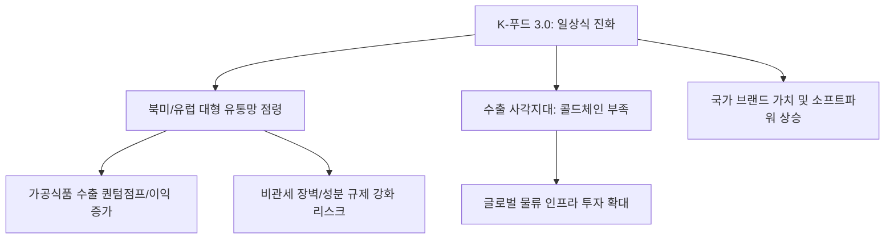

# 산업/유통 분석: K-푸드 3.0 시대와 '일상식'으로의 침투, 수출 사각지대 대응 전략
## 투자 신호 + 사회적 영향 평가

---

## 📌 기사 기본 정보

- **날짜**: 2026-03-25
- **출처**: 글로벌 K-컬처 산업 트렌드 및 유통망 분석 리포트
- **카테고리**: 경제 > 산업 > 유통/식품
- **핵심 주제**: 단순한 스낵이나 유행을 넘어 북미/유럽인들의 '일상 식단(Daily Meal)'으로 깊숙이 파고든 K-푸드 3.0의 진화와 글로벌 현지 인프라 부족으로 발생하는 수출 전략의 사각지대 및 해결 방안 분석

**메타데이터**
- 주요 품목: 냉동 김밥, 즉석밥(HMR), 김치 가공품, K-소스(고추장 베이스)
- 핵심 변화: '에스닉 푸드(궁금해서 먹는 음식)' → '스테이플 푸드(자주 먹는 주식)'로의 격상
- 주요 시장: 미국 대형 마트(Costco, Walmart), 유럽 프리미엄 리테일
- 주요 주체: CJ제일제당, 대상, 삼양식품, 그리고 떠오르는 중소 HMR 스타트업
- 키워드: K-푸드 3.0, 냉동 김밥 열풍, 콜드체인(Cold-chain) 병목, 일상식 진화

---

## 🔍 기사를 통한 투자 신호 추출

### 1단계: 핵심 사건 분해

**What (무엇이 일어났는가?)**
- SNS 챌린지 위주의 반짝 유행이 아닌, 건강식(Healthy Memory)과 간편함(Easy-to-cook)을 무기로 해외 일반 가정의 냉장고를 차지하기 시작함. 특히 냉동 김밥, 잡채 등 복합 조리 음구가 해외 주류 마트의 품절 사태를 유발하며 '가공식품 수출의 퀀텀 점프' 발생.

**When (언제 일어났는가?)**
- 2026-03-25 (글로벌 고물가로 인해 외식보다 집밥 수요가 늘고, 가성비와 영양을 모두 잡은 한국식 HMR이 대안으로 떠오른 시점)

**Why (왜 일어났는가?)**
- 글루텐 프리(Gluten-free), 비건(Vegan) 옵션 등 글로벌 건강 트렌드와 한국식 식단의 접점 발견
- K-콘텐츠(영화, 드라마)를 통한 반복적 노출이 거부감을 없애고 친숙함을 극대화함
- 한국 식품 기업의 뛰어난 급속 냉동 및 가공 기술력

**Who (누가 주도하는가?)**
- 글로벌 현지 유통 패권을 쥔 대형 유통 사와 협업하는 한국의 식품 대기업
- 아이디어 상품으로 틱톡(TikTok) 등 영미권 MZ 세대를 공략한 중소 벤처 식품 업계

---

### 2단계: 투자 신호 해석

#### A. **긍정적 신호 (Bullish)**

**① 'K-푸드 스테디셀러'의 탄생에 따른 장기적 현금 흐름 확보**
- **신호**: 유행이 아닌 '식단'으로 자리 잡는 데이터 (재구매율 상승)
- **의미**: 기업 밸류에이션이 '내수주'에서 '글로벌 성장주'로 리레이팅(Re-rating)됨을 뜻함
- **투자 기회**: 해외 매출 비중이 50%를 넘거나 북미 현지 공장을 가동 중인 식품 대장주

**② 식품 수출의 목줄을 쥔 '글로벌 콜드체인 물류'의 가치 상향**
- **신호**: 수출은 늘어나는데 현지 냉동 창고와 배송 인프라 부족(사각지대)
- **의미**: 제품을 잘 만드는 것만큼 '신선하게 전달하는 기술'이 유통의 핵심 수익원이 됨
- **투자 기회**: 글로벌 저온 물류 시스템(Cold-chain) 특화 기업, 초저온 가스 및 냉매 관련주

---

#### B. **위험 신호 (Bearish)**

**③ 현지화 실패 및 '카피캣(Copycat)' 제품의 난립**
- **신호**: 중국/동남아 기업들이 '한국식' 라벨을 달고 저가로 공세를 펼침
- **의미**: 강력한 브랜드력과 소스(Sauce) 원천 기술이 없는 단순 가공 식품은 가격 경쟁에서 밀려 도태될 위험
- **투자 리스크**: 독자적 브랜드력이 부족한 단순 OEM/ODM 식품사

**④ 각국 정부의 '위생 및 성분 규제' 장벽 강화**
- **신호**: K-푸드 점유율이 높아지자 자국 농업 보호를 위해 비관세 장벽(원료 규제 등) 발동
- **의미**: 수출 전략의 사각지대인 '현지 법규 대응력' 부족 시 대규모 반품 및 수출 중단 사태 우려
- **투자 리스크**: 수출 국가별 전담 법무/규제 대응 팀이 없는 영세 수출 사

---

### 3단계: 섹터별 투자 기회 매트릭스

#### ✅ **높은 기대도 + 낮은 리스크**

**글로벌 현지 생산 인프라와 '소스(Sauce) 원천 기술'을 보유한 기업**
- 소스는 맛을 지배하며, 이를 생산하는 발효 기술 등은 쉽게 따라 하기 힘든 해자(Moat)임
- **투자 추천도**: ⭐⭐⭐⭐⭐

---

## 💰 구체적 투자 신호 변환

### 신호 1: '에스닉 푸드'의 허물을 벗고 '글로벌 주식'이 되는 구간

**투자 해석**: 기사는 K-푸드가 더 이상 신기한 음식이 아니라, 서구권의 '냉동 피자'를 대체할 수 있는 거대 시장임을 시사함. 투자자는 유통망의 사각지대(물류 병목)를 해결하는 '스마트 물류 기업'과, 서구식 입맛에 맞춘 'K-소스'의 글로벌 표준을 선점하는 기업에 장기 베팅해야 함. 이것은 제2의 '신라면' 신화가 수십 개 종목에서 터지는 시나리오임.

---

## 🌍 사회적 영향 평가

### A. 긍정적 사회 영향
- **한국 문화 자본의 전 지구적 확산**: 식문화를 통해 한국의 라이프스타일 전반에 대한 긍정적 인식을 심어주어 국가 브랜드 가치 제고
- **국내 농·어가의 동반 성장**: 가공업체의 수출 증가는 곧 국산 원료(김, 쌀, 고추 등)에 대한 수요 증가로 이어져 1차 산업의 수익성 개선

### B. 부정적 사회 영향
- **식품 자원의 불균형 및 국내 물가 자극**: 수출 물량을 우선적으로 맞추는 과정에서 국내 공급 가격이 상승하여 국내 서민들의 장바구니 물가 부담 가중
- **전 지구적 탄소 발자국 논란**: 신선도 유지를 위한 냉동 물류 과정에서의 에너지 소비와 긴 이동 거리로 인한 환경적 비판 직면 가능성

---

## 🎯 결론: 당신의 투자 전략 수립

- **즉시 실행**: 북미 대형 마트(Costco 등)의 한국 식품 입점 품목 변화 실시간 모니터링 및 관련주 비중 확대
- **3개월 후**: 주요 수출 기업들의 '해외 현지 공장 가동률'과 '물류 비용 관리' 데이터 확인 후 리밸런싱

---

## 📝 Obsidian 연결 구조

