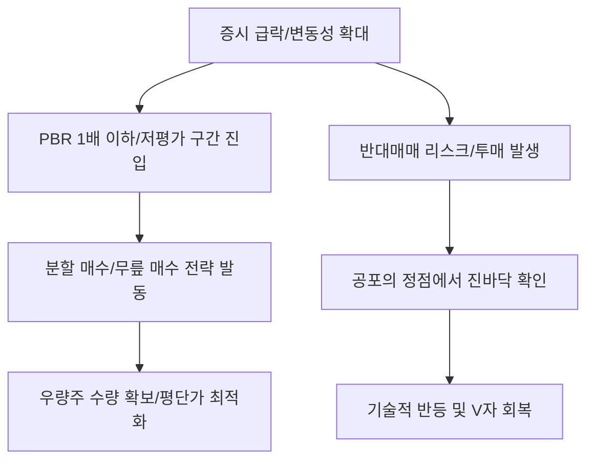

# 증시/투자 분석: 코스피·코스닥 '변동장' 속 분할 매수 기회와 기술적 반등 시나리오
## 투자 신호 + 사회적 영향 평가

---

## 📌 기사 기본 정보

- **날짜**: 2026-03-25
- **출처**: 대한민국 증시 시황 및 수급 분석 리포트
- **카테고리**: 경제 > 증권 > 투자전략
- **핵심 주제**: 글로벌 불확실성(관세, 금리 등)으로 인한 국내 증시의 변동성 확대 국면에서, 지수가 과매도 구간(Oversold)에 진입함에 따른 우량주 분할 매수 전략의 유효성과 기술적 반등 가능성 분석

**메타데이터**
- 주요 지표: KOSPI 지수 저점 지지선, KOSDAQ 변동성 지수(VKOSPI), 신용 융자 잔고 추이
- 핵심 전략: 분할 매수(Dollar-cost Averaging), 가치주-성장주 바벨 전략, 현금 비중 30% 유지
- 주요 주체: 개인 투자자(동학개미), 외국인 패시브 자금, 기관 투자자(연기금)
- 키워드: 변동성 장세, 분할 매수, 무릎 매수, 기술적 반등, 밸류에이션 저평가

---

## 🔍 기사를 통한 투자 신호 추출

### 1단계: 핵심 사건 분해

**What (무엇이 일어났는가?)**
- 악재(지정학적 리스크, 무역 전쟁 등)가 동시다발적으로 터지며 코스피와 코스닥이 단기간에 급락. 그러나 기업의 본질적 펀더멘털 손상보다는 '심리적 공포'에 의한 투매가 목격됨에 따라, 역사적 PBR 하단 부근에서의 저가 매수세 유입 조짐 포착.

**When (언제 일어났는가?)**
- 2026-03-25 (연속 하락으로 인한 반대매매 물량이 일부 해소되고, 기관 투자자들이 '저가 메리트'를 느끼기 시작한 분기점)

**Why (왜 일어났는가?)**
- 공포 지수(VIX)가 비정상적으로 높았던 과열 하락장의 마감 기대
- 삼성전자 등 대장주의 배당 매력 증가 및 실적 턴어라운드 데이터 확인
- 정부의 '증시 부양 의지'와 밸류업 프로그램 실무 지침 발표 임박

**Who (누가 주도하는가?)**
- 하락장에서 배당 수익률을 노리고 유입되는 연기금
- 극단적 공포를 활용해 물량을 매집하는 스마트 머니(Smart Money)

---

### 2단계: 투자 신호 해석

#### A. **긍정적 신호 (Bullish)**

**① 역사적 저평가 (PBR 1배 이하) 구간의 진입**
- **신호**: 코스피 지수가 청산 가치 이하로 떨어지는 국면
- **의미**: "잃을 것이 별로 없는 가격대"에 도달했음을 뜻하며, 장기 투자자에게는 최적의 진입 시나리오 제공
- **투자 기회**: 지배구조가 투명한 자산 가치주(지주사, 금융주), 반도체 대장주

**② 낙폭 과대주 중 '실적 우상향' 확인 종목의 강력한 반등**
- **신호**: 지수는 빠졌는데 분기 실적 가이던스가 상향된 종목
- **의미**: 시장의 공포가 걷히는 즉시 가장 먼저, 가장 높게 튀어 오를 '용수철 종목'임
- **투자 기회**: 인공지능(AI) 고사양 부품사, K-방산 수주 잔고 우량사

---

#### B. **위험 신호 (Bearish)**

**① '추가 하방'에 대한 불확실성 (Falling Knife)**
- **신호**: 유동성 경색이나 글로벌 신용 경색 신호의 지속
- **의미**: 바닥인 줄 알았는데 지하시설이 더 있는 '밸류 트랩'에 빠질 위험 상존
- **투자 리스크**: 신용 잔고가 여전히 높은 테마주, 부채가 많은 좀비 기업

**② 환율 급등에 따른 '외국인 자본 이탈' 가속**
- **신호**: 원/달러 환율 1,400원선 돌파 시도
- **의미**: 주가는 싸지만 환차손 때문에 외국인이 팔 수밖에 없는 구조 형성
- **투자 리스크**: 외국인 지분율이 높은 대형 패시브 종목

---

### 3단계: 섹터별 투자 기회 매트릭스

#### ✅ **높은 기대도 + 낮은 리스크**

**현금 흐름이 풍부한 '배당 성장주'의 분할 매수**
- 주가가 하락할수록 배당수익률이 올라가며 '가격 방어력'을 갖게 됨. 하락장에서 가장 먼저 채워야 할 '심리적 요새'임
- **투자 추천도**: ⭐⭐⭐⭐⭐

---

## 💰 구체적 투자 신호 변환

### 신호 1: '공포'를 '자본'으로 바꿀 수 있는 용기가 기회를 만든다

**투자 해석**: 기사는 지금이 '손절'할 때가 아니라 '수량'을 늘려야 할 때임을 강조함. 변동장에서는 '점'이 아닌 '선(분할)'으로 대응해야 함. 지금 당장 모든 자금을 투입하기보다, 3~5회에 걸친 기계적 분할 매수를 통해 평단가를 낮추며 기술적 반등(Dead Cat Bounce 이상)의 열매를 기다려야 함. 시장의 소음(뉴스)을 끄고 밸류에이션(숫자)에 집중해야 할 시점임.

---

## 🌍 사회적 영향 평가

### A. 긍정적 사회 영향
- **건전한 투자 문화 정착**: 뇌동매매가 아닌 전략적 분할 매수를 배우는 과정에서 개인 투자자들의 금융 문해력 향상
- **자산 형성을 통한 경제 자립**: 시장의 공포를 이겨낸 개인들이 중장기적으로 자산을 증식하여 계층 이동의 사다리를 구축

### B. 부정적 사회 영향
- **자산 격차의 고착화**: 현금이 있는 자산가들이 공포 장세에서 우량 자산을 저가에 흡수하고, 현금이 없는 서민들은 손실을 확정 짓는 '부의 비대칭' 심화
- **사회적 불신 및 우울 증가**: 변동성 장세에서 파산하거나 대규모 손실을 본 개인들의 증가로 인한 사회적 비용(복지, 정신 건강 등) 증대

---

## 🎯 결론: 당신의 투자 전략 수립

- **즉시 실행**: 전체 자산을 10등분 하여 2주 간격으로 우량 지수 ETF 및 대장주 분할 매수 시작
- **3개월 후**: 시장의 변동성 지수(VIX)가 하향 안정화되는 시점의 수익률 분석 및 비중 조절

---

## 📝 Obsidian 연결 구조

