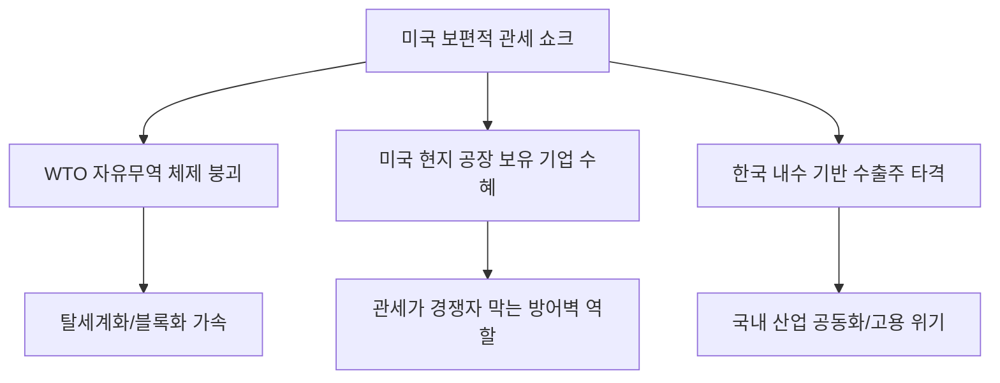

# 통상/거시 분석: 미국의 '관세 쇼크'와 WTO 체제 붕괴, 한국의 시스템적 생존 전략
## 투자 신호 + 사회적 영향 평가

---

## 📌 기사 기본 정보

- **날짜**: 2026-03-25
- **출처**: 글로벌 통상 전략 및 국제 관계 분석 리포트
- **카테고리**: 경제 > 통상무역 > 지정학
- **핵심 주제**: 미국의 자국 우선주의(America First) 강화에 따른 파격적인 보편적 관세(Universal Basic Tariff) 부과 가능성과 2차 세계 대전 이후 유지되어 온 WTO(세계무역기구) 체제의 실질적 붕괴 속에서 수출 강국 한국이 취해야 할 시스템적 생존 전략 분석

**메타데이터**
- 주요 정책: 미국의 보편적 관세(10~20%) 부과 및 대중국 고관세(60% 이상) 추진
- 핵심 쟁점: 글로벌 경제 블록화, 공급망 현지화(Onshoring), 관세 보복 전쟁 가열
- 주요 주체: 미국 상무부(DOC), 대한민국 산업통상자원부, 삼성/현대차/LG 등 주요 수출 대기업
- 키워드: 관세 쇼크, WTO 체제 붕괴, 공급망 주권, 프렌드 쇼어링(Friend-shoring)

---

## 🔍 기사를 통한 투자 신호 추출

### 1단계: 핵심 사건 분해

**What (무엇이 일어났는가?)**
- 미국이 동맹과 적국을 가리지 않고 모든 수입품에 대해 보편적 관세를 부과하겠다는 초강수를 검토 중. 이는 자유 무역의 수호자였던 WTO의 규칙을 정면으로 부정하는 것이며, 전 세계가 '관세 장벽'으로 둘러싸인 고립주의 시대로 진입함을 의미함.

**When (언제 일어났는가?)**
- 2026-03-25 (미 대선을 앞두고 핵심 지지층인 러스트벨트 유권자들을 겨냥한 보호무역주의 공약이 구체화된 시점)

**Why (왜 일어났는가?)**
- 미국의 거대한 무역 적자 해소 및 자국 내 제조업 부활 시도
- 중국의 기술 굴기를 억제하고 글로벌 공급망의 패권을 확실히 쥐기 위한 안보적 판단

**Who (누가 주도하는가?)**
- 미국의 신보호무역주의 실무 그룹 및 정치권
- 이에 대응해 독자적인 경제 동맹을 꾀하거나 현지 생산 비중을 높이려는 글로벌 기업들

---

### 2단계: 투자 신호 해석

#### A. **긍정적 신호 (Bullish)**

**① 미국 내 현지 생산 시설을 완비한 '로컬 지배력' 기업의 가치 상향**
- **신호**: 관세 장벽을 우회할 수 있는 현지 공장 보유 여부
- **의미**: 관세 폭탄에서 자유로울 뿐만 아니라, 경쟁사(수출 위주)가 관세 때문에 가격 경쟁력을 잃을 때 시장 점유율을 독식함
- **투자 기회**: 이미 조지아/텍사스 등에 대규모 공장을 돌리는 현대차/기아, 삼성전자(파운드리), 솔루션 중심의 미국 현지 방산 업체

**② 공급망 다변화 솔루션 및 '물류 최적화' 기술 섹터 부상**
- **신호**: 복잡해진 글로벌 관세와 규제를 피하기 위한 정교한 공급망 재배치 수요
- **의미**: 관세를 최소화하는 원산지 관리 시스템(Saas) 및 지역 거점 물류 인프라의 중요성 증대
- **투자 기회**: 공급망 가시성(Supply Chain Visibility) 소프트웨어 사, 베트남/멕시코 등 대체 생산 기지 인프라 리츠

---

#### B. **위험 신호 (Bearish)**

**① 수출 의존도가 높은 '단일 공급망' 부품사들의 이익 급감**
- **신호**: 한국 내 생산 후 미국으로 단순 수출하는 구조
- **의미**: 10~20%의 관세 부과는 제품 마진을 통째로 날려버리거나 판로를 상실하게 함
- **투자 리스크**: 국내 생산 비중이 절대적인 자동차 부품사, 소형 전자제품 제조사

**② 글로벌 교역량 감소에 따른 '해운/물류/석유화학' 섹터의 장기 침체**
- **신호**: 전 세계적인 보호무역주의 확산으로 인한 물동량 감소
- **의미**: 물물교환이 줄어들면 배를 띄울 일이 줄고, 공장이 덜 돌아가면 화학 소재 수요가 꺾임
- **투자 리스크**: 대형 컨테이너선사, 범용 석유화학 업체

---

### 3단계: 섹터별 투자 기회 매트릭스

#### ✅ **높은 기대도 + 낮은 리스크**

**미국 정부의 '보조금'과 '관세 혜택'을 동시에 무기로 쓰는 핵심 전략 자산 기업**
- 미국이 직접 키우고자 하는 분야(반도체, AI, 에너지 안보)에서 현지 투자를 늘리는 기업은 관세가 오히려 경쟁자를 막아주는 '성벽'이 됨
- **투자 추천도**: ⭐⭐⭐⭐⭐

---

## 💰 구체적 투자 신호 변환

### 신호 1: '자유 무역'의 시대는 끝났다, '현지화'만이 살길이다

**투자 해석**: 기사는 한국 경제의 근간이었던 '수출 전사' 모델의 유효 기한이 끝났음을 선언함. 이제 투자자는 '수출 금액'이 아니라 '현금 흐름이 어느 나라 법인에서 발생하는가'를 봐야 함. 미국에서 벌어 미국에 투자하고 미국에 세금 내는 '미국화된 한국 기업'으로 포트폴리오를 전면 압축해야 함. 관세 쇼크는 단순한 비용 증가가 아니라 업계의 '강제적 구조조정' 신호임.

---

## 🌍 사회적 영향 평가

### A. 긍정적 사회 영향
- **국내 기업의 체질 개선 및 글로벌화 강제**: 국내 시장의 한계를 넘어 글로벌 현지 거점을 확보하며 명실상부한 다국적 기업으로 도약하는 계기
- **공급망 다변화를 통한 국가 안보 강화**: 특정 국가(중국 등)에 치우쳤던 자원 및 부품 의존도를 낮춰 외부 충격에 강한 경제 구조 형성

### B. 부정적 사회 영향
- **국내 제조 현장의 공동화(Hollowing-out) 및 고용 위기**: 대기업의 공장이 해외로 이전하면서 국내 양질의 제조업 일자리가 사라지고 청년층 실업난 심화
- **물가 상승에 따른 가계 부담 가중**: 관세 비용이 최종 소비자 가격으로 전가되면서 전 지구적 인플레이션이 상시화되어 서민들의 실질 구매력 하락

---

## 🎯 결론: 당신의 투자 전략 수립

- **즉시 실행**: 포트폴리오 내 수출 비중 확인 및 '국내 생산-미국 수출' 비중이 높은 종목 비중 축소
- **3개월 후**: 미 행정부의 '보편적 관세' 입법 추이와 이에 따른 주요 기업들의 '북미 현지화' 추가 투자 발표 내용 확인

---

## 📝 Obsidian 연결 구조

