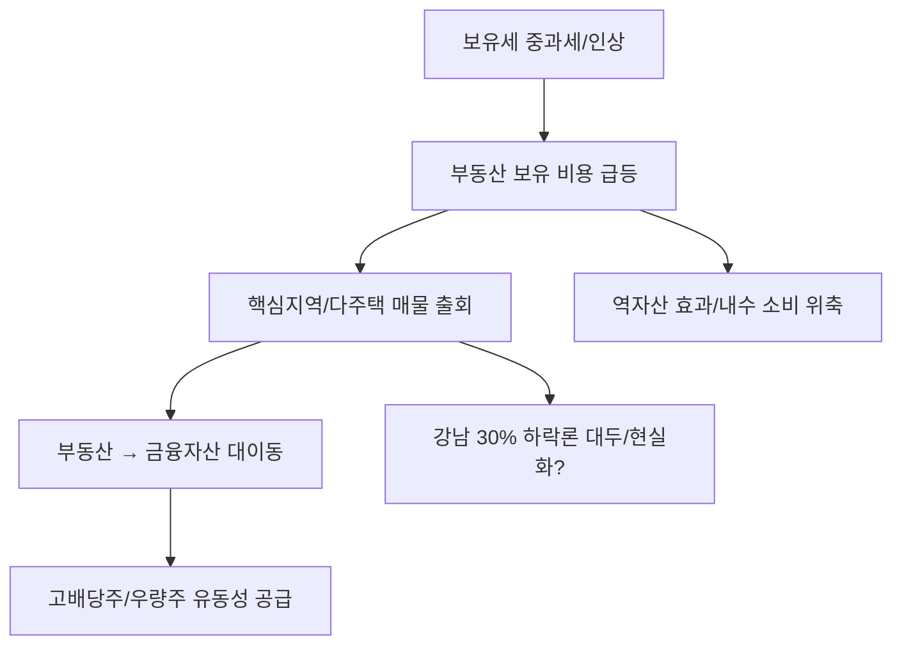

# 부동산/세제 분석: 다주택자 보유세 인상과 '부동산 머니무브', 강남 30% 하락론의 실체
## 투자 신호 + 사회적 영향 평가

---

## 📌 기사 기본 정보

- **날짜**: 2026-03-26
- **출처**: 대한민국 부동산 시장 정책 및 자산 흐름 리포트
- **카테고리**: 경제 > 부동산 > 세제/투자
- **핵심 주제**: 정부의 다주택자 보유세(종부세/재산세) 강화 조치에 따른 다주택자들의 자산 매각 움직임과 '부동산에서 금융자산'으로의 머니무브(Money Move) 현상, 그리고 시장에서 제기되는 '강남 30% 폭락론'의 현실성 분석

**메타데이터**
- 주요 정책: 다주택자 보유세 실효세율 인상, 공시가격 현실화율 조정
- 핵심 이슈: '똘똘한 한 채' 선호 현상 강화, 증시/채권 시장으로의 자금 대이동
- 영향 지역: 강남 3, 구(강남, 서초, 송파) 및 마·용·성 등 핵심 지역
- 핵심 변수: 금리 수준 유지 여부, 급매물 소화 속도, 정부의 대출 규제(DSR) 수위
- 키워드: 보유세 쇼크, 머니무브, 강남 하락론, 자산 리밸런싱

---

## 🔍 기사를 통한 투자 신호 추출

### 1단계: 핵심 사건 분해

**What (무엇이 일어났는가?)**
- 보유세 부담을 견디지 못한 다주택자들이 강남 등 핵심 지역의 매물을 급급매로 내놓기 시작함. 동시에 부동산에 묶여있던 자본이 고배당주, 미국 국채 등 높은 수익률과 유동성을 보장하는 금융 시장으로 급격히 이동하는 '머니무브' 포착.

**When (언제 일어났는가?)**
- 2026-03-26 (부동산 세금 고지서 발송 전, 선제적 자산 구조 조정을 하려는 다주택자들의 심리가 폭발한 시점)

**Why (왜 일어났는가?)**
- 자산 가치 상승분보다 매년 내야 하는 세금(현금 지출)이 더 커지며 '수익성'이 마이너스로 돌아섰기 때문
- 고금리 시대에 부동산이라는 무거운 자산보다 가볍고 빠른 금융 자산의 매력이 압도적으로 높아짐

**Who (누가 주도하는가?)**
- 강남권 다주택 자산가 및 법인 투자자
- 이들의 자금을 흡수하려는 글로벌 자산 매니저 및 금융권

---

### 2단계: 투자 신호 해석

#### A. **긍정적 신호 (Bullish)**

**① 금융 시장으로의 대규모 유동성 유입 (증시 호재)**
- **신호**: 부동산 매각 자금의 증시 및 채권 시장 유입
- **의미**: 기업 밸류업 프로그램과 맞물려 국내 우량 배당주 및 수출 대형주의 수급이 강화됨
- **투자 기회**: 고배당 ETF, 지주사, 자구책을 갖춘 금융주(은행/보험)

**② '강남 30% 하락' 시나리오 현실화 시 '현금 보유자'의 진입 기회**
- **신호**: 패닉 셀(Panic Sell)에 의한 일시적 가격 하락
- **의미**: 대한민국 부동산의 심장부인 강남이 30% 조정을 받는다면, 이는 10년에 한 번 올까 말까 한 '지수 바닥' 매수 기회임
- **투자 기회**: 현금 확보를 통한 강남권 급매물 경매 및 급매 사냥

---

#### B. **위험 신호 (Bearish)**

**① 부동산 자산 비중이 높은 가계의 '자산 가치 급락' 리스크**
- **신호**: 강남권 대장주 아파트의 하락 반전
- **의미**: 심리적 저항선이 뚫리며 전국적인 부동산 하락 도미노 발생 가능성 고조
- **투자 리스크**: 고레버리지(갭투자) 부동산 보유자, 건설/건자재 주 섹터

**② 소비 위축에 따른 '역자산 효과(Reverse Wealth Effect)'**
- **신호**: 집값 하락에 따른 부유층의 지갑 닫기
- **의미**: 부동산 평가액 하락으로 인해 내수 소비가 급감하며 경기 침체(Recession)를 가속화함
- **투자 리스크**: 하이엔드 백화점, 수입차 메이커, 럭셔리 소비재

---

### 3단계: 섹터별 투자 기회 매트릭스

#### ✅ **높은 기대도 + 낮은 리스크**

**글로벌 인컴(Income) 자산 및 고베당 성장주**
- 부동산에서 빠져나온 자금은 반드시 '안정적인 현금 흐름'을 주는 곳으로 흐름. 이 길목을 지키는 것이 가장 안전한 전략임
- **투자 추천도**: ⭐⭐⭐⭐⭐

---

## 💰 구체적 투자 신호 변환

### 신호 1: '콘크리트 신화'의 종언, '유동성'에 베팅하라

**투자 해석**: 기사는 한국인의 최대 안전 자산이었던 '강남 부동산'마저 세금과 금리라는 물리적 압박에 무너질 수 있음을 경고함. '30% 하락론'은 과장이 아니라, 수익률이 나오지 않는 자산의 당연한 '제자리 찾기' 과정임. 투자자는 지금 부동산 비중을 낮추고, 달러 자산이나 배당형 금융 자산으로 포트폴리오의 '혈액 순환'을 개선해야 함.

---

## 🌍 사회적 영향 평가

### A. 긍정적 사회 영향
- **부동산 거품 제거 및 주거 안정 기회**: 과도하게 자산 시장으로 쏠렸던 자본이 분산되며 실수요자들의 진입 장벽이 낮아지는 계기
- **생산적 자본으로의 전환**: 부동산에 잠겨있던 자금이 기업 투자(주식/채권)로 흐르며 국가 산업 발전에 필요한 재원 공급

### B. 부정적 사회 영향
- **중산층 자산 붕괴 및 사회적 박탈감**: 부동산에 전 재산을 건 서민 가계의 자산 가치가 하락하며 발생하는 사회적 우울감과 계층 이동 사다리 상실
- **지방과 수도권의 양극화 극단화**: 강남도 흔들리는 마당에 지방 부동산은 '폐허' 수준으로 전락하며 지역 불균형이 국가 재난 수준으로 심화

---

## 🎯 결론: 당신의 투자 전략 수립

- **즉시 실행**: 보유 부동산의 실효 수익률(세금 공제 후)을 냉정히 계산하고, 수익성이 낮은 비핵심 다주택 자산 우선 정리
- **3개월 후**: 강남권 실거래가 추이와 금융 시장 고객 예탁금 변화를 대조하여 '머니무브'의 정점 파악 후 추가 자산 배분

---

## 📝 Obsidian 연결 구조

