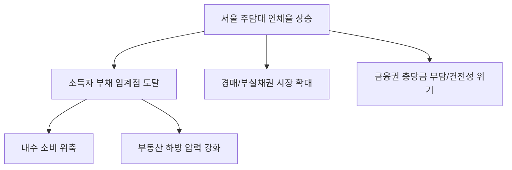

# 가계부채/부동산 분석: 서울발 주담대 연체율 경고등과 소득자 부채의 임계점
## 투자 신호 + 사회적 영향 평가

---

## 📌 기사 기본 정보

- **날짜**: 2026-03-28
- **출처**: 금융 시장 통계 분석 리포트
- **카테고리**: 경제 > 가계부채 > 부동산금융
- **핵심 주제**: 서울 지역 주택담보대출(주담대) 연체율이 급증하며 가계 부채가 소득 감당 수준의 임계점에 도달했다는 경고와 이에 따른 부동산 시장의 하방 압력 분석

**메타데이터**
- 주요 수치: 서울 지역 주담대 연체율 (전년비 XX% 상승), 가처분 소득 대비 부채 비율(DSR)
- 핵심 변수: 고금리 유지 기간, 부동산 거래량 감소, 실질 소득 정체
- 주요 주체: 금융위원회, 시중은행, 영끌족(MZ세대 포함), 부동산 투자자
- 키워드: 가계부채 임계점, 연체율 경고등, 부동산 하락 신호, DSR 규제 강화

---

## 🔍 기사를 통한 투자 신호 추출

### 1단계: 핵심 사건 분해

**What (무엇이 일어났는가?)**
- 상대적으로 안정적이었던 서울 지역의 주담대 연체율이 상승 반전하며 가계의 부채 상환 능력이 한계에 봉착. 특히 '영끌'로 주택을 구입한 소득자들이 고금리 지속에 따른 이자 부담을 더 이상 견디지 못하는 사례 속출.

**When (언제 일어났는가?)**
- 2026-03-28 (고금리 정책이 2년 이상 지속되며 서민 가계의 저축이 고갈되고 실질 소득이 물가 상승률을 따라잡지 못하는 결빙기)

**Why (왜 일어났는가?)**
- 금리 인하 기대감 지연으로 인한 이자 비용의 장기화
- 자산 가격 상승 멈춤으로 인한 '담보 가치 하락' 리스크 부각
- 고물가로 인한 생활비 급증으로 대출 상환 여력 감소

**Who (누가 주도하는가?)**
- 리스크 관리에 착수한 금융권 (대출 회수 및 금리 인상)
- 한계에 도달한 중산층 및 서민층 채무자

---

### 2단계: 투자 신호 해석

#### A. **긍정적 신호 (Bullish)**

**① '배당 및 채권 인컴' 중심의 보수적 투자 가치 상승**
- **신호**: 부동산 실물 자산의 위험성 증가
- **의미**: 변동성이 크고 부채 의존도가 높은 부동산보다, 현금이 확보된 우량 기업의 배당주나 국채로 자금이 이동
- **투자 기회**: 고배당 ETF, 단기 국채, 현금 흐름이 우수한 가치주

**② 부실 채권(NPL) 및 자산 경매 시장의 활성화**
- **신호**: 연체율 상승에 따른 경매 물건 유입 증가
- **의미**: 일반 매매 시장이 아닌, 경매/공매 시장에서 저가 매수 기회가 창출됨
- **투자 기회**: NPL 투자 전문 펀드, 경매 데이터 플랫폼 기업

---

#### B. **위험 신호 (Bearish)**

**① 부동산 시장의 '가격 조정 본격화' 신호**
- **신호**: 서울 핵심 지역의 연체율 상승
- **의미**: 가장 견고했던 서구/강남권 제외 서울 지역 마저 흔들린다는 것은 부동산 대세 하락장의 입구일 가능성 높음
- **투자 리스크**: 고레버리지 부동산 투자자, 소규모 건설사 및 시행사

**② 금융주의 건전성 악화 및 충당금 적립 부담**
- **신호**: 은행권 대출 연체율 증가
- **의미**: 순이자마진(NIM) 상승보다 '대손 비용' 증가가 실적을 갉아먹는 국면 진입
- **투자 리스크**: 가계 대출 비중이 높은 시중은행 및 저축은행

---

### 3단계: 섹터별 투자 기회 매트릭스

#### ✅ **높은 기대도 + 낮은 리스크**

**유동성이 확보된 '현금 중심형' 포트폴리오(MMF, 파킹통장 등)**
- 자산 가격의 혼돈기에는 기회를 기다리는 현금이 가장 강력한 무기임
- **투자 추천도**: ⭐⭐⭐⭐⭐

---

## 💰 구체적 투자 신호 변환

### 신호 1: '부채의 복수'가 시작되는 구간

**투자 해석**: 기사는 단순히 연체율이 올랐다는 경고가 아니라, '자산 가격 상승'이라는 신화가 깨지고 '부채 비용'이 실질 소득을 압도하는 시대가 왔음을 의미함. 이제는 '얼마나 벌 수 있는가'보다 '얼마나 버틸 수 있는가'가 투자의 핵심 지표임. 부채 비율이 높은 종목이나 자산에서 즉시 탈출해야 함.

---

## 🌍 사회적 영향 평가

### A. 긍정적 사회 영향
- **부동산 시장의 거품 제거 및 정상화 기회**: 무분별한 투기를 억제하고 실거주자 위주의 시장으로 재편되는 계기
- **경제 주체들의 부채 경각심 고취**: 과도한 레버리지의 위험성을 인지하고 재무 건전성을 확보하려는 사회적 분위기 형성

### B. 부정적 사회 영향
- **서민 가계의 붕괴 및 양극화 심화**: 대출을 갚지 못해 집을 잃는 하층 중산층의 몰락과 자산 가가 저가 매수하는 부의 쏠림 현상
- **내수 소비 위축에 따른 경기 침체**: 소득의 대부분이 이자로 나가면서 소비가 줄어들어 자영업자와 서비스업 전반의 타격

---

## 🎯 결론: 당신의 투자 전략 수립

- **즉시 실행**: 본인 및 가족의 가계 부채 DSR 총량 점검 및 고금리 대출 우선 상환
- **3개월 후**: 연체율 추이와 정부의 '가계대출 원금 상환 유예 정책' 등 대응 수위 확인 후 자산 배분 재산정

---

## 📝 Obsidian 연결 구조

