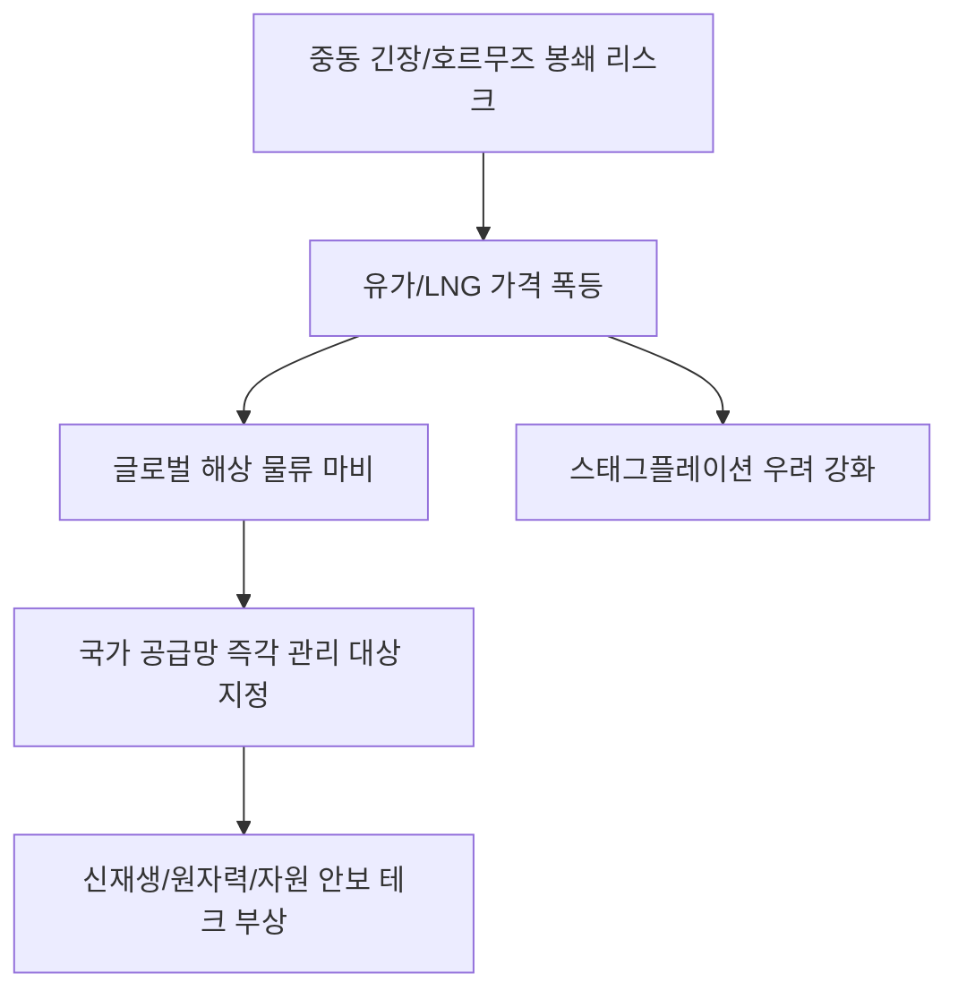

# 공급망/에너지 분석: 호르무즈 해협 봉쇄발 자원 전쟁과 국가 공급망 관리 긴급 보고
## 투자 신호 + 사회적 영향 평가

---

## 📌 기사 기본 정보

- **날짜**: 2026-03-28
- **출처**: 글로벌 지정학 및 에너지 안보 인사이트
- **카테고리**: 경제 > 지정학 > 공급망안보
- **핵심 주제**: 중동 긴장 고조로 인한 호르무즈 해협(Strait of Hormuz)의 잠재적 봉쇄 리스크와 이로 인한 글로벌 에너지 공급망 마비 가능성 및 국가 차원의 즉각 관리 시스템 구축 시급성 분석

**메타데이터**
- 주요 통로: 호르무즈 해협 (전 세계 석유 해상 물동량의 약 20%~30% 통과)
- 핵심 자원: 원유, LNG(액화천연가스), 핵심 중간재
- 주요 주세: 이란, 미국, 사우디아라비아, 대한민국 정부(공급망 컨트롤타워)
- 키워드: 호르무즈 봉쇄, 오일 쇼크, 공급망 주권, 자원 안보, 에너지 다변화

---

## 🔍 기사를 통한 투자 신호 추출

### 1단계: 핵심 사건 분해

**What (무엇이 일어났는가?)**
- 중동의 지정학적 갈등이 최고조에 달하며, 이란이 서방의 압박에 대응하기 위해 전 세계 에너지의 젖줄인 호르무즈 해협을 봉쇄할 수 있다는 '레드 라인' 경고가 나옴. 이는 단순히 유가 상승을 넘어 글로벌 제조 인프라의 가동 중단 위기를 의미함.

**When (언제 일어났는가?)**
- 2026-03-28 (에너지 전환기임에도 여전히 화석 연료 의존도가 절대적인 한국 경제에 가장 치명적인 타이밍)

**Why (왜 일어났는가?)**
- 이스라엘-중동 분쟁의 확산 및 강대국 간의 대리전 양상
- 자원을 무기화하여 협상력을 극대화하려는 자원 부국의 전략

**Who (누가 주도하는가?)**
- 해협 통제권을 쥔 이란 혁명수비대
- 해상로 확보를 위해 함대를 전진 배치하는 미군 및 다국적 연합군

---

### 2단계: 투자 신호 해석

#### A. **긍정적 신호 (Bullish)**

**① 에너지 원천지 및 해상로를 우회하는 '신에너지/기술' 섹터 가속화**
- **신호**: 전통적 에너지 공급망의 완전한 불확실성
- **의미**: 중동의 손을 빌리지 않아도 되는 원자력, 신재생에너지, 수소 인프라에 대한 국가적 투자가 '선택'에서 '생존'으로 격상
- **투자 기회**: 원전 수출 및 설비사, 태양광/풍력 밸류체인, 에너지 저장 장치(ESS)

**② '방산 및 해양 안보' 관련 기업의 가치 재평가**
- **신호**: 해상 물류 루트 보안의 중요성 증대
- **의미**: 수출입 선박을 보호하고 해상 분쟁을 억제하기 위한 해군력 증강 및 무인 잠수정/드론 수요 급증
- **투자 기회**: 함정 제조사(HD현대중공업 등), 해상 드론 전문 기업, 군용 위성 통신 사

---

#### B. **위험 신호 (Bearish)**

**① 원가 폭등에 따른 '스태그플레이션(Stagflation)' 직격탄**
- **신호**: 국제 유가 및 가스 가격의 전무후무한 급등 가능성
- **의미**: 제조 원가는 오르는데 경기 침체로 가격 전가가 어려워져 기업 이익이 급감하는 최악의 시나리오
- **투자 리스크**: 에너지 다소비 산업 (항공, 물류, 비료, 화학, 철강), 화석 연료 발전 비중이 높은 전력 사

**② '글로벌 무역량 감소'에 따른 수출 주도 경제의 위축**
- **신호**: 주요 해상 통로의 물리적 폐쇄 및 보험료 폭등
- **의미**: 한국처럼 자원 수입과 완제품 수출에 의존하는 국가의 입지 좁아짐
- **투자 리스크**: 종합 상사, 대형 컨테이너 해운사(단기 환경은 좋으나 장기로는 물동량 감소 타격)

---

### 3단계: 섹터별 투자 기회 매트릭스

#### ✅ **높은 기대도 + 낮은 리스크**

**자국 내 자원 확보 및 '포스코' 등 소재 수직 계열화 기업**
- 외부 충격에 상관없이 원료를 확보할 수 있는 공급망 주권을 가진 기업만이 살아남음
- **투자 추천도**: ⭐⭐⭐⭐⭐

---

## 💰 구체적 투자 신호 변환

### 신호 1: '지정학'이 '재무제표'보다 우선하는 시대

**투자 해석**: 기사는 단순히 유가가 오를 것이라는 예보가 아님. 전 세계 경제의 '혈관'이 막힐 수 있다는 경고임. 이제 투자자의 포트폴리오는 '얼마나 효율적인가'보다 '얼마나 안전한(Resilient) 공급망을 가졌는가'를 기준으로 리모델링되어야 함. 중동 의존도가 높은 기업의 비중을 낮추고, 북미/호주 등 대체 자원망을 보유한 기업으로 대이동해야 함.

---

## 🌍 사회적 영향 평가

### A. 긍정적 사회 영향
- **에너지 자립을 위한 국가적 각성**: 화석 연료 탈피와 신에너지 전환을 향한 사회적 합의 및 기술 발전 가속화
- **공급망 관리 지능화**: AI와 데이터 기반의 국가 자원 관리 시스템 구축으로 향후의 예상치 못한 위기 대응력 강화

### B. 부정적 사회 영향
- **서민 가계의 고통 심화**: 에너지 비용 상승에 따른 전기료, 가스비, 교통비 인상으로 실질 임금 하락 및 삶의 질 저하
- **글로벌 군비 경쟁 가속**: 평화적 해결보다 무력에 의한 통로 확보 경쟁이 치열해지며 전 지구적 안보 불안 증폭

---

## 🎯 결론: 당신의 투자 전략 수립

- **즉시 실행**: 지정학 리스크 헤지용 '금(Gold)' 및 '에너지 관련 인버스/레버리지' 상품 비중 조절
- **3개월 후**: 정부의 '국가 공급망 관리 긴급 지침' 이행 상황 및 중동 긴장 완화 여부에 따른 포트폴리오 리밸런싱

---

## 📝 Obsidian 연결 구조

