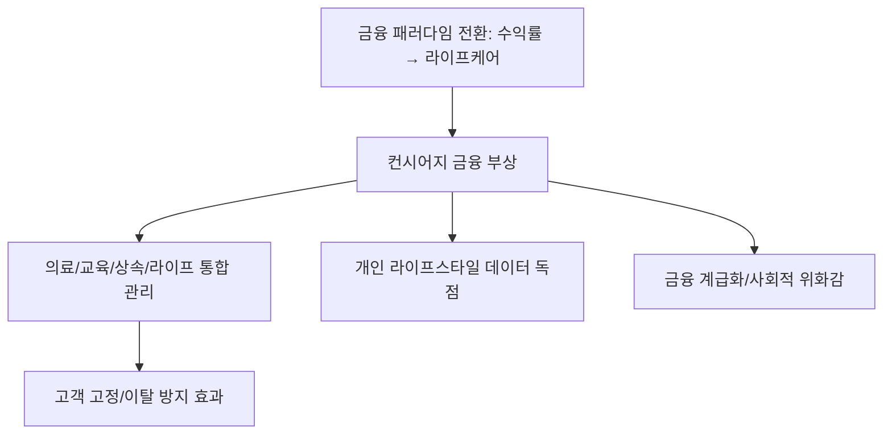

# 금융/라이프스타일 분석: 품격의 재구성, '컨시어지 금융'과 삶의 질 관리 전략
## 투자 신호 + 사회적 영향 평가

---

## 📌 기사 기본 정보

- **날짜**: 2026-03-28
- **출처**: 프리미엄 자산 관리 및 라이프 서비스 보고서
- **카테고리**: 경제 > 금융 > 웰스매니지먼트
- **핵심 주제**: 단순한 수익률 관리를 넘어 고객의 비재무적 라이프스타일(여행, 의료, 교육, 상속 등)까지 통합 관리하는 '컨시어지(Concierge) 금융'의 진화와 이를 통한 삶의 질 및 자산 가치 보존 전략 분석

**메타데이터**
- 주요 서비스: 라이프 스타일 컨시어지, 가업 승계 컨설팅, 글로벌 헬스케어 네트워킹
- 핵심 타겟: 고액 자산가(HNWI), 영앤리치(Young & Rich), 전문직 시니어
- 주요 주체: 메이저 은행 PB센터, 패밀리 오피스(Family Office), 럭셔리 라이프 플랫폼
- 키워드: 컨시어지 금융, 삶의 질 관리, 패밀리 서비스, 가치 지배력 확대

---

## 🔍 기사를 통한 투자 신호 추출

### 1단계: 핵심 사건 분해

**What (무엇이 일어났는가?)**
- 금융권의 경쟁이 '금리'나 '수익률' 싸움에서 '누가 고객의 시간을 더 가치 있게 관리해 주는가'로 이동. 고객의 건강 관리, 자녀 유학 배치, 명품 구매 대행 등 생활 전반을 해결해 주는 '맞춤형 비서 서비스'가 금융 상품의 핵심 경쟁력이 됨.

**When (언제 일어났는가?)**
- 2026-03-28 (초고령화와 신흥 부유층의 등장으로 '돈보다 시간'의 가치가 극대화된 시대)

**Why (왜 일어났는가?)**
- 자산 관리의 기술적 우위(AI 등)가 평준화되면서 차별화된 오프라인/대면 경험의 중요성 대두
- 자산가들의 욕구가 단순 증식에서 '안전한 유지와 우아한 소비'로 전환

**Who (누가 주도하는가?)**
- 글로벌 네트워크를 갖춘 대형 금융 지주 및 외국계 투자 은행
- 프리미엄 서비스를 외주(Outsourcing)로 제공하는 전문 컨시어지 파트너사

---

### 2단계: 투자 신호 해석

#### A. **긍정적 신호 (Bullish)**

**① '초개인화 라이프 케어' 서비스의 동반 성장**
- **신호**: 금융 자산과 결합된 럭셔리 소비 및 의료 서비스 패키지 확대
- **의미**: 금융사의 낙점(Partnership)을 받은 프리미엄 서비스사들은 안정적인 VVIP 고객군을 확보하게 됨
- **투자 기회**: 프리미엄 헬스케어 업체, 글로벌 교육 컨설팅 사, 하이엔드 여행 전문 기업

**② '패밀리 오피스' 형태의 자산 운용 계열사 가치 증대**
- **신호**: 한 가문의 자산을 3대 이상 관리하는 지속 가능 모델 구축
- **의미**: 단기 수익률에 연연하지 않는 끈적한(Sticky) 거대 자본이 은행의 든든한 예치금이 됨
- **투자 기회**: WM(Wealth Management) 비중이 높은 대형 금융 지주, 신탁 업무 전문화 증권사

---

#### B. **위험 신호 (Bearish)**

**① 서비스 품질 불균형에 따른 브랜드 가치 훼손**
- **신호**: 화려한 수식어 대비 부실한 컨시어지 서비스 집행 사태
- **의미**: 금융 상품과 무관한 '서비스 상의 실수'가 은행 자체의 신뢰도 하락으로 이어지는 리스크
- **투자 리스크**: 내부 인프라 없이 구호로만 럭셔리를 외치는 중형 금융사

**② 고정비 지출 과다에 따른 영업이익률(OPM) 둔화**
- **신호**: 전문 인력(컨시어지 매니저) 채용 및 공간 인프라 투자 비용 급증
- **의미**: VVIP를 잡기 위한 비용이 너무 커져 실제 수익성으로 연결되지 않는 '화려한 적자' 가능성
- **투자 리스크**: 판관비 관리가 안 되는 과잉 경쟁 중인 증권사/은행

---

### 3단계: 섹터별 투자 기회 매트릭스

#### ✅ **높은 기대도 + 낮은 리스크**

**글로벌 네트워크를 보유한 '토탈 자산 관리' 특화 대형주**
- 이미 장벽을 구축한 대형 금융사들은 규모의 경제를 통해 컨시어지 비용을 상쇄하고 데이터 독점을 가속화함
- **투자 추천도**: ⭐⭐⭐⭐

---

## 💰 구체적 투자 신호 변환

### 신호 1: '돈의 수익'보다 '시간의 수익'에 투자하라

**투자 해석**: 기사는 금융의 본질이 '자산 증식'에서 '인생 관리'로 이동하고 있음을 보여줌. 이는 앞으로 금리가 낮아져도 고객들이 '서비스의 가치'를 위해 특정 금융사에 머물 것임을 뜻함. 투자 시 단순히 시가총액이 큰 은행이 아니라, '라이프스타일 데이터'를 얼마나 정교하게 확보하고 이를 사업으로 연결하는지(데이터 기반 결합 배송, 의료 등)를 봐야 함.

---

## 🌍 사회적 영향 평가

### A. 긍정적 사회 영향
- **일자리 창출의 질적 변화**: 고도의 전문성을 갖춘 '라이프 매니저/컨시어지 전문가' 등 새로운 고부가가치 직업군 형성
- **가업과 전통의 보존**: 전문적인 승계 컨설팅을 통해 건실한 중소/중개 기업들이 대를 이어 성장하며 국가 경제의 허리 역할 수행

### B. 부정적 사회 영향
- **'금융 계급'의 노골화**: 돈이 없으면 고급 의료, 교육, 여행 정보에서 완전히 배제되는 정보 및 서비스 사다리 걷어차기 심화
- **공동체 의식의 약화**: 상위 1%만을 위한 폐쇄적인 네트워크(Exclusive Neighborhood) 구축이 가속화되며 사회적 통합 저해

---

## 🎯 결론: 당신의 투자 전략 수립

- **즉시 실행**: 본인의 금융 거래를 관리하는 PB나 매니저의 역량을 '라이프 서비스' 관점에서 재평가하고 최적화된 채널로 집중
- **3개월 후**: 주요 금융사들의 'WM 및 패밀리 오피스 매출 성장률'과 '비재무적 서비스 만족도 조사 결과' 확인

---

## 📝 Obsidian 연결 구조

