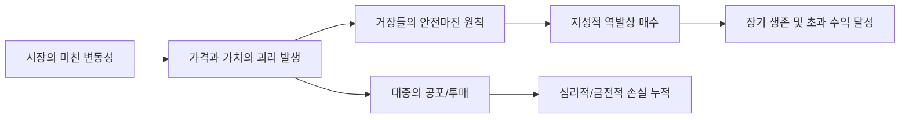

# 금융/투자 분석: 가치와 가격의 괴리 속 대가들의 '변동성 생존' 원칙
## 투자 신호 + 사회적 영향 평가

---

## 📌 기사 기본 정보

- **날짜**: 2026-03-28
- **출처**: 글로벌 자산 시장 인사이트 - 투자 거장들의 철학 재조명
- **카테고리**: 경제 > 금융 > 투자철학
- **핵심 주제**: 시장의 광풍(패닉 혹은 과열)으로 인해 '가치'와 '가격'이 극단적으로 벌어지는 불확실성 시대에, 워런 버핏, 찰리 멍거 등 투자 대가들이 강조한 변동성 생존 원칙과 심리적 방어 전략 분석

**메타데이터**
- 주요 철학: 안전 마진(Margin of Safety), 해자(Moat), 인내의 미학
- 핵심 변수: 시장의 공포 지수(VIX), 금리 변동성, 군중 심리
- 주요 주체: 글로벌 투자 거장(버핏, 하워드 막스 등), 가치 투자자, 시장 참여자 전체
- 키워드: 가치와 가격의 괴리, 변동성 생존, 멘탈 관리, 하이킹(Hicking)형 투자

---

## 🔍 기사를 통한 투자 신호 추출

### 1단계: 핵심 사건 분해

**What (무엇이 일어났는가?)**
- 지정학적 리스크와 거시경제의 불확실성으로 인해 주식 시장의 가격이 기업의 본질적 가치와 상관없이 급등락하는 현상 발생. 많은 투자자들이 공포에 휩쓸려 투매하거나 과열에 속아 고점에 물리는 상황에서 대가들의 '가치 중심적' 사고방식이 생존의 유일한 해법으로 부상.

**When (언제 일어났는가?)**
- 2026-03-28 (인공지능 알고리즘 매매와 정보의 과잉으로 시장의 변동 속도가 과거보다 비약적으로 빨라진 디지털 초고속 매매 시대)

**Why (왜 일어났는가?)**
- 인간의 뇌는 본능적으로 하락장의 고통과 상승장의 소외감을 견디지 못하도록 설계되었기 때문
- 단기적 가격 변화에 매몰되어 장기적 가치 창출 원천을 망각하는 오류

**Who (누가 주도하는가?)**
- 냉철한 분석으로 '미스터 마켓(Mr. Market)'을 활용하는 지성적 투자자
- 반대로 감정에 지배당해 유동성을 공급(손실)하는 대중 투자자

---

### 2단계: 투자 신호 해석

#### A. **긍정적 신호 (Bullish)**

**① '안전 마진'이 확보된 우량주의 역발상 매수 기회**
- **신호**: 기업의 펀더멘털은 견고하나 시장 전체의 공포로 주가가 과도하게 하락한 구간
- **의미**: 가격과 가치의 괴리가 클수록 미래 수익률은 기하급수적으로 높아짐
- **투자 기회**: 현금 보유력이 높고 독점적 지위를 가진 업종 대표주 중 배당수익률이 역대 최고치에 도달한 종목

**② '장기 보유'가 가능한 견고한 자산으로의 자본 집중**
- **신호**: 변동성 국면에서 퇴출되지 않는 '해자' 있는 기업들의 강한 회복력
- **의미**: 일시적 충격은 있지만 결국 시장 수익률을 초월할 기업들이 선별되는 과정
- **투자 기회**: 상장지수펀드(ETF)보다는 개별 기업의 분석 능력이 탁월한 '가치 투자 펀드' 혹은 자산 관리 서비스

---

#### B. **위험 신호 (Bearish)**

**① 레버리지 확대를 통한 '한탕주의'의 파멸 리스크**
- **신호**: 변동성을 이용해 한 번에 손실을 복구하려는 '빚투' 심리의 확산
- **의미**: 시장의 바닥은 인간의 상상보다 깊을 수 있으며, 변동성에 의해 '강제 청산' 당할 리스크 최고조
- **투자 리스크**: 신용 융자 잔고가 높은 종목, 파생 상품 비중이 높은 포트폴리오

**② '가격'만 보고 사는 모멘텀 투자의 한계 노출**
- **신호**: 이유 없는 급등과 급락의 반복
- **의미**: 가치의 근거 없이 유동성으로만 오르던 테마주들이 가장 먼저, 가장 깊게 무너짐
- **투자 리스크**: 실적이 뒷받침되지 않는 급등 테마주, 정치/이슈 중심의 투기 종목

---

### 3단계: 섹터별 투자 기회 매트릭스

#### ✅ **높은 기대도 + 낮은 리스크**

**필수 소비재 및 강력한 플랫폼 지배력을 가진 글로벌 1등 기업**
- 경기가 나빠져도 사람들이 쓸 수밖에 없는 서비스와 제품을 가진 기업은 변동성을 이겨내는 가장 확실한 피난처임
- **투자 추천도**: ⭐⭐⭐⭐⭐

---

## 💰 구체적 투자 신호 변환

### 신호 1: '가격'은 기분이고 '가치'는 실력이다

**투자 해석**: 기사는 단순히 버티라는 말이 아님. 시장이 미칠수록(변동성), 투자자는 더욱 정교하게 기업의 '내재 가치'를 계산해야 한다는 신호임. 대가들의 생존 원칙은 '싸게 사는 것'이 아니라 '무엇이 싼지 아는 것'임. 지금처럼 혼란스러운 시기에는 HTS를 끄고 사업 보고서에 집중하는 '지적 인내심'이 곧 최고의 수익률로 변환될 것임.

---

## 🌍 사회적 영향 평가

### A. 긍정적 사회 영향
- **자본 시장의 성숙화**: 투기적 거래보다 본질적 가치에 집중하는 건전한 투자 문화의 확산
- **금융 문해(Financial Literacy) 향상**: 거장들의 지혜를 배우며 개인 투자자들이 감정적 판단을 극복하고 장기적 자산 형성 능력을 갖추는 국면

### B. 부정적 사회 영향
- **개인 투자자의 대규모 손실에 따른 사회적 우울**: 변동성을 견디지 못한 서민들의 자산 증발로 인한 계층 이동 사다리의 붕괴
- **부의 독점 심화**: 공포를 이겨낼 현금과 정보가 있는 소수의 자산가들이 대중의 눈물을 먹고 자산을 저가에 독식하는 양극화 현상 강화

---

## 🎯 결론: 당신의 투자 전략 수립

- **즉시 실행**: 본인 포트폴리오의 '안전 마진' 재점검 및 감정적 매매를 유도하는 정보 채널(유튜브, 단톡방 등) 일시 차단
- **3개월 후**: 시장의 공포가 지나간 후, 살아남은 기업들의 실적 발표를 통해 '진짜 가치'를 확인하고 비중 확대

---

## 📝 Obsidian 연결 구조

