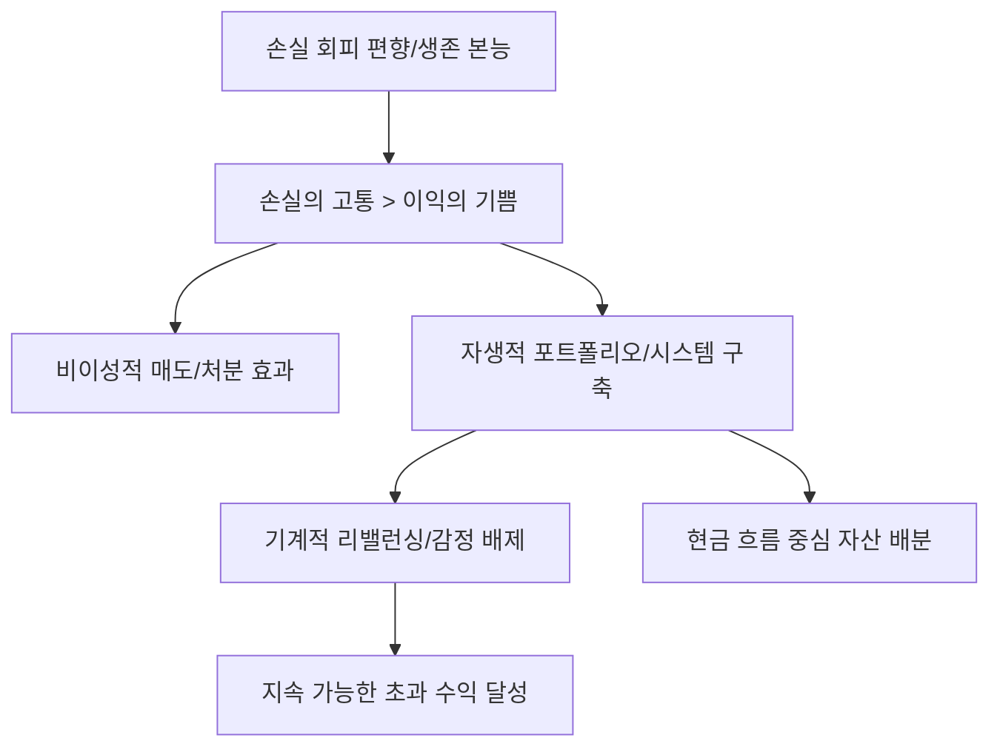

# 금융/투자 심리 분석: 손실 회피 편향과 자생적 포트폴리오의 심리학적 전략
## 투자 신호 + 사회적 영향 평가

---

## 📌 기사 기본 정보

- **날짜**: 2026-03-28
- **출처**: 행동 경제학 및 자산 관리 전략 리포트
- **카테고리**: 경제 > 금융 > 투심/행동경제학
- **핵심 주제**: 인간의 뇌가 이익의 기쁨보다 손실의 고통을 2배 더 크게 느끼는 '손실 회피 편향(Loss Aversion Bias)'에 대한 분석과 이를 극복하고 지속 가능한 수익을 내는 '자생적(Self-sustaining) 포트폴리오' 구축 전략

**메타데이터**
- 주요 이론: 전망 이론(Prospect Theory), 후회 회피, 비자발적 장기 투자
- 핵심 솔루션: 자산 배분 리밸런싱, 시스템 매매, 심리적 회계(Mental Accounting) 활용
- 주요 주체: 개인 투자자, 행동경제학자, 자산 관리 전문가(AI 자산 관리 등)
- 키워드: 손실 회피, 행동경제학, 심리적 요새, 규칙 중심 투자, 자동 리밸런싱

---

## 🔍 기사를 통한 투자 신호 추출

### 1단계: 핵심 사건 분해

**What (무엇이 일어났는가?)**
- 하락장에서 많은 투자자들이 논리적 분석이 아닌 '손실의 고통'을 피하기 위해 최악의 시점에 매도(Panic Sell)하거나, 반대로 손실을 확정 짓지 않으려고 망가진 종목을 무한정 보유(물타기)하는 비합리적 행위 반복. 이를 방지하기 위한 심리적 장치로서의 포트폴리오 전략 시급.

**When (언제 일어났는가?)**
- 2026-03-28 (시장 변동성이 커지며 개인 투자자들의 심리적 지지선이 무너지고 계좌 손실에 대한 공포가 극에 달한 시점)

**Why (왜 일어났는가?)**
- 선사 시대부터 위험(손실)으로부터 자신을 보호하려 했던 생존 본능이 현대의 자본 시장에서는 '독'으로 작용하기 때문
- '확정 손실'을 '실패'로 규정하는 뇌의 인지 구조

**Who (누가 주도하는가?)**
- 인간의 약점을 데이터와 시스템으로 극복하려는 퀀트(Quant) 및 로보어드바이저 사
- 자신의 심리 상태를 객관화하려는 상위 1%의 지성적 투자자

---

### 2단계: 투자 신호 해석

#### A. **긍정적 신호 (Bullish)**

**① '규칙 기반' 자동 투자 및 리밸런싱 시스템의 대중화**
- **신호**: 인간의 의지력을 믿지 않는 시스템에 대한 신뢰도 상승
- **의미**: 감정이 개입할 여지가 없는 '자동 매매'나 '타겟 데이트 펀드(TDF)' 등으로의 거대 자금 이동
- **투자 기회**: 핀테크 자산 관리 플랫폼, AI 알고리즘 개발 역량을 갖춘 운용사

**② '배당 성장주' 등 심리적 위안을 주는 자산군에 대한 수요 증대**
- **신호**: 시세 차익보다 '다달이 들어오는 현금'이 주는 안도감
- **의미**: 주가가 떨어져도 배당금이 손실을 메워준다는 심리적 여유가 '손실 회피' 편향을 상쇄함
- **투자 기회**: 월배당 커버드콜 ETF, 배당 가비(Dividend Aristocrats) 기업

---

#### B. **위험 신호 (Bearish)**

**① '공포의 자기실현'에 따른 가짜 하락 리스크**
- **신호**: 기업 가치와 무관하게 손실 회피가 집단적으로 발생하며 주가를 끝없이 끌어내리는 현상
- **의미**: 펀더멘털이 봐도 도저히 설명되지 않는 오버슈팅(하락 방향) 구간에서 발생하는 강제 청산 도미노
- **투자 리스크**: 대중의 손바뀜이 심한 개인 투자자 쏠림 종목

**② '장부상 이익'에 대한 조기 매도와 '손실 종목'의 장기 보유(처분 효과)**
- **신호**: 포트폴리오 내 우량주는 팔고 불량주만 남는 악순환
- **의미**: 수익이 난 주식은 고통 없이 팔 수 있어 빨리 매도해버리고, 손실 난 주식은 고통을 피하려다 영영 회복 불가능한 상태로 보유
- **투자 리스크**: 분산 투자가 안 된 소수 종목 집중 포트폴리오

---

### 3단계: 섹터별 투자 기회 매트릭스

#### ✅ **높은 기대도 + 낮은 리스크**

**글로벌 자산에 분산된 '전략적 자산 배분(Asset Allocation)' ETF**
- 상관관계가 낮은 자산들을 섞음으로써 포트폴리오 전체의 변동성(MDD)을 줄여주는 것이 손실 회피 고통을 줄이는 최선의 방책임
- **투자 추천도**: ⭐⭐⭐⭐⭐

---

## 💰 구체적 투자 신호 변환

### 신호 1: '나'를 믿지 말고 '시스템'을 믿어야 할 때

**투자 해석**: 기사는 당신의 의지력은 하락장의 공포를 이길 수 없음을 행동경제학적으로 증명함. 투자 성공의 핵심은 스마트한 분석이 아니라, 당신의 '손실 회피 본능'이 발동하지 않도록 만드는 가드레일(시스템 리밸런싱, 자동 매수 비중 조절 등)임. 수익률을 극대화하려 하지 말고 '고통을 최소화'하는 구조를 짜면 수익은 저절로 따라옴.

---

## 🌍 사회적 영향 평가

### A. 긍정적 사회 영향
- **건전한 장기 투자 문화의 뿌리**: 단기 급등락에 일희일비하지 않는 '시스템 중심' 투자가 정착되어 자본 시장의 변동성을 낮춤
- **금융 소비자 보호**: 자신의 약점을 인지하고 과도한 레버리지나 위험한 상품에서 스스로를 보호하는 능동적 금융 소비자 양성

### B. 부정적 사회 영향
- **군집 행동(Herding)에 따른 시장 왜곡**: 인공지능이나 시스템 매매가 공포 국면에서 동시에 매도 신호를 보낼 경우 발생하는 시장의 급격한 붕괴 리스크
- **인간적 판단의 거세**: 모든 것이 알고리즘화되며 개별 기업의 창의적인 가치 판단보다는 숫자 중심의 차가운 시장으로 변모

---

## 🎯 결론: 당신의 투자 전략 수립

- **즉시 실행**: 계좌 수익률을 매일 확인하는 습관을 버리고, 분기 1회 '기계적 리밸런싱' 규칙을 문서화하여 확정
- **3개월 후**: 시장 하락 시 자신의 심리적 동요 수치를 기록하고, 견디기 힘들다면 '저변동성(Low Vol)' 섹터로 비중 이동

---

## 📝 Obsidian 연결 구조

