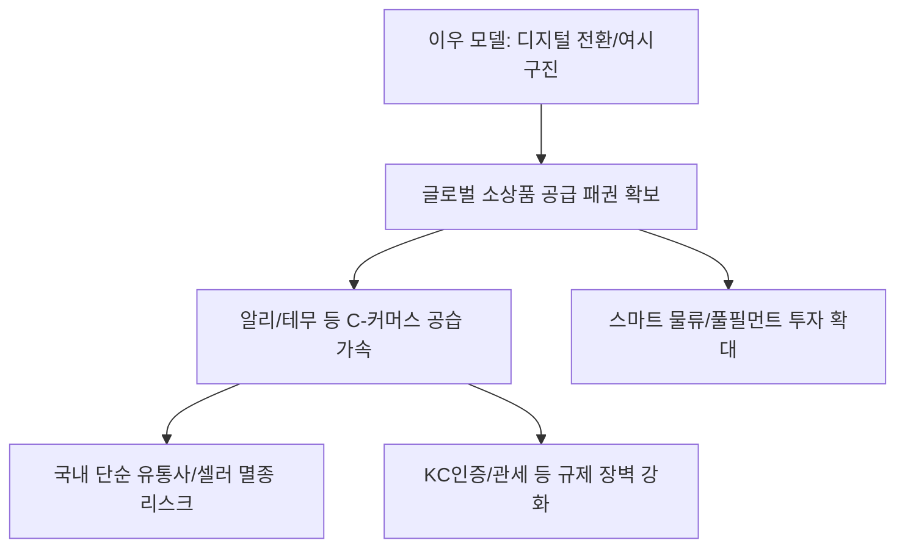

# 산업/유통 분석: '이우 모델'의 진화와 '여시구진'의 글로벌 유통 패권 전략
## 투자 신호 + 사회적 영향 평가

---

## 📌 기사 기본 정보

- **날짜**: 2026-03-28
- **출처**: 글로벌 유통망 및 중국 제조 공급망 분석 리포트
- **카테고리**: 경제 > 산업 > 유통/이커머스
- **핵심 주제**: 세계 최고의 소상품 도매 시장인 중국 이우(Yiwu) 시장의 디지털 전환과 '여시구진(與時俱進, 시대와 함께 나아감)'의 철학을 바탕으로 한 글로벌 초격차 유통 패권 전략 분석

**메타데이터**
- 주요 모델: 이우(Yiwu) 도매 모델 + 디지털 풀필먼트(Fullfillment) + 국경 간 이커머스(CBT)
- 핵심 키워드: 소상품 글로벌 소싱, 무인 물류 자동화, 빅데이터 기반 수요 예측, 여시구진
- 주요 주체: 이우 소상품 성(商城) 그룹, 알리익스프레스/테무(Temu) 공급망, 글로벌 소상공인
- 핵심 변수: 미-중 무역 갈등 영향, 물류비 변동성, 품질 표준화(QC) 수준

---

## 🔍 기사를 통한 투자 신호 추출

### 1단계: 핵심 사건 분해

**What (무엇이 일어났는가?)**
- 과거 저가 상품 떼오는 곳으로만 인식되던 중국 이우 시장이 '디지털 스마트 시장'으로 변모. 알리바바 등 거대 플랫폼과 직결된 물류 시스템, 실시간 데이터 분석을 통한 다품종 소량 생산 체계를 구축하여 전 세계 이커머스 업자들의 '심장' 역할을 강화 중.

**When (언제 일어났는가?)**
- 2026-03-28 (테무, 알리 등 중국발 'C-커머스'가 한국을 포함한 전 세계 내수 시장을 잠식하며 유통 혁명이 정점에 달한 시점)

**Why (왜 일어났는가?)**
- 규모의 경제를 통한 압도적 가격 경쟁력 유지
- 시대 변화에 맞춰 오프라인 도매에서 모바일 기반 글로벌 직접 판매 체계로의 '여시구진'식 변화 성공

**Who (누가 주도하는가?)**
- 이우 정부와 결합된 거대 유통 자본
- 전 세계 가성비 상품 수요를 빨아들이는 글로벌 이커머스 플랫폼

---

### 2단계: 투자 신호 해석

#### A. **긍정적 신호 (Bullish)**

**① 글로벌 물류 인프라 및 통관/창고(Warehouse) 섹터의 주도권**
- **신호**: 이우발 물동량의 기하급수적 증가 및 해외 창고 건설 붐
- **의미**: 상품을 만드는 것보다 '빠르게 고객 집 앞까지 배달'하는 능력이 유통의 핵심 수익원이 됨
- **투자 기회**: 스마트 물류 장비 기업, 글로벌 물류 거점 리츠(REITs), 라스트 마일 배송 혁신 기업

**② 'D2C(Consumer to Direct)' 기반의 데이터 분석 기업 부상**
- **신호**: 소비자 수요와 공장을 직결하는 '유연한 공급망' 구축
- **의미**: 유행을 선제적으로 읽고 공장에 오더를 내리는 AI 수요 예측 알고리즘의 가치 상향
- **투자 기회**: 유통 특화 AI 데이터 분석사, 이커머스 운영 대행 솔루션(SaaS)

---

#### B. **위험 신호 (Bearish)**

**① 국내 '박리다매'형 단순 도소매업의 멸종 위기**
- **신호**: 소비자들의 중국 직구 대중화 및 가격 격차 확대
- **의미**: 중간 유통 단계에서 마진을 붙여 팔던 국내 수입업자 및 소형 셀러들의 생존이 불가능해짐
- **투자 리스크**: 차별화 없는 범용 생활용품 유통주, 단순 재판매 위주의 오픈마켓 셀러군

**② '품질 및 안전성' 이슈에 따른 강력한 국내 규제 리스크**
- **신호**: 미인증 상품의 대량 유입과 발암물질 등 안전 논란
- **의미**: 정부의 KC 인증 강화 및 직구 차단 정책 등 급격한 규제 변화로 인한 공급망 중단 리스크
- **투자 리스크**: 중국 직구 플랫폼 관련 결제 주 및 배송 대행사

---

### 3단계: 섹터별 투자 기회 매트릭스

#### ✅ **높은 기대도 + 낮은 리스크**

**초저가 공세를 견뎌내는 '브랜드 가치'와 '하이엔드 기술력' 보유 기업**
- 이우 모델이 따라올 수 없는 독자적 디자인이나 특허 기술을 가진 기업은 오히려 유통 경로가 다양해지는 수혜를 입음
- **투자 추천도**: ⭐⭐⭐⭐

---

## 💰 구체적 투자 신호 변환

### 신호 1: '소싱'의 시대에서 '플랫폼'의 시대로

**투자 해석**: 기사는 단순히 중국 물건이 싸다는 말이 아님. 중국 제조 인프라가 이제는 '데이터'와 결합되어 전 세계 안방까지 직접 연결되었음을 선언한 것임. 투자자는 '무엇을 파는가'보다 '누구의 망(Network)을 타고 오는가'에 집중해야 함. 유통 패권이 오프라인 마트에서 해외 직접 공급망으로 넘어가는 거대 변곡점(Inflection Point)을 이용해야 함.

---

## 🌍 사회적 영향 평가

### A. 긍정적 사회 영향
- **소비자 잉여 확대 및 물가 안정**: 저렴한 가격에 다양한 고품질 소상품을 공급함으로써 전 세계 서민 가계의 실질 구매력 향상 기여
- **전 지구적 소상공인 기회 창출**: 누구나 이우의 공급망을 활용해 온라인 창업을 할 수 있는 '유통 민주화' 실현

### B. 부정적 사회 영향
- **로컬 상권 및 전통 제조업의 붕괴**: 자국 내 뿌리 깊은 소상공인 생태계가 중국발 가격 폭격에 무너지며 발생하는 실업 및 경제적 종속 심화
- **환경 및 쓰레기 문제**: 초저가 สินค้า의 대량 생산 및 소비, 폐기로 이어지는 '패스트 유통'이 자원 낭비와 전 지구적 쓰레기 산을 형성하는 환경적 재앙 초래

---

## 🎯 결론: 당신의 투자 전략 수립

- **즉시 실행**: 포트폴리오 내 '경쟁력 없는 단순 유통사' 전면 매도 및 '스마트 물류/데이터 거점' 종목 편입
- **3개월 후**: 정부의 해외 직구 규제 가이드라인과 관세법 개정 방향에 따른 글로벌 이커머스 수혜주 비중 조정

---

## 📝 Obsidian 연결 구조

