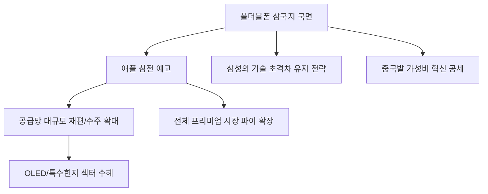

# 산업/기술 분석: 폴더블폰 '삼국지'와 애플의 참전, 프리미엄 스마트폰 시장의 지각변동
## 투자 신호 + 사회적 영향 평가

---

## 📌 기사 기본 정보

- **날짜**: 2026-03-28
- **출처**: 글로벌 테크 및 모바일 산업 트렌드 보고서
- **카테고리**: 경제 > 산업 > IT/하이브리드
- **핵심 주제**: 삼성전자가 주도해 온 폴더블폰 시장에 중국 업체들의 매서운 추격과 마침내 예고된 애플(Apple)의 폴더블 아이폰 참전이 가져올 시장의 판도 변화 및 핵심 부품 공급망의 지각변동 분석

**메타데이터**
- 주요 모델: 갤럭시 Z 시리즈(삼성), 메이트 X 시리즈(화웨이), 믹스 폴드(샤오미), 폴더블 아이폰(가칭)
- 핵심 기술: UTG(Ultra Thin Glass), 물방울 힌지, 온디바이스 AI, 하이브리드 OLED
- 주요 주체: 삼성전자, 애플, 화웨이, 구글, 디스플레이 서플라이 체인
- 키워드: 폴더블 삼국지, 애플 이펙트, 폼팩터 혁신, 스마트폰 프리미엄화

---

## 🔍 기사를 통한 투자 신호 추출

### 1단계: 핵심 사건 분해

**What (무엇이 일어났는가?)**
- 니치 마켓(틈새시장)으로 여겨졌던 폴더블폰이 주류 프리미엄 세그먼트로 진입. 특히 폴더블 시장에 회의적이었던 애플이 관련 비공개 프로토타입 테스트를 마치고 양산 준비에 들어갔다는 소식이 전해지며, 전 세계 부품 공급망이 '애플 기준'으로 재편되고 있음.

**When (언제 일어났는가?)**
- 2026-03-28 (기존 바(Bar) 형태 스마트폰의 하드웨어 혁신이 한계에 도달하고, 생성형 AI를 구동하기 위한 '대화면'의 필요성이 극대화된 시점)

**Why (왜 일어났는가?)**
- 정체된 스마트폰 교체 주기를 깨우기 위한 강력한 폼팩터(형태) 변화 필요성
- 중국 업체들의 기술적 진보로 인한 삼성의 독점적 지위 약화와 생태계 확장

**Who (누가 주도하는가?)**
- '완성도'를 무기로 뒤늦게 시장을 장악하려는 애플
- '초격차 기술'로 점유율 방어에 나선 삼성전자
- '가성비와 혁신 속도'를 앞세운 중국 연합(화웨이, 오포, 비보)

---

### 2단계: 투자 신호 해석

#### A. **긍정적 신호 (Bullish)**

**① '애플 공급망' 대규모 수주 및 부품 고도화 수혜**
- **신호**: 애플의 폴더블 양산 확정 및 부품 발주 시작
- **의미**: 애플의 시장 진입은 전체 폴더블 시장 파이를 3~5배 이상 키우는 기폭제가 됨. 특히 까다로운 애플의 품질 기준을 맞춘 기업은 '글로벌 표준' 부품사로 등극
- **투자 기회**: 하이브리드 OLED 패널사(LG디스플레이, 삼성디스플레이), 고난도 힌지(Hinge) 부품사, 강화유리(UTG) 가공 업체

**② 전용 '온디바이스 AI'와 결합된 하드웨어 수요 폭발**
- **신호**: 접었을 때와 폈을 때 각각 다른 AI 기능을 수행하는 UI/UX 경쟁
- **의미**: 큰 화면을 활용한 멀티태스킹 AI 기능이 폴더블폰의 킬러 콘텐츠가 됨
- **투자 기회**: AP(애플리케이션 프로세서) 공급사, 모바일 AI 가속기(NPU) 설계사

---

#### B. **위험 신호 (Bearish)**

**① 삼성전자의 '독점적 점유율' 급감 및 마진 압박**
- **신호**: 애플의 진입과 중국의 가성비 폴더블 공세
- **의미**: 삼성이 더 이상 유일한 선택지가 아니게 되며 가격 경쟁이 시작됨. 대규모 마케팅 비용 지출로 인한 수익성 악화 우려
- **투자 리스크**: 삼성전자 모바일(MX) 사업부 비중이 과도한 단일 부품 공급사

**② '주름 및 내구성' 이슈 재부각에 따른 교체 수요 지연**
- **신호**: 애플 폴더블폰 출시 후 소비자들의 냉정한 평가 (주름 불만 등)
- **의미**: 기술적 완성도가 대중의 기대치를 충족하지 못할 경우 시장 성장세가 급격히 꺾일 위험
- **투자 리스크**: 기술력이 낮은 범용 부품 납품 업체

---

### 3단계: 섹터별 투자 기회 매트릭스

#### ✅ **높은 기대도 + 낮은 리스크**

**글로벌 디스플레이 및 특수 소재(PI, UTG) 독점 기업**
- 누가 이기든 화면은 구부려야 하며, 이 핵심 소재를 대체할 수 있는 기술은 극소수 기업만이 보유하고 있음
- **투자 추천도**: ⭐⭐⭐⭐⭐

---

## 💰 구체적 투자 신호 변환

### 신호 1: '아이폰 폴더블'은 거대 유동성의 이정표다

**투자 해석**: 기사는 테크 투자자들에게 '마지막 남은 거대 하드웨어 전환'이 시작되었음을 알림. 애플의 참전은 단순한 신제품 출시가 아니라, 전 세계 수억 명의 아이폰 유저가 폴더블 생태계로 넘어온다는 뜻임. 이는 디스플레이, 힌지, 안테나, 배터리 구조 전반의 대변혁을 가져오므로, 지금부터 애플의 '공급망 리스트(Apple Supplier List)' 변화를 추적하는 것이 향후 3년의 수익률을 결정할 것임.

---

## 🌍 사회적 영향 평가

### A. 긍정적 사회 영향
- **모바일 생산성의 혁명적 진화**: 태블릿과 스마트폰의 경계가 무너지며 이동 중 업무 및 창작 활동의 효율성 극대화
- **첨단 소재 및 기계 공학 기술의 진보**: 폴더블 기술 개발 과정에서 얻은 소재/기계 기술이 로보틱스, 웨어러블 등 타 산업으로 확산(Spillover Effect)

### B. 부정적 사회 영향
- **스마트폰 가격의 '초고가화'에 따른 가계 부담**: 200~300만 원대의 사치재가 된 통신 기기로 인해 청년층 및 서민 가계의 통신비 지출 증가
- **전자 쓰레기(E-waste) 증가**: 복잡한 부품 구조로 인해 수리가 어렵고 교체 주기가 짧아지며 발생하는 환경 오염 심화

---

## 🎯 결론: 당신의 투자 전략 수립

- **즉시 실행**: 포트폴리오 내 스마트폰 섹터를 '부품 가구치(Content value)' 상승 종목(힌지, OLED) 위주로 압축
- **3개월 후**: 애플 개발자 컨퍼런스(WWDC) 등에서 발표될 '폴더블 전용 OS' 힌트 및 부품 양산 일정 확인

---

## 📝 Obsidian 연결 구조

