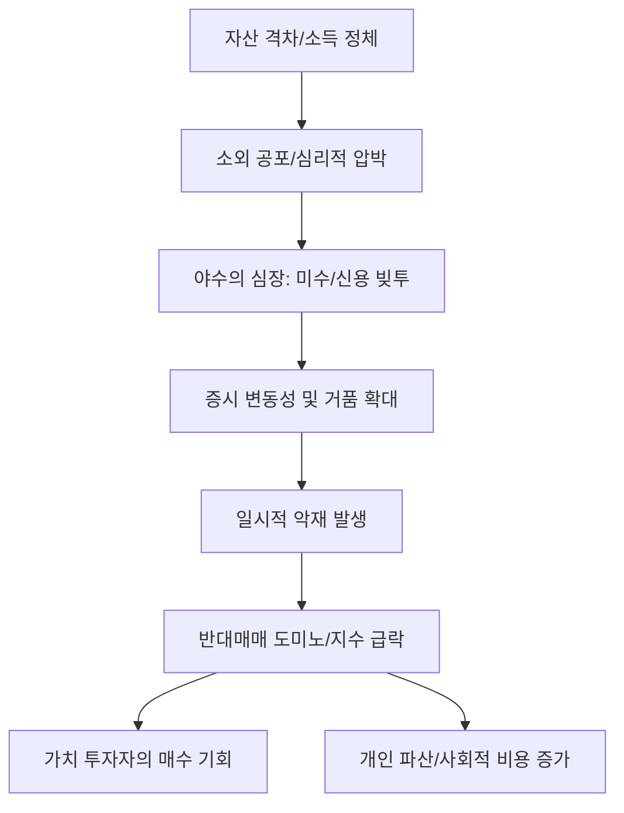

# 증시/사회 분석: '야수의 심장'과 '빚투'의 늪, 자산 격차 시대의 고위험 머니게임
## 투자 신호 + 사회적 영향 평가

---

## 📌 기사 기본 정보

- **날짜**: 2026-03-28
- **출처**: 대한민국 증시 수급 및 투자자 심리 리포트
- **카테고리**: 경제 > 증시 > 투자심리
- **핵심 주제**: 자산 양극화가 심화되는 가운데, 일확천금을 노리는 '야수의 심장'을 가진 개인 투자자들이 신용 대출과 미수 거래를 동원한 '빚투'에 몰리는 현상과 이로 인한 증시 변동성 확대 및 파산 리스크 분석

**메타데이터**
- 주요 지표: 신용공여 잔고(전년비 XX% 증가), 반대매매 건수, 2030 영끌 투자 비중
- 핵심 변수: 고금리 환경에서의 이자 부담, 특정 테마주 쏠림, FOMO(소외 공포) 심리
- 주요 주체: 개인 투자자, 금융감독원, 증권사 유관 부서, 유튜브 주식 채널
- 키워드: 빚투(Debt Investing), 야수의 심장, 반대매매 리스크, 자산 격차, 도박적 투자

---

## 🔍 기사를 통한 투자 신호 추출

### 1단계: 핵심 사건 분해

**What (무엇이 일어났는가?)**
- 노동 소득만으로는 계층 이동이 불가능하다는 좌절감이 확산되면서, 개인 투자자들이 무리한 대출을 끌어 고위험·고수익 종목에 베팅하는 현상 가속. 특히 정보가 부족한 상태에서 인공지능이나 2차전지 등 변동성이 큰 특정 테마주에 미수 거래가 집중되며 '폭락 시 반대매매 도미노' 리스크가 임계점에 도달.

**When (언제 일어났는가?)**
- 2026-03-28 (시장의 펀더멘털은 불안정한데 유동성 랠리에 대한 막연한 기대와 자산 격차에 대한 공포가 충돌하는 극도의 혼란기)

**Why (왜 일어났는가?)**
- '벼락 거지'가 될 수 있다는 공포가 이성적인 리스크 관리를 압도
- 유튜브 등 SNS를 통해 전파되는 일부 성공 사례의 일반화 오류
- 고금리로 인해 낮아진 실질 가처분 소득을 투기적 수익으로 보전하려는 심리

**Who (누가 주도하는가?)**
- 인생 역전을 꿈꾸는 청년 및 서민층 투자자
- 이자 수익을 높이기 위해 신용 한도를 유연하게 운영하는 일부 증권사

---

### 2단계: 투자 신호 해석

#### A. **긍정적 신호 (Bullish)**

**① 역설적인 '바닥 매수'의 선행 지표**
- **신호**: 반대매매가 터지며 시장 전체가 이유 없이 투매되는 시점
- **의미**: '빚투' 자금이 강제로 청산되는 국면은 보통 과도한 하락의 정점이자, 현금을 보유한 가치 투자자에게는 최고의 매수 타이밍임
- **투자 기회**: 반대매매 도미노로 동반 하락한 지수 대표주 및 우량 성장주

**② 개인의 정보 접근성을 높이는 'AI 투자 컨설팅' 수요 증대**
- **신호**: 뇌동매매로 인한 손실 경험 후 '정교한 데이터'에 대한 갈증
- **의미**: 감정을 제거하고 객관적 지표를 제공하는 로보어드바이저 솔루션의 신뢰도 상승
- **투자 기회**: 인공지능 기반 자산 관리 엔진 개발사, 데이터 유료 구독 서비스 업체

---

#### B. **위험 신호 (Bearish)**

**① '수급의 벼랑 끝' 리스크 (Tail Risk)**
- **신호**: 신용 잔고가 역대 최고치 경신 중인 종목
- **의미**: 악재가 터질 경우 '반대매매 → 주가 하락 → 추가 반대매매'의 지옥 레이스가 펼쳐질 가능성 매우 높음
- **투자 리스크**: 신용 융자 비율이 5%를 넘는 고점 횡보 중인 테마주

**② 가계 부채 부실화에 따른 '사회적 금융 비용' 증가**
- **신호**: 주식 파산에 따른 개인 회생 신청자 급증
- **의미**: 증권사들의 미수금 회수 불능 리스크 및 사회 전반의 소비 위축으로 이어져 전체 경제 활력 저하
- **투자 리스크**: 미수금 비중이 높은 중소형 증권사

---

### 3단계: 섹터별 투자 기회 매트릭스

#### ✅ **높은 기대도 + 낮은 리스크**

**신용 잔고가 극도로 적고 자사주 매입/소각을 활발히 하는 '주주 환원 우량주'**
- 투기 자금이 꼬이지 않아 변동성 장세에서도 견고하게 버틸 수 있는 '방어적 성장주'임
- **투자 추천도**: ⭐⭐⭐⭐⭐

---

## 💰 구체적 투자 신호 변환

### 신호 1: '남들의 빚'이 당신의 '수익'이 되는 잔인한 구간

**투자 해석**: 기사는 지금이 '제정신이 아닌 시장'임을 경고함. '야수의 심장'은 곧 '눈먼 돈'의 다른 이름임. 투자자는 지금 빚내서 들어가는 대중의 뒤를 쫓을 것이 아니라, 그들이 감당하지 못해 내뱉을(반대매매) 우량한 매물을 담을 '사냥꾼의 지갑'을 준비해야 함. 신용 잔고가 바닥까지 털리는 날이 진정한 '매수 버튼'을 누르는 날임.

---

## 🌍 사회적 영향 평가

### A. 긍정적 사회 영향
- **금융 시장의 자정 작용**: 과도한 투기 열풍이 한 차례 휩쓸고 지나가며 '진짜 실력' 있는 투자자와 기업만이 남는 시장 정화 과정
- **국가 차원의 금융 교육 강화**: 투기적 참상의 반복을 막기 위해 정부와 교육 기관이 실질적인 금융 리트러시 교육을 강화하는 계기

### B. 부정적 사회 영향
- **세대적 자산 몰락**: 미래 동력인 청년 세대가 주식 도박으로 자산을 탕진할 경우 발생하는 장기적인 고용 및 결혼 시장의 위축
- **사회적 위화감 및 분노 축적**: '운 좋게' 번 사람과 '운 없게' 망한 사람 간의 갈등이 공동체의 연대감을 저해하고 극단적인 혐오 정서로 발전

---

## 🎯 결론: 당신의 투자 전략 수립

- **즉시 실행**: 본인 계좌의 미수/신용 설정 해제 및 관심 종목의 '신용 비중' 전수 조사 후 5% 이상 종목 제외
- **3개월 후**: 반대매매 물량이 쏟아진 후의 지수 바닥 확인 및 우량주 중심의 단계적 분할 매수 시작

---

## 📝 Obsidian 연결 구조

