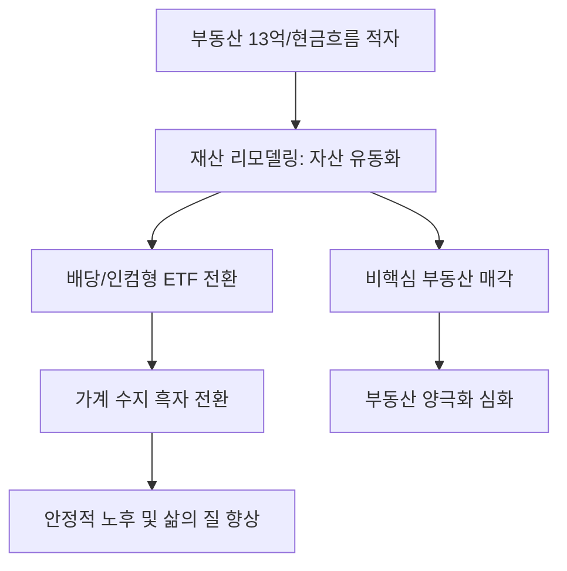

# 재테크/자산 분석: 자산 13억의 '매달 적자' 역설, 부동산 매각 후 배당 ETF로의 재산 리모델링
## 투자 신호 + 사회적 영향 평가

---

## 📌 기사 기본 정보

- **날짜**: 2026-03-30
- **출처**: 대한민국 가계 재무 설계 실무 사례 리포트
- **카테고리**: 경제 > 재테크 > 자산리모델링
- **핵심 주제**: 13억 원대의 자산을 보유하고도 현금 흐름 부재로 매달 생활비 적자를 겪는 가계의 사례를 통해, 비핵심 부동산을 매각하고 이를 매달 배당을 주는 ETF로 전환하여 '살아있는 현금 흐름'을 구축하는 재산 리모델링 전략 분석

**메타데이터**
- 주요 문제: 자산의 90% 이상이 비유동성 부동산에 묶인 '하우스 푸어(House Poor)' 현상
- 솔루션: 비핵심 부동산(지방 아파트, 오피스텔 등) 정리 → 고배당 ETF(월배당형) 분산 투자
- 주요 목표: 매달 일정한 현금 흐름(Cash Flow) 창출 및 가계 수지 흑자 전환
- 키워드: 자산 리모델링, 현금 흐름(Cash Flow), 배당 ETF, 수익형 자산 전환, 부동산 유동화

---

## 🔍 기사를 통한 투자 신호 추출

### 1단계: 핵심 사건 분해

**What (무엇이 일어났는가?)**
- 자산의 총액(Size)은 크지만 수익성(Yield)이 없는 부동산에 묶여 삶의 질이 떨어지고 원리금 상환에 허덕이는 중산층 가계의 위기 부각. 단순히 자산을 지키는 전략에서 '자산을 활용해 생활비를 버는' 유동성 중심 전략으로의 대전기 도래.

**When (언제 일어났는가?)**
- 2026-03-30 (부동산 가격 상승세는 둔화된 반면 금리와 세금 등 유지 비용은 급증하여 실질 수익률이 마이너스(-)로 돌아선 시점)

**Why (왜 일어났는가?)**
- 부동산 중심의 한국형 자산 구조가 가진 취약성 노출
- 고물가 시대에 '평가 차익'보다 '당장 쓸 수 있는 현금'의 가치가 더 높아짐
- 배당 투자의 대중화 및 다양한 인컴(Income)형 금융 상품의 등장

**Who (누가 주도하는가?)**
- 은퇴를 앞두거나 자녀 교육비 등 현식적 지출이 큰 4050 세대 가계
- 자산 구조조정을 돕는 은행 PB 및 프라이빗 금융 컨설턴트

---

### 2단계: 투자 신호 해석

#### A. **긍정적 신호 (Bullish)**

**① '월배당 ETF' 및 '인컴 펀드' 시장의 폭발적 수요**
- **신호**: 부동산 매각 자금의 대규모 금융권 유입
- **의미**: 주식 시장의 성격이 '시세 차익(Growth)'에서 '안정적 배당(Value)'으로 다변화되며 배당주들의 밸류에이션 리레이팅
- **투자 기회**: 미국/국내 고배당 성장 ETF, 연 5~7% 이상의 배당 수익률을 가진 리츠(REITs), 금융지주사

**② 자산 관리 컨설팅 및 세무 대행 서비스의 활성화**
- **신호**: 부동산 매각 과정에서의 양도세 절세 및 자산 재배치 수요
- **의미**: 복잡한 자산 구조 조정을 전문적으로 설계해 주는 유료 서비스의 가치 상승
- **투자 기회**: 세무 전문 핀테크, 프리미엄 자산 관리 플랫폼

---

#### B. **위험 신호 (Bearish)**

**① 비핵심 지역 부동산 시장의 '급매물 출회' 및 가격 하락**
- **신호**: 현금 흐름 확보를 위한 다주택자들의 지방/비역세권 자산 매각
- **의미**: 자산 리모델링 열풍이 불수록 입지가 좋지 않은 부동산은 구매자가 없어 가격이 급락하는 '양극화' 심화
- **투자 리스크**: 지방 소도시 부동산, 수익률이 낮은 구축 오피스텔 등 수익형 부동산

**② 배당 수익률에만 집착한 '고위험 커버드콜' 등의 원금 손실 리스크**
- **신호**: 높은 배당을 준다는 광고에 혹한 무리한 투자
- **의미**: 배당은 많이 주지만 주가 자체가 우하향하는 상품에 투자할 경우, 결국 총자산이 깎여나가는 함정에 빠질 우려
- **투자 리스크**: 자산의 펀더멘털 확인 없이 수익률 숫자만 높은 파생 결합 상품

---

### 3단계: 섹터별 투자 기회 매트릭스

#### ✅ **높은 기대도 + 낮은 리스크**

**글로벌 우량 자산(배당 성장주) 중심의 배당 ETF**
- 단순히 배당만 많이 주는 게 아니라 기업 가치가 동반 상승하는 종목들로 구성된 자산은 가계의 장기 생존을 위한 필수 기초 자산임
- **투자 추천도**: ⭐⭐⭐⭐⭐

---

## 💰 구체적 투자 신호 변환

### 신호 1: '평가액'의 허상을 버리고 '현금 흐름'이라는 실리를 취하라

**투자 해석**: 기사는 자산 13억이 주는 안도감보다 '매달 100만 원의 적자'가 주는 고통이 더 실질적임을 보여줌. 앞으로의 투자는 '얼마를 가졌는가'가 아니라 '매달 얼마의 현금을 스스로 만들어내는가'로 패러다임이 완전히 바뀔 것임. 투자자는 부동산 비중을 줄이고 시스템에서 나오는 인컴 비중을 30~50%까지 확대하는 '자산의 가동률'을 높여야 함.

---

## 🌍 사회적 영향 평가

### A. 긍정적 사회 영향
- **자본 시장으로의 자금 유입 및 기업 투자 활성화**: 부동산에 고여 있던 자금이 주식 등 자본 시장으로 흐르며 생산적 분야의 투자 재원 확보 기여
- **노후 빈곤 예방 및 건강한 소비 유지**: 현금 흐름을 확보한 은퇴 세대가 안정적인 소비를 이어감으로써 내수 경기 침체 방어망 역할

### B. 부정적 사회 영향
- **부동산 양극화에 따른 지방 공동화**: 자산 리모델링 과정에서 소외된 지역의 부동산 가치가 폭락하며 발생하는 지역 간 빈부 격차 및 사회적 소외감 증대
- **금융 시장 변동성에 노출된 가계**: 부동산이라는 콘크리트 안전자산에서 변동성이 큰 금융 자산으로 이동하며 발생하는 리스크 관리 부족 시의 대규모 빈곤화 우려

---

## 🎯 결론: 당신의 투자 전략 수립

- **즉시 실행**: 현재 본인 자산의 '유동성 비율(당장 현금화 가능한 자산 vs 묶인 자산)' 계산 및 매달 가계 수지 분석
- **3개월 후**: 수익성이 낮은 부동산 자산의 과감한 정리 및 이를 대체할 '배당 성장주 포트폴리오' 셋업 완료

---

## 📝 Obsidian 연결 구조

