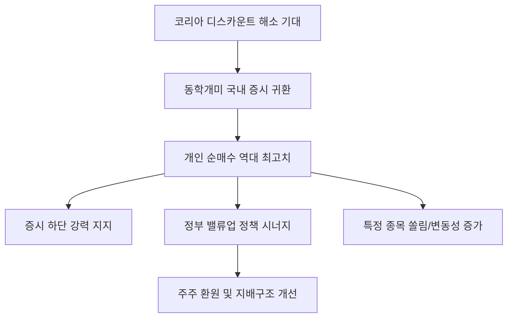

# 증권/수급 분석: '동학개미'의 귀환과 개인 순매수 역대 최대, 국내 주식 쏠림 현상
## 투자 신호 + 사회적 영향 평가

---

## 📌 기사 기본 정보

- **날짜**: 2026-03-30
- **출처**: 대한민국 증권 시장 수급 동향 실시간 리포트
- **카테고리**: 경제 > 증권 > 투자자수급
- **핵심 주제**: 해외 주식(서학개미) 열풍을 뒤로하고 다시금 국내 주식 시장으로 돌아온 개인 투자자들의 강력한 매수세와 역대 최대 기록을 경신 중인 개인 순매수 규모 및 특정 업종 쏠림 현상 분석

**메타데이터**
- 주요 수치: 개인 순매수 점유율(XX%), 누적 매수 거래 대금 역대 최고치
- 핵심 종목: 삼성전자 등 반도체 대형주, 특정 신성장 테마주(저PBR 등)
- 주요 주체: 동학개미(개인 투자자), 외국인/기관 투자자, 한국거래소(KRX)
- 키워드: 동학개미 귀환, 개인 순매수 역대 최대, 주주 환원 기대감, 수격세(수급 충격)

---

## 🔍 기사를 통한 투자 신호 추출

### 1단계: 핵심 사건 분해

**What (무엇이 일어났는가?)**
- 해외 시장(엔비디아, 나스닥 등)의 고점 부담감이 커진 가운데, 상대적으로 저평가된 국내 시장의 '기업 밸류업 프로그램' 기대감과 반도체 업황 회복이 맞물리며 '동학개미'들이 대거 귀환. 개인 투자자들이 외국인과 기관의 매도 물량을 압도적으로 받아내며 시장의 하단을 강력하게 지지하고 있음.

**When (언제 일어났는가?)**
- 2026-03-30 (정부의 주주 환원 정책 강화 예고와 삼성전자의 실적 턴어라운드가 가시화된 '국내 증시 재평가'의 초입)

**Why (왜 일어났는가?)**
- 해외 주식 양도세 부담 및 환율 변동성 확대에 따른 '안방 투자' 매력 증가
- 정부 주도의 '밸류업' 정책으로 인한 배당 확대 및 자사주 소각 기대
- 국내 반도체 산업의 세계적 경쟁력 재확인에 따른 자신감 회복

**Who (누가 주도하는가?)**
- 스마트해진 4050 주력 투자층 및 정보력을 갖춘 MZ 세대
- 수급의 질적 변화(단타 위주에서 장기 보유 성향으로 일부 전환)

---

### 2단계: 투자 신호 해석

#### A. **긍정적 신호 (Bullish)**

**① 증시 하방 경직성 확보 및 '유동성 랠리'의 토대 마련**
- **신호**: 개인 투자자들의 끊이지 않는 매수 대기 자금(고객 예탁금 상승)
- **의미**: 외국인이 일시적으로 이탈해도 개인이 이를 방어할 수 있는 '수급의 맷집'이 생겼음을 의미
- **투자 기회**: 개인이 선호하는 대형 우량주, 증권 거래 대금 증가 수혜를 입는 '증권사 대장주'

**② '저PBR(주가순자산비율)' 및 가치주 섹터의 리레이팅(Re-rating)**
- **신호**: 정부 정책과 동학개미의 매수세가 맞물린 저평가 종목 사냥
- **의미**: 그동안 소외되었던 금융, 자동차, 지주사 등 저평가 자산 가치주들의 주가 정상화
- **투자 기회**: 밸류업 프로그램 수혜주, 현금 흐름이 풍부한 지배구조 우량주

---

#### B. **위험 신호 (Bearish)**

**① 특정 테마주와 종목에 대한 '쏠림(Concentration)' 및 변동성 증폭**
- **신호**: 개인 매수세가 반도체나 초전도체 등 특정 섹터에만 기형적으로 집중됨
- **의미**: 개인이 주도하는 수급은 '공포'나 '탐욕'에 의해 한순간에 빠져나갈 수 있어 주가 급등락 리스크 상시화
- **투자 리스크**: 펀더멘털과 상관없이 개인 수급으로 오버슈팅 중인 테마주

**② 외국인/기관과의 수급 불균형 및 '외끌이' 장세의 한계**
- **신호**: 외국인은 파는데 개인만 사는 형국
- **의미**: 개인의 자금력에는 한계가 있으며, 글로벌 자금(외국인)이 장기적으로 들어오지 않을 경우 지수의 상단이 제한됨
- **투자 리스크**: 외국인 지분율이 급격히 낮아지는 대형 수출주

---

### 3단계: 섹터별 투자 기회 매트릭스

#### ✅ **높은 기대도 + 낮은 리스크**

**외국인 수급과 개인 수급이 '쌍끌이'로 유입되는 실적 턴어라운드 섹터**
- 개인만 사는 종목보다, 개인이 사는데 외국인도 뒤늦게 따라오는(혹은 그 반대) 교집합 종목이 가장 안정적인 상승세를 보임
- **투자 추천도**: ⭐⭐⭐⭐

---

## 💰 구체적 투자 신호 변환

### 신호 1: '코리아 디스카운트'를 해소할 진짜 주체는 '개미'다

**투자 해석**: 기사는 한국 증시의 주권이 다시 개인에게 돌아오고 있음을 시사함. 이는 단순히 물량을 받는 게 아니라, 주주 권리를 찾으려는 '행동주의적 경향'이 개인 투심과 결합되고 있다는 뜻임. 투자자는 이제 외국인 창구만 볼 게 아니라, 신용 잔고와 예탁금 추이를 보며 '개인들이 어디에 줄을 서 있는지'를 먼저 읽어야 수익의 기회를 잡을 수 있음.

---

## 🌍 사회적 영향 평가

### A. 긍정적 사회 영향
- **국민 자산 형성의 선순환 구조 마련**: 해외로 빠져나가던 자본이 국내 기업에 투자되어 기업 성장의 과실을 국민들이 직접 향유
- **주주 자본주의 성숙화**: 개인 투자자들의 목소리가 커지며 기업들의 불투명한 지배구조 개선 및 주주 중시 경영 문화 정착 기폭제

### B. 부정적 사회 영향
- **쏠림 매매에 따른 박탈감 및 손실 위험**: 특정 종목을 못 가진 사람들의 소외감과, 상부에서 물린 개인들의 대규모 손실 시 발생하는 사회적 활력 저하
- **도박성 투기 문화 변질 우려**: '투심 쏠림'이 심해질수록 건전한 투자가 아닌 '눈치 게임' 식의 투기판으로 변질될 위험 상존

---

## 🎯 결론: 당신의 투자 전략 수립

- **즉시 실행**: 개인 투자자 매수가 집중되는 종목 중 '공매도 잔고'와 '신용 비중'을 대조하여 숏 스퀴즈(Short Squeeze) 가능성 조기 포착
- **3개월 후**: 정부의 밸류업 프로그램 실질 이행 공시와 배당 시즌 수익률을 확인하며 포트폴리오 리밸런싱

---

## 📝 Obsidian 연결 구조

