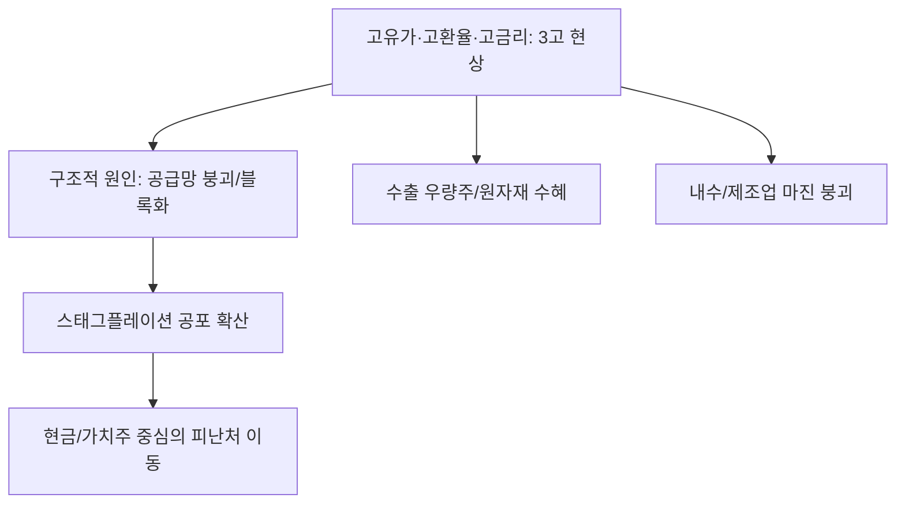

# 거시/금융 분석: '신민영의 마켓나우' 고유가·고환율·고금리, 이번은 다르다
## 투자 신호 + 사회적 영향 평가

---

## 📌 기사 기본 정보

- **날짜**: 2026-03-31
- **출처**: 신민영의 마켓나우 (Market Now) 전문 칼럼
- **카테고리**: 경제 > 거시경제 > 글로벌금융
- **핵심 주제**: 유가, 환율, 금리가 동시에 치솟는 '3고(高) 현상' 재발과 과거의 위기와는 다른 복합적 구조적 원인 분석 및 한국 경제의 대응 체력 진단

**메타데이터**
- 주요 지표: WTI 유가($100 돌파 가능성), 원/달러 환율, 기준 금리 유지 기조
- 핵심 쟁점: 고물가 고착화(Sticky Inflation), 지정학적 공급망 마비, 자본 유출 리스크
- 주요 주체: 한국은행, 기획재정부, 연방준비제도(Fed), 글로벌 원자재 시장
- 키워드: 3고 현상, 스태그플레이션 공포, 구조적 리스크, 통화 정책 딜레마

---

## 🔍 기사를 통한 투자 신호 추출

### 1단계: 핵심 사건 분해

**What (무엇이 일어났는가?)**
- 국제 유가가 지정학적 불안으로 급등하고, 이에 따라 달러 강세(고환율)와 고금리 기조가 꺾이지 않는 '3고 현상'이 전방위적으로 확산. 과거 일시적 충격과 달리 이번엔 공급망 해체와 블록화라는 '구조적 원인'이 결합되어 장기화될 조짐.

**When (언제 일어났는가?)**
- 2026-03-31 (금리 인하를 기대하던 시장의 낙관론이 깨지고, 다시금 인플레이션 방어를 위한 긴축 모드가 강화된 시점)

**Why (왜 일어났는가?)**
- 중동 및 동유럽 발 에너지 공급 불안 (고유가 주도)
- 미국의 견고한 경제 데이터와 안전 자산 쏠림 (고환율/고금리 유발)
- 세계화의 종말과 보호무역주의 강화로 인한 생산 원가 상승

**Who (누가 주도하는가?)**
- 공급망을 무협화한 자원 부국과 패권 국가군
- 물가 안정을 위해 금리 인하 카드를 만지작거리다 다시 얼어붙은 중앙은행들

---

### 2단계: 투자 신호 해석

#### A. **긍정적 신호 (Bullish)**

**① 원자재 및 에너지 직접 수혜 섹터의 독주**
- **신호**: 유가 및 원자재 가격의 장기 우상향
- **의미**: 인플레이션을 방어할 수 있는 실물 자산 및 관련 인프라 기업의 실적 급증
- **투자 기회**: 정유/에너지 대장주, 원자재 트레이딩 상사, 대체 에너지(태양광, 수소) 인프라 구축 사

**② '환차익' 수혜를 입는 수출 우량주의 실적 개선**
- **신호**: 원/달러 환율의 고공행진
- **의미**: 해외 매출 비중이 압도적인 기업들은 원화 환산 시 매출과 이익이 자동 뻥튀기되는 효과 향유
- **투자 기회**: 북미 매출 비중이 높은 자동차, 방산, 반도체 대장주

---

#### B. **위험 신호 (Bearish)**

**① '비용 인상' 압박에 의한 제조업 마진 붕괴**
- **신호**: 고유가에 따른 물류비 및 에너지 원가 상승
- **의미**: 원재료를 수입해 가공하는 국내 대부분의 제조업체가 이익률 급락 위기 직면
- **투자 리스크**: 원가 전가력이 낮은 소형 완제품 기업, 항공/물류 섹터

**② 자산 가격 하락 및 소비 위축 (스태그플레이션 진입)**
- **신호**: 고금리로 인한 소비 여력 상실과 고물가의 결합
- **의미**: 주식, 부동산 등 위험 자산의 매력도가 급감하고 내수 소비재 기업들의 실적 악화
- **투자 리스크**: 부채 비율이 높은 건설사, 저가 경쟁 중인 내수 유통주

---

### 3단계: 섹터별 투자 기회 매트릭스

#### ✅ **높은 기대도 + 낮은 리스크**

**글로벌 독점력을 갖춘 '현금 부자' 가치주**
- 3고 현상이 지속될수록 현금을 많이 보유하고 가격 결정력이 있는 기업만이 살아남아 시장 점유율을 확장함
- **투자 추천도**: ⭐⭐⭐⭐⭐

---

## 💰 구체적 투자 신호 변환

### 신호 1: '이번엔 다르다'는 경고를 '포트폴리오 체질 개선'의 기회로

**투자 해석**: 기사는 지금의 위기가 일시적 난관이 아닌 '뉴 노멀(New Normal)'일 가능성을 경고함. 더 이상 저금리/저물가 시대의 공식(레버리지 성장주)은 작동하지 않음. 투자자는 '인플레이션 연동 자산'과 '글로벌 현금 흐름' 비중을 과감히 높여야 함. 유가가 오르면 돈을 벌고, 환율이 오르면 웃을 수 있는 구조(수출 기반 가치주)로 포트폴리오를 전면 개편해야 생존할 수 있음.

---

## 🌍 사회적 영향 평가

### A. 긍정적 사회 영향
- **에너지 및 자원 효율화 가속**: 고유가 압박으로 인해 산업 전반의 에너지 효율화 기술과 친환경 공정 도입이 획기적으로 빨라짐
- **국가 공급망 관리 시스템 정밀화**: 구조적 위기에 대응하기 위한 정부와 기업의 협력 강화로 공급망 탄력성 확보

### B. 부정적 사회 영향
- **서민 경제의 '트리플 악재' 타격**: 공공요금 인상, 대출 이자 부담 증가, 실질 임금 하락으로 인한 빈곤층 확대 및 양극화 심화
- **기업 구조조정 및 고용 한파**: 인건비와 원가를 감당하지 못한 기업들의 폐업과 신규 채용 중단으로 인한 사회적 불안 고조

---

## 🎯 결론: 당신의 투자 전략 수립

- **즉시 실행**: 부채 비중이 높은 종목 매도 및 금리 인하에 기대어 들고 있던 성장주 비중 축소
- **3개월 후**: 인플레이션 지표 하락 여부 및 환율 방어 대책 실효성 확인 후 원자재/수출주 비중 재조정

---

## 📝 Obsidian 연결 구조

