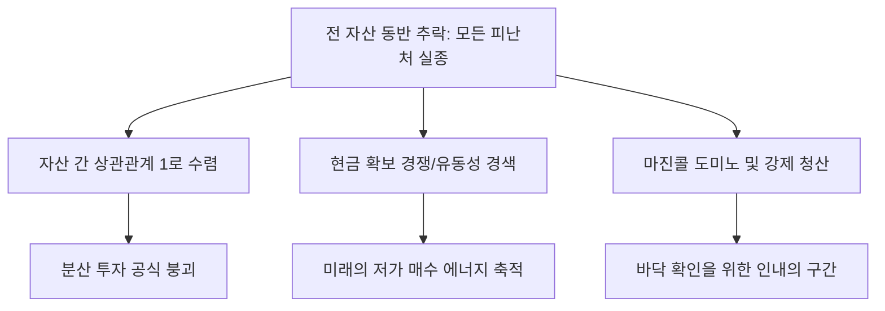

# 금융/시장 분석: 전 자산 동반 추락과 투자 피난처 실종 및 '현금 확보' 현상
## 투자 신호 + 사회적 영향 평가

---

## 📌 기사 기본 정보

- **날짜**: 2026-04-01
- **출처**: 글로벌 자산 시장 실시간 모니터링 센터
- **카테고리**: 경제 > 금융 > 자산배분
- **핵심 주제**: 주식, 채권, 부동산, 심지어 금(Gold)까지 전 자산군이 동시에 추락하며 전통적인 분산 투자 공식이 붕괴된 현상과 위험 자산을 회피하고 '현금(Cash)'으로 쏠리는 피난처 실종 국면 분석

**메타데이터**
- 주요 사건: 주식-채권 동반 하락, 안전 자산(금, 엔화)의 동반 약세 혹은 변동성 확대
- 핵심 원인: 긴축 장기화 공포, 글로벌 유동성 경색(Credit Crunch), 레버리지 자산의 연쇄 청산
- 주요 주체: 기관 투자자(헤지펀드, 연기금), 개인 투자자 전체, 중앙은행
- 키워드: 자산 동반 추락, 피난처 실종, Cash represents KING, 유동성 함정, 자산 상관관계 1단계

---

## 🔍 기사를 통한 투자 신호 추출

### 1단계: 핵심 사건 분해

**What (무엇이 일어났는가?)**
- 주식이 떨어지면 채권이 오르는 식의 '역상관관계'가 깨지고 모든 자산이 파란색(하락)을 기록. 인플레이션과 고금리가 고착화되면서 모든 자산의 할인율이 높아져 가치가 동시에 훼손되는 극한의 시장 상황 발생. 투자자들은 "어디로 숨어도 죽는다"는 공포 속에 모든 우량 자산을 팔아 현금을 챙기는 '현금 확보 경쟁' 돌입.

**When (언제 일어났는가?)**
- 2026-04-01 (만우절 같은 현실: 금리 인하 기대가 완전히 소멸하고 시장의 마지막 유동성 방어선이 무너진 시점)

**Why (왜 일어났는가?)**
- 고금리가 장기화되며 부채로 지탱되던 자산들의 버블이 동시에 터짐
- 상호 연결된 파생 상품들의 담보 부족(Margin Call)으로 인해 우량 자산(금, 대형주)까지 강제 매도해야 하는 상황
- '현금'의 구매력이 가장 강력해지는 대공황 전조적 심리

**Who (누가 주도하는가?)**
- 마진콜 대응을 위해 자산을 투매하는 대형 기관들
- 극도로 안정적인 단기 금융 상품(MMF 등)으로 자금을 이동시키는 스마트 머니

---

### 2단계: 투자 신호 해석

#### A. **긍정적 신호 (Bullish)**

**① '현금 보유자'에게 열리는 역대급 저가 매수 시장 (Deep Value)**
- **신호**: 모든 자산이 실적과 상관없이 '유동성 부족' 때문에 투매되는 구간
- **의미**: 펀더멘털은 멀쩡한데 가격만 폭락한 '금싸라기'들을 주워 담을 수 있는 10년 만의 기회
- **투자 기회**: 현금 비중 50% 이상 확보 후, 자산 동반 추락이 멈추는(거래량 폭증) 시점의 우량 지수 ETF

**② 단기 유동성 공급처 및 파킹/초단기 채권 시장의 팽창**
- **신호**: 자산 시장 이탈 자금의 MMF, 파킹통장 쏠림
- **의미**: 대기 자금이 어마어마하게 쌓이고 있음을 뜻하며, 이는 시장 신뢰 회복 시 강력한 반등 장세를 만들 에너지가 됨
- **투자 기회**: MMF 운용사, 초단기 금리 연동 ETF

---

#### B. **위험 신호 (Bearish)**

**① '분산 투자의 배신'에 따른 포트폴리오 붕괴**
- **신호**: 자산 간 상관관계가 1(모두 똑같이 움직임)에 수렴
- **의미**: 주식-채권 6:4 전략 등 고전적 분산 투자가 더 이상 작동하지 않아 손실 방어가 불가능함
- **투자 리스크**: 기존의 '안전하다'고 믿었던 중위험 중수익 상품 전체

**② 신용 경색 및 기업 파산 도미노**
- **신호**: 자산 가격 하락 → 담보 가치 하락 → 대출 회수 → 추가 자산 매도 → 파산
- **의미**: 실물 경기로 위기가 전이되어 견실한 기업들마저 자금 조달에 실패해 무너질 수 있음
- **투자 리스크**: 부채 비율이 높고 단기 차입금 비중이 큰 모든 섹터

---

### 3단계: 섹터별 투자 기회 매트릭스

#### ✅ **높은 기대도 + 낮은 리스크**

**미국 달러(USD) 및 초단기 국채(T-Bill)**
- 모든 것이 추락할 때 마지막까지 가치를 지키는 것은 '기축 통화 현금' 그 자체임
- **투자 추천도**: ⭐⭐⭐⭐⭐

---

## 💰 구체적 투자 신호 변환

### 신호 1: '아무것도 하지 않는 것'이 최고의 전략이 되는 시기

**투자 해석**: 기사는 지금이 '물타기'도 '불타기'도 위험한, 피난처가 없는 폭풍우 한가운데임을 경고함. 지금의 투자 신호는 '항복(Capituation)'이 나올 때까지 현금을 쥐고 관망하라는 것임. 자산이 동반 하락한다는 것은 시장의 시스템적 리스크가 터졌다는 뜻이므로, 기술적 반등을 노린 단타보다는 '현금이라는 총알'을 아껴두어 나중에 시장이 쓰레기 값에 내놓는 우량주를 사냥할 준비를 해야 함.

---

## 🌍 사회적 영향 평가

### A. 긍정적 사회 영향
- **레버리지 중심의 과열된 경제 구조 정상화**: 빚으로 만든 자산 거품이 제거되며 사회 전반의 부채 다이어트 및 건전성 확보
- **진정한 가치 투자자로의 선별**: 투기 세력이 떠나고 기업의 본질을 보려는 진지한 자본가들이 시장의 주류로 등극

### B. 부정적 사회 영향
- **중산층 및 은퇴 세대의 자산 증발**: 믿었던 분산 투자 자산이 동시에 무너지며 노후 자금이 훼손된 시민들의 사회적 불안과 우울증 확산
- **금융 시스템에 대한 불신**: '안전자산'조차 보호받지 못한다는 인식이 확산되며 뱅크런이나 자본 유출 등 시스템 붕괴 징조 심화

---

## 🎯 결론: 당신의 투자 전략 수립

- **즉시 실행**: 위험 자산 비중을 최소화하고 포트폴리오의 30~50% 이상을 현금성 자산(MMF, 파킹통장)으로 전환
- **3개월 후**: 전 자산 동반 하락의 끝을 알리는 'VIX 지수 피크' 및 '거래량 실린 장대 양봉' 확인 후 단계적 진입

---

## 📝 Obsidian 연결 구조

