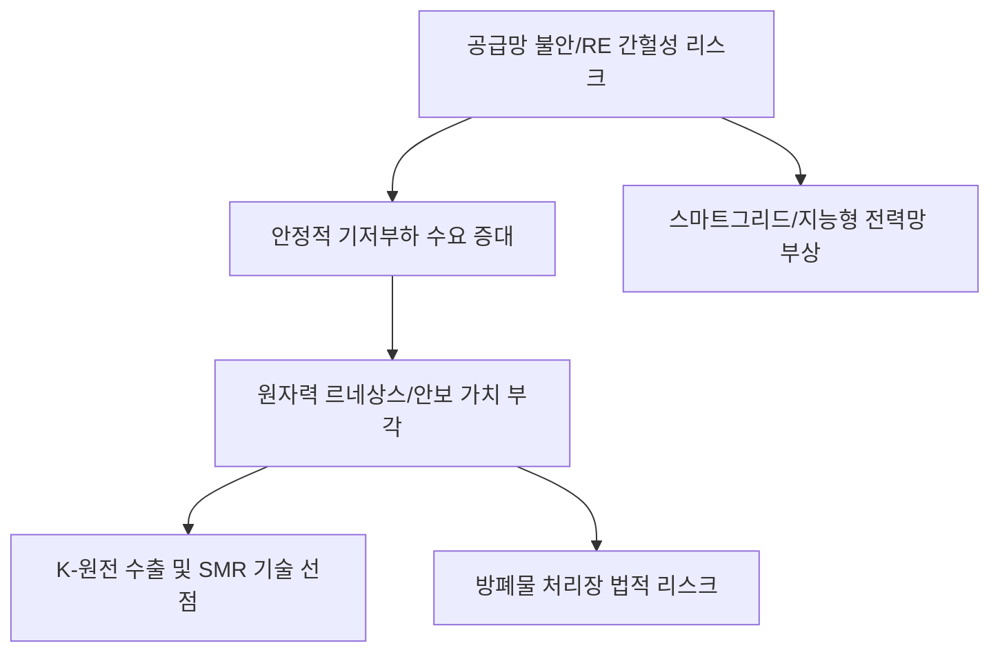

# 에너지/안보 분석: 원자력의 안보 가치와 재생에너지의 '간헐성 리스크' 분석
## 투자 신호 + 사회적 영향 평가

---

## 📌 기사 기본 정보

- **날짜**: 2026-04-01
- **출처**: 글로벌 에너지 믹스 및 전력 계통 안보 리포트
- **카테고리**: 경제 > 산업 > 에너지안보
- **핵심 주제**: 탄소 중립을 향한 여정에서 태양광·풍력 등 재생에너지가 가진 '간헐성(Intermittency)'의 물리적 한계와 리스크를 재확인하고, 기저 부하(Base Load)로서의 원자력 발전이 가진 전략적·경제적·안보적 가치의 재평가 분석

**메타데이터**
- 주요 이슈: 재생에너지 발전 비중 확대에 따른 계통 불안(Blackout 위험), ESS 비용 부담
- 핵심 대안: 차세대 원전(SMR), 기존 대형 원전의 수명 연장 및 신규 건설
- 주요 주체: 산업통상자원부, 한국전력(KEPCO), 글로벌 에너지 기업, 원자력 연구소
- 키워드: 원자력 르네상스, 간헐성 리스크, 전력 계통 안정성, SMR(소형모듈원전)

---

## 🔍 기사를 통한 투자 신호 추출

### 1단계: 핵심 사건 분해

**What (무엇이 일어났는가?)**
- 친환경 기조 속에 재생에너지를 급격히 늘렸으나, 날씨와 시간에 따라 전력 공급이 들쭉날쭉한 '간헐성' 문제가 국가 전력망을 위협하는 수준에 도달. 이를 보완하기 위해 24시간 안정적으로 전력을 생산할 수 있는 원자력이 '가장 현실적이고 안보적인 탄소중립 수단'으로 다시금 주목받음.

**When (언제 일어났는가?)**
- 2026-04-01 (유럽 등지에서 재생에너지 과잉 투자 이후 전기료 폭등과 잦은 정전을 경험하며 '에너지 안보'의 중요성을 깨닫게 된 교정기)

**Why (왜 일어났는가?)**
- 태양광/풍력의 변동성을 메워줄 ESS(에너지저장장치)의 설치 비용이 예상보다 훨씬 비싸고 수명에 한계가 있기 때문
- 러시아-우크라이나 전쟁 이후 화석 연료를 통한 백업 발전이 불가능해지며 원자력 외에는 대안이 사라짐

**Who (누가 주도하는가?)**
- 원전 강국으로서 수출 기회를 엿보는 대한민국 정부 및 기업
- 기술적 돌파구를 찾으려는 미국(빌 게이츠 등) 중심의 SMR 개발 세력

---

### 2단계: 투자 신호 해석

#### A. **긍정적 신호 (Bullish)**

**① 'K-원전' 밸류체인의 장기적 고성장 가속화**
- **신호**: 전 세계적인 원전 신규 건설 및 수명 연장 수요 폭증
- **의미**: 설계, 건설, 핵심 부품, 핵연료 관리 등 전 분야에서 세계 최고 수준인 한국 기업들의 독점적 수혜
- **투자 기회**: 원전 기자재사(한전기술, 두산에너빌리티 등), 원자력 제어 시스템 기업, SMR 특허 보유사

**② 전력 계통 안정화를 위한 '스마트 그리드' 및 지능형 전력망 수요 증대**
- **신호**: 원전과 재생에너지를 효율적으로 믹스하기 위한 관리 기술 필요
- **의미**: 전력의 흐름을 실시간으로 조절하고 저장하는 기술이 에너지 산업의 핵심 부가가치가 됨
- **투자 기회**: 스마트 미터링 기업, 송배전 자동화 솔루션 업체, 지능형 에너지 관리 소프트웨어(SaaS)

---

#### B. **위험 신호 (Bearish)**

**① 재생에너지 단일 섹터의 '수익성 악화' 및 투자 회수 지연**
- **신호**: 간헐성 리스크 보완을 위한 부가 비용(ESS 등)이 재생에너지 경제성을 갉아먹음
- **의미**: 단순히 설치 용량을 늘리는 것만으로는 돈을 벌기 힘든 구조적 한계 봉착
- **투자 리스크**: 보조금에만 의존하는 중소 규모 재생에너지 설치사, ESS 기술력이 낮은 배터리사

**② 고준위 방사성 폐기물 처리장 건설 지연에 따른 법적 리스크**
- **신호**: 원전은 늘리는데 버릴 곳은 없는 현실
- **의미**: 폐기물 처리 문제(방폐장법 등)가 해결되지 않을 경우 원전 가동이 중단되거나 사회적 비용이 폭증할 위험
- **투자 리스크**: 부지 확보가 안 된 상태에서 무리하게 확장하는 원전 운영사

---

### 3단계: 섹터별 투자 기회 매트릭스

#### ✅ **높은 기대도 + 낮은 리스크**

**원전의 안전성과 효율을 높이는 '디지털 트윈 및 AI 유지보수' 기술**
- 원전은 안전이 최우선이므로, 사고를 미리 예측하고 진단하는 고난도 소프트웨어 기술은 대체 불가한 수익원이 됨
- **투자 추천도**: ⭐⭐⭐⭐⭐

---

## 💰 구체적 투자 신호 변환

### 신호 1: '이념'의 에너지를 버리고 '물리'의 에너지에 집중하라

**투자 해석**: 기사는 에너지 정책이 정치적 이석(재생에너지 vs 원자력)을 떠나, 국가 경제가 돌아가기 위한 '물리적 안정성(간헐성 해결)'으로 회귀하고 있음을 시사함. 투자자는 이제 재생에너지 테마에만 매몰될 게 아니라, 그 빈틈을 누가 채워주는지(원자력, SMR)를 봐야 함. 국가 전략 산업으로서 원전 비중이 다시 높아지는 것은 거스를 수 없는 거대한 흐름임.

---

## 🌍 사회적 영향 평가

### A. 긍정적 사회 영향
- **일률적인 탄소 중립 달성**: 화석 연료를 효과적으로 대체하면서도 대량의 저렴한 전기를 공급하여 탄소 중립 목표와 산업 경쟁력을 동시 확보
- **지역 경제 활성화 및 기술 일자리 창출**: 원전 건설 및 운영을 통해 지역에 양질의 고소득 일자리를 제공하고 유관 기술 생태계 복원

### B. 부정적 사회 영향
- **방사능 안전에 대한 국민적 불안감**: 과거 원전 사고의 기억으로 인한 지역 위민 및 사회적 갈등의 상존
- **세대 간의 환경 부채 전가**: 폐기물 처리 문제를 해결하지 못한 상태에서 원전 비중을 높이는 것이 '미래 세대에게 짐을 지우는 것'이라는 윤리적 비판 노출

---

## 🎯 결론: 당신의 투자 전략 수립

- **즉시 실행**: 포트폴리오 내 에너지 비중을 '재생에너지 몰입'에서 '원자력-재생에너지 믹스'로 재조정
- **3개월 후**: 정부의 '제11차 전력수급기본계획' 등 구체적인 원전 확대 로드맵과 SMR 실증 사업 성과 확인

---

## 📝 Obsidian 연결 구조

