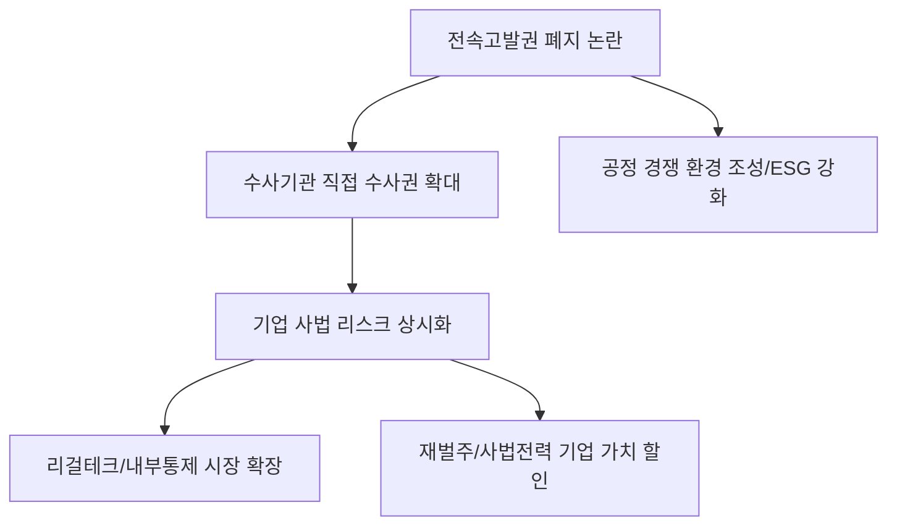

# 경제/정책 분석: 공정위 '전속고발권' 폐지 논란과 기업 수사권 확대의 파장
## 투자 신호 + 사회적 영향 평가

---

## 📌 기사 기본 정보

- **날짜**: 2026-04-01
- **출처**: 대한민국 공정거래 및 정책 법률 리포트
- **카테고리**: 경제 > 정책 > 법규준수
- **핵심 주제**: 공정거래위원회가 독점해 온 기업 고발권인 '전속고발권(Exclusive Referral Right)' 폐지 논란과 이에 따른 검찰 및 경찰의 직접 수사권 확대가 기업 경영 환경 및 투자 심리에 미치는 영향 분석

**메타데이터**
- 주요 법안: 공정거래법 개정안 (전속고발권 폐지 또는 대폭 축소)
- 핵심 변화: 공정위 고발 없이도 수사기관의 인지 수사 및 기소 가능
- 주요 주체: 공정거래위원회, 검찰청, 경제단체(경총, 전경련), 주요 대기업 법무팀
- 키워드: 전속고발권 폐지, 기업 수사권, 공정거래 리스크, 컴플라이언스(Compliance)

---

## 🔍 기사를 통한 투자 신호 추출

### 1단계: 핵심 사건 분해

**What (무엇이 일어났는가?)**
- 기업의 담합(카르텔)이나 불공정 행위에 대해 공정위만이 검찰에 고발할 수 있었던 권한을 폐지하여, 일반 시민의 신고나 수사기관의 자체 판단만으로도 기업을 직접 수사할 수 있도록 제도가 바뀌려 하고 있음. 이는 기업들에게 '전무후무한 사법 리스크'로 받아들여짐.

**When (언제 일어났는가?)**
- 2026-04-01 (기업의 투명성 강화를 내세운 입법 화두가 강력하게 제기되며 경영계가 '방어적 일 전' 모드로 들어간 시점)

**Why (왜 일어났는가?)**
- 공정위가 기업을 봐주거나 늦장 고발한다는 비판을 해소하기 위함
- 경제 범죄에 대한 엄단 의지를 통해 시장의 공정성 확보 유도

**Who (누가 주도하는가?)**
- 사법 정의 구현을 강조하는 국회 법사위 및 수사 주체들
- 이에 맞서 '경영 위축'과 '중복 수사'의 고통을 호소하는 재계 리더들

---

### 2단계: 투자 신호 해석

#### A. **긍정적 신호 (Bullish)**

**① '법률 및 컴플라이언스(Compliance)' 전문 솔루션 시장의 폭발적 성장**
- **신호**: 기업의 사법 리스크 관리 비용 급증
- **의미**: 누구나 고발할 수 있는 시대에는 사전에 법 위반 요소를 제거하는 '감시 시스템'이 생존의 열쇠가 됨
- **투자 기회**: 리걸테크(Legal-tech) 기업, 내부 통제 소프트웨어 전문사, 대형 로펌 관련 상장주

**② 시장 질서 확립에 따른 '중소 협력사' 및 '소비자' 권익 향상**
- **신호**: 대기업의 갑질이나 담합에 대한 강력한 억제력 작동
- **의미**: 공정한 경쟁 환경이 조성되며 혁신 역량을 갖춘 강소기업들의 실적 개선 기회 확대
- **투자 기회**: 대기업 의존도가 높았던 중소 부품사 중 기술 자립도가 높은 기업

---

#### B. **위험 신호 (Bearish)**

**① '사법 리스크 상수화'에 따른 기업 가치(Valuation) 할인**
- **신호**: 시시때때로 이어지는 검찰 수사와 압수수색 가능성
- **의미**: 경영진이 수사에 대응하느라 미래 전략에 집중하지 못하고, 브랜드 이미지가 실추되는 리스크 상시화
- **투자 리스크**: 오너 리스크가 크거나 과거 법 위반 전력이 많은 대규모 기업 집단(재벌주)

**② 국내 투자 위축 및 자본 유출 우려**
- **신호**: "한국에서는 사업하기 무섭다"는 경영계의 정서 확산
- **의미**: 신규 투자를 해외 생산 기지로 돌려 국내 고용과 투자가 줄어드는 '산업 공동화' 리스크
- **투자 리스크**: 국내 시장 비중이 높은 전통 제조업 및 수주 기반 대형 건설사

---

### 3단계: 섹터별 투자 기회 매트릭스

#### ✅ **높은 기대도 + 낮은 리스크**

**투명한 지배구조(ESG 수준이 높은)와 '클린 경영'이 확인된 우량주**
- 사법 리스크가 커질수록 투명하게 일해온 기업들의 가치는 '희소성' 때문에 올라가게 됨
- **투자 추천도**: ⭐⭐⭐⭐

---

## 💰 구체적 투자 신호 변환

### 신호 1: '방패'를 파는 기업은 뜨고, '구설'이 많은 기업은 진다

**투자 해석**: 기사의 핵심은 기업의 리스크 관리 중심축이 '공정위 로비'에서 '실질적 법규 준수'로 옮겨간다는 것임. 투자자는 기업이 내부 고발자 보상 제도를 잘 갖췄는지, 준법 감시 조직이 독립적인지를 집요하게 확인해야 함. 전속고발권 폐지는 기업의 '도덕성'을 '돈'의 가치로 직접 환산하게 만드는 강력한 시장 동력이 될 것임.

---

## 🌍 사회적 영향 평가

### A. 긍정적 사회 영향
- **시장 정의 구현 및 특권 폐지**: 기업의 불법 행위에 대해 예외 없이 법의 심판을 받게 함으로써 공정 경쟁의 가치 회복
- **투명한 기업 문화 유도**: 사법 리스크를 피하기 위해 스스로 내부 문화를 개혁하려는 기업들의 자정 작용 가속화

### B. 부정적 사회 영향
- **남고발 및 기획 수사 남용 가능성**: 경쟁사가 비리를 기획 제보하여 기업의 경영권을 흔드는 '법적 보복' 수단으로 변질될 위험
- **경영의 위축과 혁신 저하**: '안 하면 처벌받지 않는다'는 소극적 문화가 확산되며 과감한 대규모 투자가 사라질 우려

---

## 🎯 결론: 당신의 투자 전략 수립

- **즉시 실행**: 투자 중인 기업 중 '공정거래 관련 소송'이 진행 중이거나 이슈가 잦은 종목의 비중 축소
- **3개월 후**: 전속고발권 폐지 관련 법안의 통과 여부 및 검찰의 '기업 수사 전담팀' 신설 규모 확인

---

## 📝 Obsidian 연결 구조

