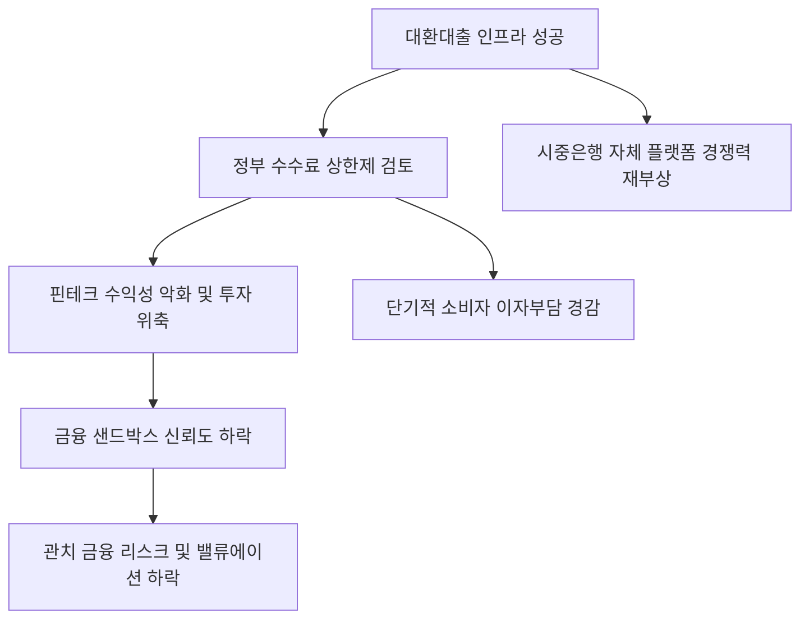

# 금융/혁신 분석: 대환대출 수수료 규제와 '핀테크 샌드박스' 성과 훼손 논란
## 투자 신호 + 사회적 영향 평가

---

## 📌 기사 기본 정보

- **날짜**: 2026-04-02
- **출처**: 대한민국 디지털 금융 혁신 및 규제 동향 리포트
- **카테고리**: 경제 > 금융 > 핀테크/규제
- **핵심 주제**: 대환대출 인프라의 성공에도 불구하고 정부가 '수수료 상한선' 규제를 검토하며 발생하는 핀테크 업계의 반발과, 혁신 금융의 상징인 '금융 샌드박스'의 성과가 관치 금융 논란으로 퇴색될 우려 분석

**메타데이터**
- 주요 정책: 대환대출 수수료 공시 및 상한제 도입 가능성 검토
- 핵심 쟁점: 혁신의 대가(Fee)에 대한 정부 개입 적절성, 핀테크 플랫폼 수익성 악화
- 주요 주체: 금융위원회, 핀테크 대장주(카카오페이, 토스, 네이버파이낸셜), 시중은행
- 키워드: 대환대출 인프라, 수수료 규제, 핀테크 샌드박스, 관치 금융 리스크

---

## 🔍 기사를 통한 투자 신호 추출

### 1단계: 핵심 사건 분해

**What (무엇이 일어났는가?)**
- 낮은 이자로 대출을 갈아타게 해주는 '대환대출 플랫폼'이 국민적 호응을 얻자, 정부가 여기서 발생하는 핀테크 사의 수수료가 금리 인하분을 상쇄한다며 수수료 전반을 규제하려 함. 업계는 혁신 서비스의 본질을 훼손하고 투자 의욕을 꺾는 조치라며 강력 항의 중.

**When (언제 일어났는가?)**
- 2026-04-02 (대환대출 인프라가 신용대출을 넘어 주택담보대출까지 확장되며 핀테크 기업의 새로운 수익원이 되려던 찰나)

**Why (왜 일어났는가?)**
- 고금리로 고통받는 서민들의 이자 부담을 1원이라도 더 줄여주려는 정치적/정책적 압박
- 핀테크 공룡들의 과도한 수수료 이익(낙수효과 미흡)에 대한 경계감

**Who (누가 주도하는가?)**
- 상생 금융과 물가 안정을 국정 과제로 삼은 금융 당국
- 상장 후 수익성 증명(Monetization) 압박을 받는 핀테크 경영진

---

### 2단계: 투자 신호 해석

#### A. **긍정적 신호 (Bullish)**

**① 시중은행의 '디지털 전환' 및 자체 플랫폼 경쟁력 강화**
- **신호**: 핀테크 플랫폼의 영향력을 규제로 억제하려는 분위기
- **의미**: 거대 플랫폼 세입자로 전락하려던 개별 시중은행들에게 숨통이 트이며, 자체 앱(Super App) 내의 금융 서비스 경쟁력이 다시 부각됨
- **투자 기회**: 탄탄한 자사 앱 유저를 보유한 대형 금융지주(KB, 신한 등)

**② 'B2B 금융 소프트웨어' 등 수수료 규제에서 자유로운 기술 공급 사**
- **신호**: 단순 중개보다는 '시스템 구축 및 데이터 연동' 기술의 가치 상승
- **의미**: 최종 수수료는 깎여도 인프라를 돌리는 기술료(SaaS)는 고정적으로 발생함
- **투자 기회**: 뱅킹 인프라 솔루션 기업, 데이터 API 전문 핀테크 지원 사

---

#### B. **위험 신호 (Bearish)**

**① 핀테크 섹터의 '수익 모델 훼손'에 따른 목표주가 하향**
- **신호**: 수수료 상한제 및 강력한 공시 의무 부과
- **의미**: 핀테크 기업의 가장 큰 성장 엔진인 '금융 중개 수수료'의 마진이 인위적으로 캡(Cap)에 씌워짐. 플랫폼 성장성의 천장이 조기에 닫힐 우려
- **투자 리스크**: 카카오페이, 토스(비상장 포함) 등 개인 금융 중개 비중이 높은 기업

**② '혁신 금융 샌드박스'의 신뢰성 실추 및 글로벌 인재 이탈**
- **신호**: 샌드박스 기간에는 혁신이라 칭찬하더니 수익이 나니 규제하는 행태 반복
- **의미**: 한국 금융 시장의 예측 불가능성(Regulatory Uncertainty)이 높아져 글로벌 VC 투자 유치가 어려워짐
- **투자 리스크**: 한국 시장 중심의 초기 핀테크 스타트업 전반

---

### 3단계: 섹터별 투자 기회 매트릭스

#### ✅ **높은 기대도 + 낮은 리스크**

**글로벌 결제 네트워크나 '비금융' 비중이 높은 빅테크 상장사**
- 국내 대출 규제 노이즈에서 자유롭고 사업 다변화가 잘 된 기업은 조정 시 매수 기회가 됨
- **투자 추천도**: ⭐⭐⭐

---

## 💰 구체적 투자 신호 변환

### 신호 1: '혁신'은 권장하지만 '이익'은 통제하는 시장의 이면

**투자 해석**: 기사는 한국 금융 시장의 가장 큰 리스크인 '관치(Government direction)'를 여실히 보여줌. 정부는 혁신 금융이라는 꽃은 피우고 싶어 하지만, 그 대가인 수수료 수익이라는 꿀은 국민에게 돌려주길 원함. 이는 핀테크 주식 투자 시 '성장성'보다 '정부 정책과의 마찰 가능성'을 제1의 분석 지표로 삼아야 함을 뜻함. 수익 모델이 규제 칼날 위에 있는 기업은 장기 투자에서 배제해야 함.

---

## 🌍 사회적 영향 평가

### A. 긍정적 사회 영향
- **소비자 금융 비용 절감의 극대화**: 중개 수수료 인하를 통해 대환대출 서비스의 혜택이 오롯이 서민 가계의 이자 경감으로 이어지는 효과
- **금융 서비스의 투명성 제고**: 불투명했던 플랫폼 수수료가 공시를 통해 공개되면서 정당한 가격 경쟁 유도

### B. 부정적 사회 영향
- **혁신 서비스의 질적 저하 및 중단**: 수익성이 담보되지 않는 핀테크 기업들이 신규 기술 개발이나 고객 편의 서비스 투자를 줄이는 악순환
- **국가 디지털 경쟁력 약화**: 규제가 무서워 새로운 시도를 하지 않는 '복지부동'형 핀테크 생태계 고착으로 글로벌 랭킹 하락

---

## 🎯 결론: 당신의 투자 전략 수립

- **즉시 실행**: 포트폴리오 내 핀테크 비중을 '기술 수출 가능 기업' 위주로 압축하고 국내 대출 중개 비중이 높은 종목은 중립 의견으로 하향
- **3개월 후**: 금융위원회의 '수수료 가이드라인' 확정본과 이에 따른 주요 플랫폼의 분기 실적 가이던스 변화 확인

---

## 📝 Obsidian 연결 구조

