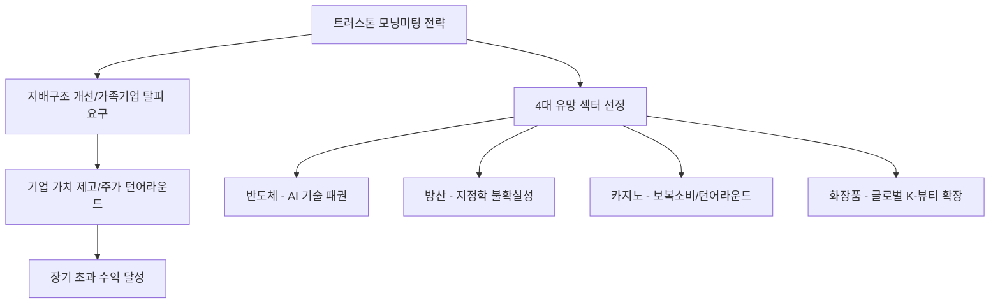

# 금융/투자 분석: 트러스톤자산운용 '모닝미팅' 투자철학과 2026 유망 섹터 포트폴리오
## 투자 신호 + 사회적 영향 평가

---

## 📌 기사 기본 정보

- **날짜**: 2026-04-02
- **출처**: 트러스톤자산운용 최고투자책임자(CIO) 인터뷰 및 모닝미팅 기록
- **카테고리**: 경제 > 금융 > 투자전략
- **핵심 주제**: 가치 투자의 본질을 고수하는 트러스톤자산운용의 운용 철학(철저한 상향식 리서치)과 2026년 주도 세터로 꼽은 반도체, 방산, 카지노, 화장품의 유망 사유 및 선정 기준 분석

**메타데이터**
- 주요 철학: 지배구조 개선(Actionable ESG), 펀더멘컬 기반 역발상 투자
- 핵심 유망 섹터: 반도체(AI 확장), 방산(지정학 수혜), 카지노(보복 소비/턴어라운드), 화장품(K-뷰티 2.0)
- 주요 주체: 트러스톤자산운용 CIO 및 섹터 매니저, 국내 기관 투자자
- 키워드: 트러스톤 모닝미팅, 기업 거버넌스, 섹터 로테이션, 알파 수익 추구

---

## 🔍 기사를 통한 투자 신호 추출

### 1단계: 핵심 사건 분해

**What (무엇이 일어났는가?)**
- 국내 독립계 자산운용사의 자존심인 트러스톤이 내부 전략 회의인 '모닝미팅'의 핵심 인사이트 공개. 단순히 인기 테마를 쫓는 것이 아니라, 기업 지배구조가 개선될 수 있는 기업(저평가 해소)과 글로벌 경쟁력이 입증된 4대 섹터(반도체, 방산, 카지노, 화장품)에 집중하는 포트폴리오 전략 제시.

**When (언제 일어났는가?)**
- 2026-04-02 (시장 변동성이 커지며 '진짜 실력' 있는 기업만이 살아남는 차별화 장세가 강화된 시점)

**Why (왜 일어났는가?)**
- 한국 증시의 고질적 문제인 '거버넌스(지배구조)' 개선이 주가 상승의 가장 큰 촉매제라는 신념
- 지정학적 갈등(방산)과 기술 패권(반도체), 실적 턴어라운드(카지노/화장품)라는 실질적 숫자(Number) 확인

**Who (누가 주도하는가?)**
- 행동주의 가치 투자를 지향하는 트러스톤자산운용 매니저들
- 기업 밸류업에 동참하려는 연기금 및 스마트 개인 자금

---

### 2단계: 투자 신호 해석

#### A. **긍정적 신호 (Bullish)**

**① '행동주의 펀드'가 지목한 저평가 기업의 가치 현실화**
- **신호**: 트러스톤 등 대형 운용사의 지배구조 개선 요구 및 지분 확보
- **의미**: 배당 확대, 자사주 소각 등 주주 환원 정책이 강제되어 주가가 하단 지지선을 넘어 레벨업(Level-up)될 가능성
- **투자 기회**: 트러스톤이 주주 서한을 보냈거나 지배구조 개선 가능성이 높은 중대형 가치주

**② 섹터 간 시너지와 '수출 실적'이 동반된 우량주의 장기 독주**
- **신호**: 방산(수주), 화장품(북미 수출), 반도체(HBM)의 역대급 데이터
- **의미**: 꿈(Hope)이 아닌 현실(Fact)에 기반한 성장을 하는 섹터들로 시장 수급 쏠림 현상 심화
- **투자 기회**: 각 유망 섹터 내 시장 점유율 1~2위 대장주

---

#### B. **위험 신호 (Bearish)**

**① '지배구조 개선 실패' 시 발생하는 대규모 실망 매물**
- **신호**: 경영진의 저항으로 인한 주주 제안 부결
- **의미**: 밸류업 기대감이 실망감으로 바뀌며 주가가 급등 이전보다 더 떨어지는 '밸류 트랩(Value Trap)' 위험
- **투자 리스크**: 오너가의 권력이 너무 견고해 외부 목소리를 전혀 듣지 않는 기업들

**② 업종별 '피크 아웃(Peak-out)' 논란 및 밸류에이션 부담**
- **신호**: 유망 섹터(방산, 화장품 등)의 주가가 단기 과열 양상
- **의미**: 실적은 좋으나 이미 주가에 선반영되어 있어, 기대치를 조금이라도 밑돌 경우 혹독한 조정 가능성
- **투자 리스크**: 전고점 부근에서 호재성 뉴스가 쏟아지는 인기 종목

---

### 3단계: 섹터별 투자 기회 매트릭스

#### ✅ **높은 기대도 + 낮은 리스크**

**글로벌 현금 흐름이 압도적인 '반도체·방산' 핵심 소재사**
- 완성품 업체보다 변동성이 적으면서도 전방 산업의 성장을 고스란히 흡수하는 '인프라 성격의 부품사'임
- **투자 추천도**: ⭐⭐⭐⭐⭐

---

## 💰 구체적 투자 신호 변환

### 신호 1: '모닝미팅'의 질문이 당신의 수익률을 결정한다

**투자 해석**: 기사의 핵심은 트러스톤 매니저들이 "이 회사가 주주를 위해 무엇을 하는가?"와 "이 회사가 세계 1등이 될 수 있는가?"라는 두 가지 질문을 매일 던진다는 점임. 투자자는 지금 당장 오르는 테마에 혹하지 말고, 트러스톤이 꼽은 4대 섹터(반도체, 방산, 카지노, 화장품)의 실적 지속성을 검증해야 함. 특히 '거버넌스 개선'이라는 재료가 붙은 종목은 하락장에서도 최고의 안전판이 될 것임.

---

## 🌍 사회적 영향 평가

### A. 긍정적 사회 영향
- **기업 경영의 투명성 및 주주권 강화**: 기관 투자자들이 적극적인 목소리를 냄으로써 소액 주주의 권리가 보호받고 코리아 디스카운트가 해소되는 선순환 구조 형성
- **수출 중심 산업의 체력 증진**: 유망 섹터에 대한 집중 투자는 국가 전략 산업의 R&D와 설비 투자를 촉진하여 국가 경쟁력 강화 기여

### B. 부정적 사회 영향
- **단기 성과주의 폐해 우려**: 지배구조 개선 요구가 과도하게 단기 배당에만 집중될 경우, 기업의 장기적 연구 개발이 위축될 수 있는 사회적 리스크 존재
- **투자 쏠림에 따른 자산 소외 현상**: 유망 섹터로만 자본이 몰리며 전통 제조업이나 내수 소상공인 관련 산업의 자금 경색 및 사회적 불평등 심화

---

## 🎯 결론: 당신의 투자 전략 수립

- **즉시 실행**: 트러스톤자산운용의 주요 공시(지분 보유 현황)를 확인하고, 유망 4대 섹터 내 대장주들의 최근 수출 데이터 전수 점검
- **3개월 후**: 반기 실적 발표 결과에 따른 섹터별 순이익 증가율 확인 및 목표가 도달 종목 부분 수익 실현

---

## 📝 Obsidian 연결 구조

