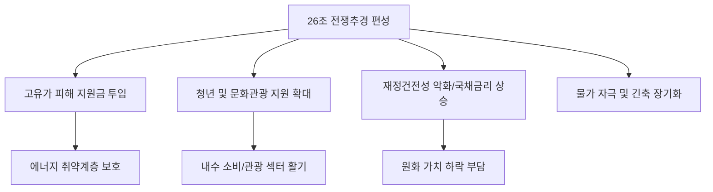

# 경제/정책 분석: 26조 '전쟁추경' 편성의 명암과 부문별 파급 효과
## 투자 신호 + 사회적 영향 평가

---

## 📌 기사 기본 정보

- **날짜**: 2026-04-02
- **출처**: 대한민국 정부 예산 및 거시경제 지표 분석
- **카테고리**: 경제 > 정책 > 추경예산
- **핵심 주제**: 글로벌 에너지 위기(호르무즈 해협 긴장)를 '준전시 상황'으로 규정한 정부의 26조 원 규모 추가경정예산(추경) 편성 내용과 고유가 피해 지원금, 청년 일자리, 농어촌 기본소득 등 부문별 지원 정책의 실효성 및 인플레이션 자극 가능성 분석

**메타데이터**
- 주요 예산 항목: 고유가 피해 지원금(10조), 청년·문화관광 지원(8조), 농어촌 기본소득(5조) 등
- 핵심 키워드: 전쟁추경, 민생 안정, 고물가 대책, 재정 건전성 논란
- 주요 주체: 기획재정부, 국회 예결위, 피해 취약 계층, 일반 서민
- 핵심 변수: 유가 상승 지속 여부, 추경 집행 속도, 한국은행의 금리 정책과의 상충

---

## 🔍 기사를 통한 투자 신호 추출

### 1단계: 핵심 사건 분해

**What (무엇이 일어났는가?)**
- 정부가 호르무즈 해협 봉쇄 리스크로 인한 '2차 오일 쇼크'급 경제 위기에 대응하기 위해 26조 원이라는 거대 추경을 편성. 이는 취약 계층의 에너지 비용 부담을 줄여주고, 위축된 내수 경기를 부양하기 위한 '긴급 수혈' 성격이 강함.

**When (언제 일어났는가?)**
- 2026-04-02 (유가가 $120를 상회하며 국내 물가가 통제 불능 상태로 치닫기 전, 선제적 방어막을 구축하려는 시점)

**Why (왜 일어났는가?)**
- 에너지 수입 물가 폭등으로 인한 자영업자 및 농어민의 도산 위기 방어
- 경기 침체기에 청년층의 고용 절벽 완화 및 문화관광 산업의 고사 방지

**Who (누가 주도하는가?)**
- 재정 확대를 통해 위기를 극복하려는 현 정권 경제팀 및 지역구 표심을 고려한 정치권

---

### 2단계: 투자 신호 해석

#### A. **긍정적 신호 (Bullish)**

**① 내수 소비재 및 관광/여가 섹터의 단기 모멘텀**
- **신호**: 8조 원 규모의 청년 및 문화관광 바우처/지원금 투입
- **의미**: 고물가로 지갑을 닫았던 젊은 층의 소비가 일시적으로 살아나며 관련 서비스업 실적 개선
- **투자 기회**: 국내 대표 여행사, 쇼핑 플랫폼, MZ 선호 F&B 브랜드

**② 농어촌 인프라 및 '스마트 팜' 관련 산업의 재평가**
- **신호**: 농어촌 기본소득 및 피해 지원 예산 집중
- **의미**: 농촌의 가처분 소득 증대는 곧 노후화된 농기계 교체나 자동화 설비 도입으로 이어질 가능성 높음
- **투자 기회**: 농기계 전문 제조사, 스마트 팜 솔루션 업체, 사료 및 비료 대장주

---

#### B. **위험 신호 (Bearish)**

**① 인플레이션 기대 심리 자극 및 '추가 금리 인상' 압박**
- **신호**: 26조 원이라는 거대 유동성의 시장 유입
- **의미**: 한은이 금리를 올려 물가를 잡으려는데 정부가 돈을 푸는 '정책 엇박자' 발생. 결과적으로 물가가 더 안 잡히고 금리 인하 시점이 뒤로 밀리는 리스크
- **투자 리스크**: 금리에 민감한 고레버리지 기술주/성장주, 부동산 리츠

**② 국가 채무 비율 급증에 따른 '원화 가치' 하락 (고환율 지속)**
- **신호**: 추경 재원 마련을 위한 대규모 국채 발행 가능성
- **의미**: 공급 증가로 인한 국채 가격 하락(금리 상승) 및 재정 건전성 우려로 인한 외국인 자본 이탈
- **투자 리스크**: 원화 약세에 취약한 에너지 수입 의존 정유/화학주

---

### 3단계: 섹터별 투자 기회 매트릭스

#### ✅ **높은 기대도 + 낮은 리스크**

**정부 공급망 관리 정책과 연계된 '에너지 효율화 및 신기술' 기업**
- 추경 예산 중 일부는 에너지 위기 근본 해결을 위한 기술 지원에 포함될 것이며, 이는 정치적 성향과 무관하게 지속 지원될 가능성이 큼
- **투자 추천도**: ⭐⭐⭐⭐

---

## 💰 구체적 투자 신호 변환

### 신호 1: '돈 푸는 정책'의 끝은 '더 높은 금리'일 수 있다

**투자 해석**: 기사는 정부의 '착한 예산' 뒤에 숨은 '무서운 인플레이션'의 위협을 경고함. 26조 원이 풀리면 내수는 잠깐 돌겠지만, 시장 금리는 내려갈 틈이 없어짐. 투자자는 추경 수혜주(관광, 내수)를 단기로 보되, 장기적으로는 '고금리 고착화'를 견딜 수 있는 현금 흐름 우량주로 자산을 피신시켜야 함. 정부 지원금이 들어가는 구체적 섹터(청년, 농촌)의 소비 흐름을 추적하는 것이 단기 수익의 핵심임.

---

## 🌍 사회적 영향 평가

### A. 긍정적 사회 영향
- **취약 계층의 생존권 보호**: 고유가로 인해 난방비, 급식비 등을 걱정하는 소외 계층에게 실질적인 '생존 지원금' 제공
- **지역 소멸 방지**: 농어촌 기본소득을 통해 낙후된 지역에 최소한의 경제 활력을 불어넣고 인구 유출 방어

### B. 부정적 사회 영향
- **미래 세대의 부채 부담**: 오늘 푼 26조 원은 결국 내일의 청년들이 세금으로 갚아야 할 빚(재정 적자) 가중
- **'포퓰리즘' 논란 및 사회적 분열**: 지원 대상에서 제외된 계층과의 불평등 논의 및 선거를 앞둔 매표 행위라는 비판으로 인한 사회적 갈등 격화

---

## 🎯 결론: 당신의 투자 전략 수립

- **즉시 실행**: 추경 집행 시 우발적인 소비가 발생하는 '내수 유통/플랫폼' 섹터 단기 비중 확대 및 국채 금리 변동성에 따른 채권 포트폴리오 헤지
- **3개월 후**: 추경 집행 후의 실질 물가 상승률(CPI) 데이터 확인 및 한국은행의 통화 정책 스탠스 변화(매파적 태도 강화 여부) 모니터링

---

## 📝 Obsidian 연결 구조

