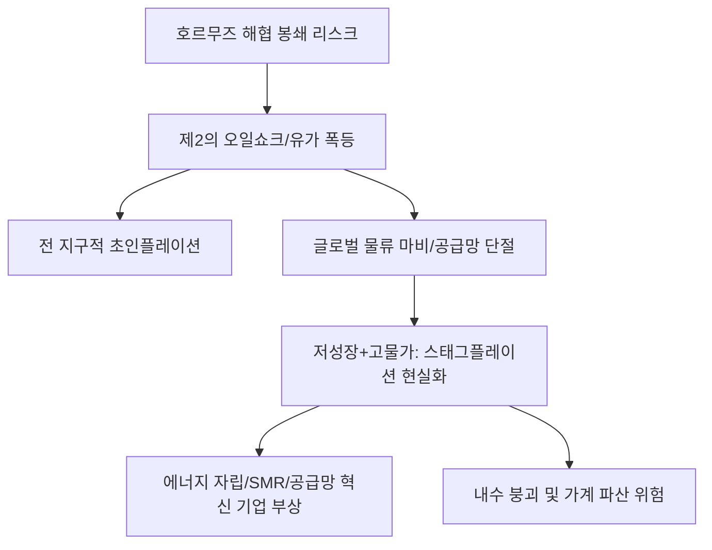

# 공급망/거시 분석: 호르무즈 해협 봉쇄와 제2의 오일쇼크, 스태그플레이션 전망
## 투자 신호 + 사회적 영향 평가

---

## 📌 기사 기본 정보

- **날짜**: 2026-04-02
- **출처**: 글로벌 에너지 지정학적 리스크 긴급 전망 보고서
- **카테고리**: 경제 > 거시경제 > 글로벌위기
- **핵심 주제**: 중동 정세 악화로 인한 호르무즈 해협(Strait of Hormuz)의 물리적 봉쇄 가능성과 이로 인한 국제 유가 $150 돌파 및 저성장-고물가가 결합된 '스태그플레이션(Stagflation)'의 현실화 가능성 집중 분석

**메타데이터**
- 주요 통로: 호르무즈 해협 (전 세계 석유의 1/3, 천연가스(LNG)의 25% 통과)
- 핵심 전망: 유가 폭등 → 물가 급등 → 금리 유지 → 경기 침체 (Death Spiral)
- 주요 주체: 이란, 이스라엘, 미국, 사우디아라비아, IEA(국제에너지기구)
- 키워드: 제2의 오일쇼크, 호르무즈 봉쇄, 스태그플레이션, 공급망 마비, 안보 파괴

---

## 🔍 기사를 통한 투자 신호 추출

### 1단계: 핵심 사건 분해

**What (무엇이 일어났는가?)**
- 이란의 직접적 군사 개입 가능성으로 전 세계 에너지 물동량의 핵심인 호르무즈 해협이 봉쇄 위기에 처함. 이는 1970년대 오일쇼크를 능가하는 충격을 예고하며, 단순히 가격 문제를 넘어 에너지와 원자재의 '물리적 소멸' 공포를 자극 중.

**When (언제 일어났는가?)**
- 2026-04-02 (이미 고물가로 고통받던 글로벌 경제에 최후의 일격(Coup de grâce)이 될 수 있는 시점)

**Why (왜 일어났는가?)**
- 중동 내 패권 다툼과 서방의 경제 제재에 대한 이란의 '자원 무기화' 반격
- 미국 등 강대국의 해상 통제 능력 약화 및 대안 해로 부재

**Who (누가 주도하는가?)**
- 해협 봉쇄 카드를 쥔 이란 지도부
- 해상로 확보를 위해 항공모함을 투입하는 미국 및 동맹국들

---

### 2단계: 투자 신호 해석

#### A. **긍정적 신호 (Bullish)**

**① 에너지 주권과 직결된 '가장 현실적인 대안(SMR, LNG선)'의 가치 폭등**
- **신호**: 중동 및 러시아 에너지 공급망의 영구적 불확실성
- **의미**: 바닷길이 막혀도 에너지를 공급할 수 있는 소형 원전(SMR) 기술과, 중동 외 지역에서 가스를 실어 나를 수 있는 고사양 LNG선 건조사의 지배력 강화
- **투자 기회**: 국내 대형 조선사(HD현대 등), SMR 핵심 소재 및 부품사

**② '자원 안보'를 위한 글로벌 공급망 재편 파트너사의 급부상**
- **신호**: 중동 비중 축소 및 북미/호주 자원 비중 확대
- **의미**: 안정적인 자원 루트를 확보한 종합상사나 핵심 광물 채굴권 보유 기업의 몸값 상승
- **투자 기회**: 원자재 트레이딩 상사, 대체 에너지 인프라 구축 사(송전망 등)

---

#### B. **위험 신호 (Bearish)**

**① '스태그플레이션' 시나리오 최악의 피해: 내수 기반 제조업**
- **신호**: 에너지 원가 폭등과 소비 심리 빙결의 동시 발생
- **의미**: 생산 비용은 사상 최고인데 파는 법(수요)은 전무한 진퇴양난의 상황
- **투자 리스크**: 가전, 유통, 자동차 등 경기 민감 내수 소비재 섹터

**② 항공/해운 물류비 폭등에 따른 '수출 경쟁력' 약화**
- **신호**: 위험 지역 항로 우회로 인한 운송 시간 및 비용 2~3배 증가
- **의미**: 한국처럼 '가공 수출'로 먹고사는 나라의 제품 경쟁력이 물류비 때문에 사라짐
- **투자 리스크**: 항공사(연료비 부담), 중소형 수출 제조사

---

### 3단계: 섹터별 투자 기회 매트릭스

#### ✅ **높은 기대도 + 낮은 리스크**

**글로벌 현금 비중이 높고 부채가 거의 없는 '현금 부자' 가치주**
- 스태그플레이션 국면에서 대출을 받아 사업하는 기업은 이자 부담에 무너짐. 오직 자기 자본으로 견디는 기업만이 시장을 독식할 것임
- **투자 추천도**: ⭐⭐⭐⭐⭐

---

## 💰 구체적 투자 신호 변환

### 신호 1: '에너지=안보' 공식의 완전한 정착

**투자 해석**: 기사는 단순히 기름값이 비싸진다는 예보가 아님. '에너지가 곧 무기'인 시대로의 완전한 진입을 선언한 것임. 투자자는 이제 기업 분석 시 '전력 수급처가 어디인가?'를 재무제표만큼 중요하게 봐야 함. 중동 발 에너지 충격에 직접 노출된 기업은 과감히 버리고, 에너지 자립도가 높거나 공급망을 다변화한 기업으로 포트폴리오의 '혈관'을 바꿔야 함.

---

## 🌍 사회적 영향 평가

### A. 긍정적 사회 영향
- **탈 화석 연료 및 에너지 전환 속도 혁명**: 에너지 위기를 기회삼아 그동안 지지부진했던 신재생에너지 및 차세대 원전에 대한 국가적 투자가 비약적으로 빨라짐
- **불필요한 과잉 소비의 정화**: 고물가 압박으로 인해 자원 낭비를 줄이고 본질적인 가치 중심의 소비 문화가 정착되는 계기

### B. 부정적 사회 영향
- **에너지 빈곤층의 생존 위협**: 전기료, 가스비 감당이 안 되는 서민들의 삶이 무너지며 발생하는 사회적 폭동이나 불안 확산
- **글로벌 경제 블록화에 따른 고립**: 자원 부국과 기술 부국 간의 갈등으로 인해 전 지구적 협력이 사라지고 각자도생의 차가운 세계로 진입

---

## 🎯 결론: 당신의 투자 전략 수립

- **즉시 실행**: 항공/화학주 전량 매도 및 '에너지 안보' 관련주 혹은 원자재 인버스/레버리지 상품으로 포트포이로 헤징
- **3개월 후**: 호르무즈 해협의 물리적 봉쇄 실행 여부 및 미군의 항로 확보 작전 성과 확인 후 자산 배분 재산정

---

## 📝 Obsidian 연결 구조

