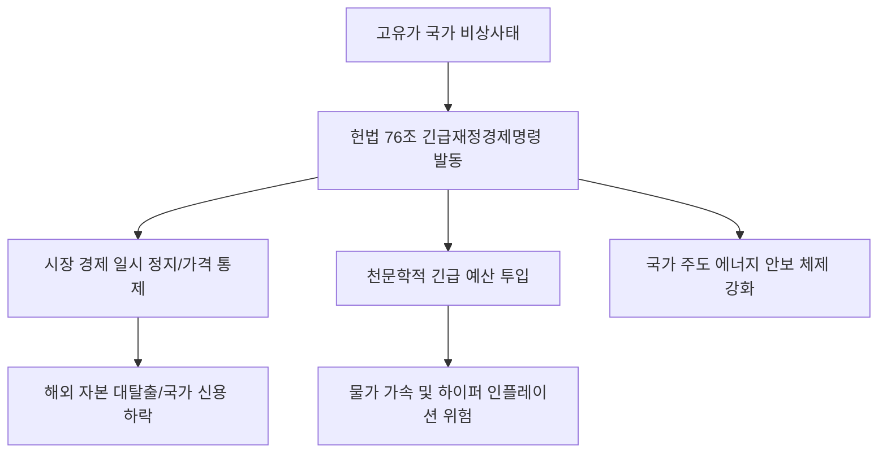

# 경제/정책 분석: 33년 만의 '긴급재정경제명령', 고유가 위기와 헌법 76조의 발동 분석
## 투자 신호 + 사회적 영향 평가

---

## 📌 기사 기본 정보

- **날짜**: 2026-04-03
- **출처**: 대한민국 헌법 제76조 및 긴급 경제 정책 특별 리포트
- **카테고리**: 경제 > 정책 > 국가위기관리
- **핵심 주제**: 1993년 금융실명제 이후 33년 만에 발동 검토 중인 '긴급재정경제명령(헌법 76조)'의 배경과 고유가 위기 극복을 위한 재정 투입이 오히려 물가를 자극할 수 있다는 '정책 딜레마' 집중 분석

**메타데이터**
- 관련 법령: 대한민국 헌법 제76조 1항 (대통령의 경제상 긴급처분권)
- 주요 조치: 에너지 가격 통제, 강제적 배급/절약령, 대규모 긴급 예산 집행
- 핵심 논란: 물가 자극 vs 민생 보호, 시장 질서 훼손 vs 국가 생존
- 주요 주체: 대통령실, 기획재정부, 한국은행, 헌법재판소(잠재적 심판)
- 키워드: 긴급재정경제명령, 헌법 76조, 고유가 엑소더스, 물가 폭발 딜레마

---

## 🔍 기사를 통한 투자 신호 추출

### 1단계: 핵심 사건 분해

**What (무엇이 일어났는가?)**
- 국제 유가의 전례 없는 폭등과 공급망 붕괴 가능성으로 국회가 정상적으로 열릴 시간조차 없는 '긴급한 상황'이라 판단, 대통령이 법률의 효력을 갖는 명령을 통해 경제 전반을 통제하려 함. 이는 시장 경제 체제의 일시적 정지를 의미하며 비상시국을 선언한 것과 다름없음.

**When (언제 일어났는가?)**
- 2026-04-03 (경제 지표가 '공황' 수준의 경고등을 켜고, 일반적인 추경이나 금리 정책으로는 사태 해결이 불가능하다고 판단된 시점)

**Why (왜 일어났는가?)**
- 호르무즈 해협 봉쇄 등 물리적 에너지 부족으로 인한 국가 기능 마비 우려
- 물가 폭등으로 인한 민심 이반과 약탈 등 사회적 무질서 방어 필요성

**Who (누가 주도하는가?)**
- 강력한 행정력을 행사하려는 대통령실 및 비상경제대책본부
- 절차적 민주주의와 인플레이션 가속화를 우려하는 야당 및 경제학계

---

### 2단계: 투자 신호 해석

#### A. **긍정적 신호 (Bullish)**

**① 국가 주도의 '에너지 대전환' 관련 국영급 기업 수혜**
- **신호**: 긴급 명령을 통한 국가 자원 배분의 효율성 증대
- **의미**: 민간의 복잡한 이해관계를 무시하고 원전 가속, 재생에너지 인프라 구축 등에 거액을 쏟아부으며 관련 기술 기업들이 초고속 성장
- **투자 기회**: 원전 폐기물 처리 및 건설사, 스마트 그리드 통합 솔루션 사

**② '필수 공공재'를 공급하는 방어적 거대 기업의 지위 강화**
- **신호**: 시장 가격 통제 및 국가 수매 시스템 가동
- **의미**: 수익 모델은 제한되나, 국가가 망하지 않는 이상 매출과 생존을 보장받는 '준 공기업' 성격의 대기업 부각
- **투자 기회**: 한국전력(재무구조 개선 지원 가능성), 통신사, 필수 식품 가공사

---

#### B. **위험 신호 (Bearish)**

**① 시장 원리 실종에 따른 '자산 가치 평가 불능'**
- **신호**: 정부의 가격 강제 인하 및 배당 제한 등 초법적 규제
- **의미**: 기업이 돈을 벌어도 주주에게 주지 못하거나, 아예 이익을 낼 수 없는 구조로 강제 변모
- **투자 리스크**: 금융 업종(금리 강제 인하), 정유주(초과입수세 환수), 고가 가구/사치재

**② 법치주의 논란에 따른 '코리아 디스카운트'의 극한 달성**
- **신호**: 헌법 76조 발동에 따른 해외 자본의 엑소더스(Exodus)
- **의미**: "한국 정치는 언제든 사유 재산을 통제할 수 있다"는 공포가 확산되며 외국인 투자가 영구적 이탈
- **투자 리스크**: 외국인 지분율이 높은 코스피 대형주 전체

---

### 3단계: 섹터별 투자 기회 매트릭스

#### ✅ **높은 기대도 + 낮은 리스크**

**국내 정치 노이즈에서 자유로운 '글로벌 매출 100%' 기업**
- 자산의 핵심 소재가 해외에 있고 매출도 해외에서 발생하며, 한국 현지는 생산 기지 역할만 하는 기업은 국내 법적 통제에서 비교적 자유로울 수 있음
- **투자 추천도**: ⭐⭐⭐

---

## 💰 구체적 투자 신호 변환

### 신호 1: '시장'을 믿지 말고 '권력'의 이동을 읽어라

**투자 해석**: 기사는 우리가 알던 '자본주의 시장'이 일시적으로 멈출 것임을 예고함. 긴급재정경제명령이 발동되면 모든 투자 판단 공식은 쓰레기통으로 가고, 오직 '정부가 어디에 돈을 쓰는가?'와 '정부가 누구를 죽이려고 하는가(규제)?'만이 유일한 수익 지표임. 투자자는 지금 즉시 자신의 포트폴리오에서 '정부의 눈치'를 봐야 할 내수 독점 기업들을 털어내고, 무국적(Global-only) 자산으로 이동해야 함.

---

## 🌍 사회적 영향 평가

### A. 긍정적 사회 영향
- **국가적 생존 위기의 돌파구 마련**: 법적 절차를 뛰어넘는 신속한 재산 분배와 가격 통제로 에너지 고통 분담 및 사회적 대혼란 방어
- **국가 전략 산업의 초고속 성장**: 규제 샌드박스를 넘어서는 '명령'을 통해 차세대 미래 에너지 기술을 단기간에 상용화하는 계기

### B. 부정적 사회 영향
- **자유민주주의 및 시장 경제의 훼손**: 헌법의 예외적 규정을 남용할 경우 발생하는 법적 안정성 붕괴 및 국민의 재산권 침해 논란
- **물가 폭발의 도화선**: 긴급 투입된 천문학적 예산이 시중에 풀리며 '명령'이 끝난 직후 하이퍼 인플레이션(Hyper Inflation)을 유발할 수 있는 잠재적 폭탄 형성

---

## 🎯 결론: 당신의 투자 전략 수립

- **즉시 실행**: 국내 내수 중심의 주식 및 채권 비중 0% 선언 및 해외(미국, 일본 등) 자산으로의 완전 대피
- **3개월 후**: 긴급명령의 해제 시점 혹은 위헌 법률 심판 제기 여부에 따른 국내 시장 귀환 타이밍 타진

---

## 📝 Obsidian 연결 구조

