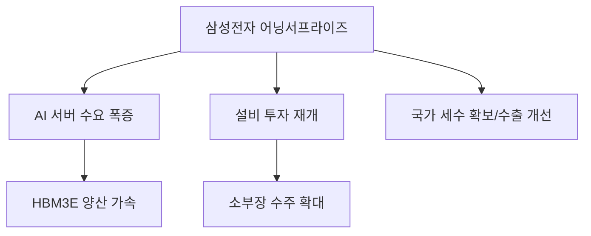

# 기업 분석: 삼성전자 1분기 '어닝 서프라이즈'와 반도체 업황의 V자 반등
## 투자 신호 + 사회적 영향 평가

---

## 📌 기사 기본 정보

- **날짜**: 2026-04-08
- **출처**: 글로벌 산업 경제 분석실
- **카테고리**: 경제 > 기업 > 반도체
- **핵심 주제**: 삼성전자의 2026년 1분기 영업이익이 시장 예상치를 크게 상회(어닝 서프라이즈)하며, 메모리 반도체 가격 상승과 AI 수요 폭증에 따른 실적 턴어라운드 본격화 분석

**메타데이터**
- 주요 수치: 1분기 잠정 영업이익(전년비 +XXX%), HBM(고대역폭 메모리) 출하량 증가율
- 핵심 변수: 메모리 감산 종료 시점, AI 서버용 DDR5 수요, 파운드리 수율 개선
- 주요 주체: 삼성전자 DX/DS 부문, 글로벌 빅테크(엔비디아, MS), 외인/기관 투자자
- 키워드: 어닝 서프라이즈(Earning Surprise), 반도체 봄날, HBM 5세대(HBM3E) 양산

---

## 🔍 기사를 통한 투자 신호 추출

### 1단계: 핵심 사건 분해

**What (무엇이 일어났는가?)**
- 삼성전자가 반도체(DS) 부문의 흑자 전환과 함께, 스마트폰(MX) 부문의 AI 폰 판매 호조로 역대급 1분기 실적을 발표. 특히 고부가가치 메모리(HBM, DDR5) 비중 확대가 수익성 개선을 주도.

**When (언제 일어났는가?)**
- 2026-04-08 (반도체 겨울이 끝나고 '슈퍼 사이클'의 초입인지 검증받는 시점)

**Why (왜 일어났는가?)**
- 글로벌 AI 데이터센터 건설 붐으로 인한 메모리 부족 현상
- 강도 높은 감산 정책의 효과로 인한 재고 정상화 및 고정 거래가 반등
- 온디바이스 AI(On-device AI) 스마트폰 시장의 성공적 안착

**Who (누가 주도하는가?)**
- 삼성전자 경영진 (전략적 감산 및 상단 공정 전환)
- 엔비디아(NVIDIA) 등 AI 가속기 시장의 지배자들

---

### 2단계: 투자 신호 해석

#### A. **긍정적 신호 (Bullish)**

**① 메모리 가격 결권(Pricing Power)의 회복**
- **신호**: 공급자 우위 시장으로의 재편
- **의미**: 삼성전자가 가격을 주도하는 국면 진입 → 마진율의 폭발적 상승
- **투자 기회**: 삼성전자 본주 및 우선주, 반도체 레버리지 상품

**② HBM3E 공급망의 본격 가동**
- **신호**: 5세대 HBM의 대규모 납품 가시화
- **의미**: 경쟁사(SK하이닉스)와의 점유율 격차 축소 및 기술 리더십 탈환 신호
- **투자 기회**: 리플로워, 세정 장비 등 HBM 전용 공정 장비 공급사

---

#### B. **위험 신호 (Bearish)**

**① 파운드리 부문의 적자 지속 및 수율 리스크**
- **신호**: 메모리는 좋으나 파운드리는 여전히 고전 중
- **의미**: 종합 반도체 기업(IDM)으로서의 밸류에이션 할인이 지속될 우려
- **투자 리스크**: 파운드리 턴어라운드에만 베팅한 공격적 투자자

**② 지정학적 수출 통제 및 중화권 자급률 상승**
- **신호**: 중국 CXMT 등 레거시 공정의 추격
- **의미**: 범용 메모리 시장에서의 가격 경쟁 격화 리스크 잔존

---

### 3단계: 섹터별 투자 기회 매트릭스

#### ✅ **높은 기대도 + 낮은 리스크**

**삼성전자 핵심 소부장(소재·부품·장비) 협력사**
- 삼성의 실적 반등은 곧 설비 투자(CAPEX) 재개로 이어지며, 협력사들의 수주 잔고가 가장 먼저 반응함
- **투자 추천도**: ⭐⭐⭐⭐⭐

---

## 💰 구체적 투자 신호 변환

### 신호 1: '숫자'가 증명하는 업황의 바닥 확인

**투자 해석**: 기사의 '어닝 서프라이즈'는 단순히 이익이 많다는 뜻이 아니라, 업계 전체의 재고 순환 주기가 상승 국면에 진입했음을 알리는 '공식 선언'임. 주가는 실적에 선행하므로, 지금의 실적 발표는 추가 상승을 위한 든든한 바닥(Bottom)을 형성하는 과정으로 봐야 함.

---

## 🌍 사회적 영향 평가

### A. 긍정적 사회 영향
- **국가 실무 경제의 견인**: 삼성전자의 실적 호조는 법인세수 증대 및 국내 수출 지표 개선으로 직결되어 국가 신용도에 긍정적
- **AI 대중화 가속**: 저렴하고 고성능인 메모리 공급은 인류 전체의 AI 접근성을 높임

### B. 부정적 사회 영향
- **산업 생태계의 양극화**: 반도체만 잘 나가고 내수나 전통 제조업은 소외되는 '반도체 착시 현상'으로 인한 체감 경기와의 괴리
- **노사 갈등의 불씨**: 역대급 이익 발표는 자연스럽게 직원들의 과감한 성과급 요구로 이어져 노사 대립이 격화될 가능성

---

## 🎯 결론: 당신의 투자 전략 수립

- **즉시 실행**: 반도체 섹터 내 대장주 비중 유지 및 실적 가시성이 높은 후공정(OSAT) 업체 선별 매수
- **3개월 후**: 엔비디아의 신규 칩 출시와 삼성 HBM의 채택 비중 변화를 보고 포트폴리오 리밸런싱

---

## 📝 Obsidian 연결 구조

