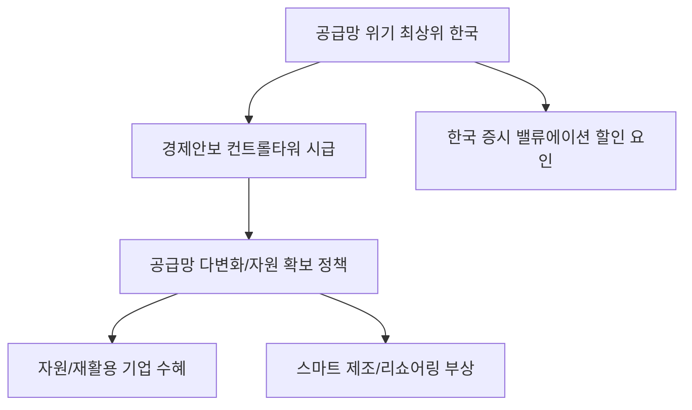

# 글로벌 안보 분석: 공급망 위기 '최상위' 한국과 경제안보 컨트롤타워의 시급성
## 투자 신호 + 사회적 영향 평가

---

## 📌 기사 기본 정보

- **날짜**: 2026-04-09
- **출처**: 국가 안보 전략 리서치 센터
- **카테고리**: 경제 > 지정학 > 공급망안보
- **핵심 주제**: 글로벌 공급망 리스크 조사에서 한국이 가장 취약한 '최상위' 국가로 분류됨에 따른 경제안보 컨트롤타워 구축의 시급성 및 대응 전략 분석

**메타데이터**
- 주요 지표: 수입 의존도(특정국 80% 이상 품목 수), 에너지 및 핵심 광물 자급률
- 핵심 변수: 미-중 갈등 심화, 자원 무기화, 해상 물류 루트 보안
- 주요 주체: 국가안보실(OSN), 국가정보원, 산업부, 공급망 핵심 연관 기업들
- 키워드: 경제안보(Economic Security), 컨트롤타워, 자원 자주권, 리스크 프리미엄

---

## 🔍 기사를 통한 투자 신호 추출

### 1단계: 핵심 사건 분해

**What (무엇이 일어났는가?)**
- 국제 보고서에서 한국이 원자재 및 중간재의 특정 국가(중국 등) 의존도가 지나치게 높아, 지정학적 충격 발생 시 경제 시스템 전체가 멈출 위험이 가장 큰 나라로 평가됨.

**When (언제 일어났는가?)**
- 2026-04-09 (러-우 전쟁 장기화 및 중동 위기로 인해 '자료 주권'과 '공급망 안정'이 국가 생존의 핵심이 된 시점)

**Why (왜 일어났는가?)**
- 과거 경제성 중심의 분업 구조에만 몰입하여 '안보 비용'을 지불하지 않은 결과
- 국내 자원 부재 및 핵심 산업(반도체, 배터리)의 소재 수급 구조가 편중됨

**Who (누가 주도하는가?)**
- 경제와 안보를 통합 관리하려는 대통령실 직속 경제안보팀
- 공급망 다변화를 위해 해외 광산 확보 및 대체 소재 개발에 뛰어든 국내 기업군

---

### 2단계: 투자 신호 해석

#### A. **긍정적 신호 (Bullish)**

**① '자원 및 소재 주권' 관련 기업의 국가적 지원**
- **신호**: 경제안보 컨트롤타워의 강력한 지원 예산 편성
- **의미**: 핵심 광물(리튬, 니켈, 희토류 등)을 직접 확보하거나 재활용하는 기업에 대한 세제 혜택 및 금융 지원 확대
- **투자 기회**: 해외 자원 개발사, 폐배터리 리사이클링 업체, 소재 국산화 선도 기업

**② 공급망 관리(SCM) 인프라 및 물류 보안 테크의 부상**
- **신호**: 공급망 가시성(Visibility) 확보를 위한 디지털 전환 요구
- **의미**: 실시간으로 글로벌 물류 리스크를 감지하고 대안 루트를 제시하는 소프트웨어 시장의 팽창
- **투자 기회**: AI 기반 물류 지능화 기업, 사이버 보안 솔루션 업체

---

#### B. **위험 신호 (Bearish)**

**① 수입 의존도가 높은 제조업의 '리스크 프리미엄' 상시화**
- **신호**: 한국을 '공급망 위기 최상위'로 분류한 보고서의 파급력
- **의미**: 외국인 투자자들이 한국 기업의 밸류에이션을 산정할 때 '공급망 리스크'를 감점 요인으로 반영하기 시작
- **투자 리스크**: 중국산 중간재 비중이 절대적인 범용 화학, 철강, 배터리 부품사

**② 물가 상승 압력의 구조적 고착화**
- **신호**: 공급망 다변화를 위한 비용 발생(Reshoring/Friend-shoring 비용)
- **의미**: 싼 중국산 대신 비싼 우방국 소재를 써야 하므로, 장기적인 제조 원가 상승 및 인플레이션 압력
- **투자 리스크**: 원가 전가력이 낮은 소형 완제품 제조업체

---

### 3단계: 섹터별 투자 기회 매트릭스

#### ✅ **높은 기대도 + 낮은 리스크**

**국내 복귀(Reshoring) 지원 정책 수혜 및 스마트 제조 기업**
- 정부의 강력한 유턴 기업 지원책과 인건비 리스크를 줄일 자동화 설비 수요가 만나는 지점임
- **투자 추천도**: ⭐⭐⭐⭐

---

## 💰 구체적 투자 신호 변환

### 신호 1: '안전'에 지불하는 비용이 '수익'을 결정한다

**투자 해석**: 기사는 한국 경제의 아킬레스건이 '공급망'임을 명확히 경고함. 앞으로는 단순히 영업이익이 높은 기업보다, 공급망을 얼마나 '다변화(Diversification)'하고 '자립화(Independence)' 했는지가 주가의 진정한 펀더멘털이 될 것임. 경제안보 컨트롤타워가 지정하는 '핵심 전략 자산' 관련 기업 리스트를 확보해야 함.

---

## 🌍 사회적 영향 평가

### A. 긍정적 사회 영향
- **국가 위기 대응 능력 강화**: 파편화된 행정을 통합하여 공급망 위기 시 일사불란한 대응 체계 구축
- **기술 및 자원 안보 의식 고취**: 국민적 공감대를 통해 장기적인 자원 확보 사업에 대한 지속성 보장

### B. 부정적 사회 영향
- **경제의 안보화(Securitization)에 따른 비용**: 효율성보다 안보를 우선시하며 발생하는 소비자 물가 상승
- **특정 국가와의 외교적 마찰**: 공급망 다변화 과정에서 기존 최대 공급처(중국 등)와의 관계 악화로 인한 보복 리스크 노출

---

## 🎯 결론: 당신의 투자 전략 수립

- **즉시 실행**: 투자 종목 중 특정 국가 수입 의존도가 70%를 넘는 기업들의 공급망 다변화 공시 점검
- **3개월 후**: 정부의 '공급망 안정화 특별법' 시행 세칙 및 예산 배정 우선순위 확인 후 포트폴리오 조정

---

## 📝 Obsidian 연결 구조

