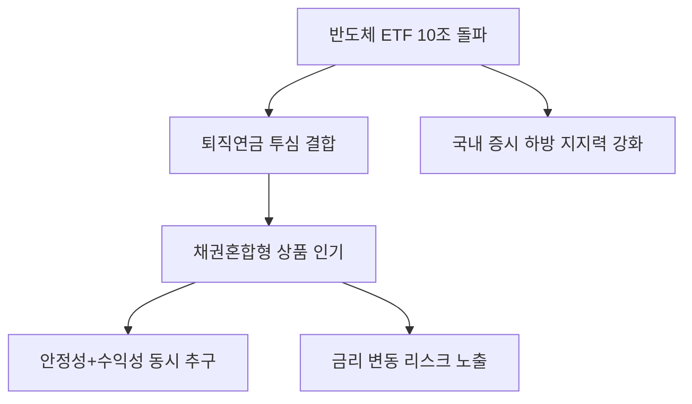

# 금융/증권 분석: 반도체 ETF 10조 돌파와 '퇴직 연금 투톱' 투자 열풍
## 투자 신호 + 사회적 영향 평가

---

## 📌 기사 기본 정보

- **날짜**: 2026-04-09
- **출처**: 대한민국 증권 시장 동향
- **카테고리**: 경제 > 금융 > 증권/투자
- **핵심 주제**: 국내 반도체 ETF 순자산이 10조 원을 돌파하며 퇴직연금 시장의 핵심 자산으로 부상. 특히 '채권혼합형 반도체 ETF'가 안정성과 수익성을 동시에 잡으며 투자자들의 강력한 지지를 받는 현상 분석

**메타데이터**
- 주요 수치: 반도체 ETF 총 순자산 10조 원+, 퇴직연금 내 비중 급증
- 핵심 상품: 국내/글로벌 반도체 ETF, 채권혼합형 반도체 ETF(Retirement Focused)
- 주요 주체: 삼성자산운용, 미래에셋운용 등 주요 운용사, 퇴직연금 개별 투자자(DC/IRP)
- 키워드: 반도체 ETF(Semiconductor ETF), 연금 투자, 채권혼합형, 자산 배분

---

## 🔍 기사를 통한 투자 신호 추출

### 1단계: 핵심 사건 분해

**What (무엇이 일어났는가?)**
- 대한민국 시가총액의 압도적 비중을 차지하는 반도체 섹터에 대한 ETF 투자가 대중화됨. 특히 원금 손실 우려가 큰 연금 계좌에서 '채권 70% + 반도체 30%' 구조의 혼합형 상품이 폭발적인 인기를 끌며 10조 원이라는 마일스톤 달성.

**When (언제 일어났는가?)**
- 2026-04-09 (반도체 업황 개선 기대감과 노후 자금 마련을 위한 직접 투자 열풍이 결합된 시점)

**Why (왜 일어났는가?)**
- 개별 종목 투자보다 위험을 분산하면서도 반도체 상승세에는 올라타고 싶은 욕구
- 퇴직연금(DC/IRP) 제도 내에서 안전 자본 비중(70%) 규제를 충족하면서도 성장주에 투자할 수 있는 '채권혼합형'의 구조적 장점
- 고령화 시대에 따른 '운용 수익률 제고'가 절실한 개인들의 선택

**Who (누가 주도하는가?)**
- 자산관리(WM) 서비스를 이용하는 4050 직장인 및 스마트 투자를 지향하는 젊은 연금 투자자
- 경쟁적 마케팅을 펼치는 대형 자산운용사 및 증권사

---

### 2단계: 투자 신호 해석

#### A. **긍정적 신호 (Bullish)**

**① 반도체 섹터의 '간접 투자 자본' 유입 지속**
- **신호**: ETF 순자산 10조 돌파 및 연금 유동성 유입
- **의미**: 개별 기사나 수급에 따라 출렁이는 단기 자금이 아닌, 연금 성격의 '장기 우량 자본'이 반도체주를 든든하게 받쳐줌
- **투자 기회**: 국내 반도체 대장주(삼성전자, SK하이닉스) 및 핵심 소부장 기업들의 주가 하방 경직성 확보

**② 퇴직연금 운용 서비스 및 플랫폼 시장의 활성화**
- **신호**: 연금 계좌 내 직접 운용 비중 확대
- **의미**: 연금 자산을 단순 예금이 아닌 ETF 등으로 운용하려는 수요가 커지며 금융 서비스 수수료 수익 및 관리 플랫폼의 가치 증대
- **투자 기회**: 증권사, 로보어드바이저, 연금 특화 금융 앱

---

#### B. **위험 신호 (Bearish)**

**① 반도체 섹터 쏠림(Concentration) 리스크**
- **신호**: 10조 원이라는 거대 자금이 특정 섹터(반도체)에 집중됨
- **의미**: 반도체 업황이 하강 사이클로 접어들 경우 국민들의 노후 자산이 동시에 큰 손실을 입을 수 있는 시스템 리스크
- **투자 리스크**: 분산 투자가 부족한 '반도체 몰빵형' 포트폴리오

**② 채권 부문의 금리 변동 리스크**
- **신호**: 채권혼합형 ETF의 높은 비중
- **의미**: 반도체가 올라도 금리 급등으로 채권 가격이 폭락할 경우 ETF 전체 수익률이 훼손될 수 있음
- **투자 리스크**: 금리 변동성에 취약한 장기물 채권 혼합 상품

---

### 3단계: 섹터별 투자 기회 매트릭스

#### ✅ **높은 기대도 + 낮은 리스크**

**글로벌 반도체 밸류체인 분산 투자 ETF 및 리츠(REITs)**
- 특정 기업 리스크를 줄이면서 전 세계적인 반도체 성장세와 부동산 임대수익(안전 자산)을 결합한 자산군
- **투자 추천도**: ⭐⭐⭐⭐⭐

---

## 💰 구체적 투자 신호 변환

### 신호 1: '연금 개미'가 증시의 새로운 고래(Whale)가 되다

**투자 해석**: 기사에서 언급된 10조 원의 머니 무브는 대한민국 증시의 수급 지형이 바뀌었음을 뜻함. 외국인/기관에 휘둘리던 과거와 달리, 이제는 연금 계좌를 통한 거대하고 영속적인 개인들의 자금이 반도체 업황을 지지함. 이는 반도체주의 '저점 매수(Buy the Dip)' 강도가 매우 강력해졌음을 의미함.

---

## 🌍 사회적 영향 평가

### A. 긍정적 사회 영향
- **국민 자산 형성 기회 확대**: 저금리 예금에 묶여 있던 연금 자산이 혁신 산업에 투자됨으로써 은퇴 후 소득 수준 향상 기대
- **주식 시장의 건전화**: 장기 투자 성향인 연금 자금 유입으로 인해 단기 투기성 거래 비중 감소 및 변동성 완화

### B. 부정적 사회 영향
- **특정 산업 위기 시 사회 갈등 증대**: 반도체 산업이 고꾸라질 경우 수많은 은퇴층의 손실이 정부 정책이나 기업에 대한 비난으로 번질 위험
- **금융 문해력 차이에 따른 양극화**: 투자 상품을 선택할 수 있는 정보 접근력이 있는 사람과 없는 사람 간의 노후 준비 격차 심화

---

## 🎯 결론: 당신의 투자 전략 수립

- **즉시 실행**: 본인 퇴직연금(DC/IRP) 내 안전자산 비율 준수 여부 확인 및 고수수료 상품을 저비용 ETF로 교체
- **3개월 후**: 반도체 업황의 정점 여부와 금리 하향 안정화 가능성을 재산정하여 주식/채권 비중 리밸런싱

---

## 📝 Obsidian 연결 구조

