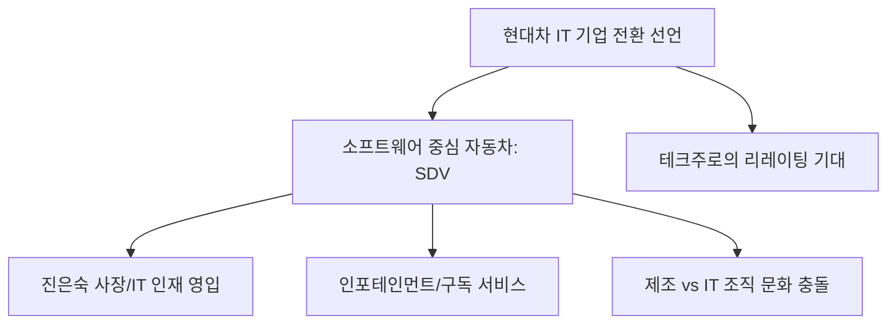

# 기업/테크 분석: 현대차의 'IT 기업 전환' 선언과 진은숙 사장의 비전
## 투자 신호 + 사회적 영향 평가

---

## 📌 기사 기본 정보

- **날짜**: 2026-04-09
- **출처**: 글로벌 오토모티브 및 테크 저널
- **카테고리**: 경제 > 기업 > 미래모빌리티
- **핵심 주제**: 현대차그룹이 더 이상 제조사가 아닌 'IT 소프트웨어 기업'으로의 정체성 전환 선언. 특히 NHN 출신 진은숙 사장을 영입하여 SDV(소프트웨어 중심 자동차) 체계로의 근본적 개편 추진 분석

**메타데이터**
- 주요 인물: 정의선 회장, 진은숙 사장(SDV 본부장)
- 핵심 전략: SDV(Software Defined Vehicle), 차량용 OS 'ccOS' 내재화, 데이터 기반 서비스 확장
- 주요 주체: 현대자동차, 포티투닷(42dot), 구글/MS(협력 파트너)
- 키워드: 하천에서 바다로(제조에서 IT로), 모빌리티 서비스(MaaS), 전용 데이터 센터

---

## 🔍 기사를 통한 투자 신호 추출

### 1단계: 핵심 사건 분해

**What (무엇이 일어났는가?)**
- 현대차그룹이 자동차 제조 기술을 넘어 소프트웨어 역량을 핵심 경쟁력으로 설정. 이를 위해 전통의 하드웨어 조직을 소프트웨어 중심으로 재편하고, 외부 IT 전문가인 진은숙 사장을 사령탑으로 세워 전 차종의 디지털 전환 가속화.

**When (언제 일어났는가?)**
- 2026-04-09 (테슬라의 FSD 성능 비약과 중국 샤오미의 스마트카 출시로 '바퀴 달린 스마트폰' 전쟁이 격화된 시점)

**Why (왜 일어났는가?)**
- 하드웨어 마진율은 낮아지는 반면, 자율주행·콘텐츠·업그레이드(OTA) 등 소프트웨어 구독 수익의 성장 잠재력이 무궁무진하기 때문
- 제조 기반만으로는 미래 경쟁에서 도태될 것이라는 절박한 위기감

**Who (누가 주도하는가?)**
- 미래 먹거리를 소프트웨어에서 찾는 정의선 회장의 결단
- 네이버/NHN 출신의 개발 문화를 이식하려는 진은숙 사장과 SDV 개발팀

---

### 2단계: 투자 신호 해석

#### A. **긍정적 신호 (Bullish)**

**① 밸류에이션 리레이팅(Re-rating)의 기회**
- **신호**: 단순 제조업에서 '빅테크' 기업으로의 정체성 확장
- **의미**: 자동차 기업의 낮은 PER(주가수익비율)이 아닌, IT 기업의 높은 PER을 적용받는 체전 변화 시도
- **투자 기회**: 현대차 본주, SDV 개발 핵심 파트너사인 '현대오토에버' 등 그룹 내 SW 계열사

**② 차량 데이터 기반 '구독 경제' 모델의 안착**
- **신호**: 전 차종 OTA(무선 업데이트) 및 차량용 앱스토어 구축
- **의미**: 차를 파는 시점이 이익의 시작이 됨 (구독료, 광고, 인포테인먼트 결제 등 지속적 매출)
- **투자 기회**: 차량용 인포테인먼트 부품 및 보안 솔루션 업체

---

#### B. **위험 신호 (Bearish)**

**① '개발 문화' 충돌에 따른 인재 이탈 및 조직 경직성**
- **신호**: "제조 공장 마인드"와 "애자일 IT 마인드"의 충돌 가능성
- **의미**: 연공서열 중심의 전통적 자동차 조직이 뛰어난 개발자들을 품지 못할 경우 비전은 구호에 그칠 리스크
- **투자 리스크**: 핵심 개발 인력의 이직 속도 및 조직 개편 잡음 여부

**② 천문학적인 R&D 비용 지출에 따른 단기 수익성 훼손**
- **신호**: 매년 수조 원 규모의 소프트웨어 인력 채용 및 데이터센터 구축 투자
- **의미**: 소프트웨어가 돈을 벌기 시작할 때까지 상당한 기간 동안 이익률이 하향될 수 있음
- **투자 리스크**: 분기 실적에 민감한 단기 투자자

---

### 3단계: 섹터별 투자 기회 매트릭스

#### ✅ **높은 기대도 + 낮은 리스크**

**차량용 사이버 보안 및 임베디드 OS 고도화 기업**
- 현대차가 IT 기기로 변할수록 해킹 방지 및 안정적 운영체제(OS) 기술은 필수불가결한 하단 지지대임
- **투자 추천도**: ⭐⭐⭐⭐⭐

---

## 💰 구체적 투자 신호 변환

### 신호 1: '강철'이 아닌 '코드'가 값을 결정한다

**투자 해석**: 기사의 핵심은 현대차가 스스로를 'IT 기업'이라 부르기 시작했다는 것임. 이는 향후 차량 선택 기준이 마력/연비가 아닌 'OS의 편의성'과 '앱 생태계'로 바뀔 것임을 예고함. 따라서 투자 포커스를 '엔진' 부품사에서 '차량용 AP(애플리케이션 프로세서)', 'AI 반도체', '빅데이터 분석' 업체로 완전히 옮겨야 함.

---

## 🌍 사회적 영향 평가

### A. 긍정적 사회 영향
- **모빌리티 혁신을 통한 삶의 질 개선**: 자율주행 및 커넥티드 카 서비스를 통해 이동 시간이 '온전한 휴식/업무 시간'으로 변모
- **국가 차원의 IT 인재 양성**: 현대차급의 거대 기업이 소프트웨어를 지향하며 국내 개발자 생태계의 비약적 팽창 유도

### B. 부정적 사회 영향
- **기존 내연기관 숙련공들의 고용 위기**: 소프트웨어 중심 조직으로 개편되며 전통 제조 직업군의 사회적 소외 및 구조조정 압력
- **차량 가격 인상 및 정보 평등권 이슈**: 디지털 기능이 강화될수록 차량 가격이 상승하여 저소득층의 이동권 제약 및 '디지털 격차' 발생 우려

---

## 🎯 결론: 당신의 투자 전략 수립

- **즉시 실행**: 포트폴리오 내 자동차 비중의 성격을 '제조'에서 '모빌리티 서비스'로 재정의하고, 관련 소프트웨어 수혜주 편입
- **3개월 후**: 진은숙 사장 주도로 발표될 현대차의 독자 운영체제(ccOS) 고도화 로드맵 및 개발자 컨퍼런스 성과 확인

---

## 📝 Obsidian 연결 구조

